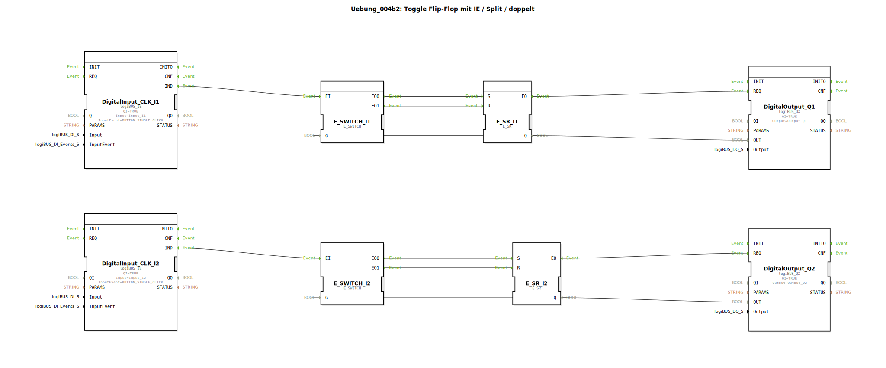

# Uebung_004b2: Toggle Flip-Flop mit IE / Split / doppelt


[](https://notebooklm.google.com/notebook/a6872e59-1dfc-4132-a118-aff1bc7bc944)

Dieser Artikel beschreibt die logiBUS®-Übung `Uebung_004b2`. Hier wird die manuelle Toggle-Logik aus Übung 004b auf zwei unabhängige Kanäle erweitert.

----


## Ziel der Übung

Vertiefung des Verständnisses für parallele, rückgekoppelte Logikstrukturen. Jeder Kanal muss seinen eigenen Zustand korrekt verwalten, um unabhängig schaltbar zu sein.

-----

## Beschreibung und Komponenten

[cite_start]In `Uebung_004b2.SUB` sind zwei identische Logik-Stränge (Switch + Speicher) nebeneinander aufgebaut[cite: 1].

### Funktionsbausteine (FBs)




  * **Kanal 1**: Taster `I1`, Weiche `E_SWITCH_I1`, Speicher `E_SR_I1`, Ausgang `Q1`.
  * **Kanal 2**: Taster `I2`, Weiche `E_SWITCH_I2`, Speicher `E_SR_I2`, Ausgang `Q2`.

-----

## Funktionsweise

Die beiden Kanäle arbeiten nach dem gleichen Prinzip wie in Übung 004b: Der Ausgangszustand (`Q`) steuert über den Gate-Eingang (`G`) der Weiche, ob der nächste Tastendruck ein Setz- oder Rücksetz-Ereignis auslöst.

```xml
<!-- Beispiel Kanal 1 -->
<Connection Source="DigitalInput_CLK_I1.IND" Destination="E_SWITCH_I1.EI"/>
<Connection Source="E_SWITCH_I1.EO0" Destination="E_SR_I1.S"/>
<Connection Source="E_SWITCH_I1.EO1" Destination="E_SR_I1.R"/>
<Connection Source="E_SR_I1.Q" Destination="E_SWITCH_I1.G"/>
```

[cite_start][cite: 1]

Da keine Querverbindungen zwischen den Strängen existieren, beeinflusst die Bedienung von Taster 1 niemals den Zustand von Lampe 2 und umgekehrt.