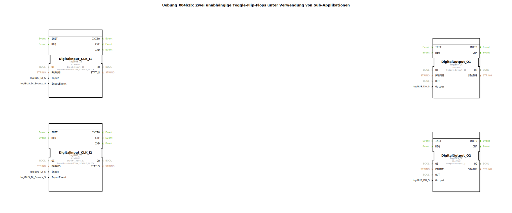

# Uebung_004b2b: Zwei unabhängige Toggle-Flip-Flops unter Verwendung von Sub-Applikationen




* * * * * * * * * *

## Einleitung

Diese Übung realisiert zwei voneinander unabhängige Toggle-Flip-Flops.  
Die Logik wird in einer wiederverwendbaren Sub-Applikation gekapselt, die zweimal instanziiert wird.  
Als Eingabe dienen zwei Taster (Singelklick), als Ausgabe zwei digitale Ausgänge.  
Bei jedem Tastendruck wechselt der zugehörige Ausgang seinen Zustand (Ein/Aus).

## Verwendete Funktionsbausteine (FBs)

### Haupt-FBs auf oberster Ebene

- **logiBUS_IE** – Ereignisgesteuerter Digitaleingang  
  - Parameter: `Input` = `Input_I1` bzw. `Input_I2`, `InputEvent` = `BUTTON_SINGLE_CLICK`  
  - Empfängt ein Ereignis, sobald der angeschlossene Taster einfach gedrückt wird.

- **logiBUS_QX** – Digitalausgang  
  - Parameter: `Output` = `Output_Q1` bzw. `Output_Q2`  
  - Setzt den physischen Ausgang entsprechend dem anliegenden Datenwert (BOOL).

### Sub-Bausteine: `Uebung_004b2b_sub`

- **Typ**: SubAppType  
- **Beschreibung**: Sub-Applikation für ein Toggle-Flip-Flop (besteht aus `E_SWITCH` und `E_SR`)

#### Verwendete interne FBs

- **`E_SWITCH_I1`**: Typ `E_SWITCH`  
  - Ereigniseingang: `EI`  
  - Ereignisausgänge: `EO0` (bei G=FALSE), `EO1` (bei G=TRUE)  
  - Dateneingang: `G` (BOOL) – entscheidet über die Ereignisweiterleitung

- **`E_SR_I1`**: Typ `E_SR` (Set-Reset-Flip-Flop)  
  - Ereigniseingänge: `S` (Set), `R` (Reset)  
  - Ereignisausgang: `EO`  
  - Datenausgang: `Q` (BOOL) – aktueller Zustand

#### Funktionsweise

1. Die Sub-Applikation empfängt ein Ereignis am Eingang `IND`.  
2. Der interne `E_SWITCH` prüft den Wert seines Dateneingangs `G` (der mit dem aktuellen Ausgang `Q` des `E_SR` verbunden ist):  
   - Ist `Q = FALSE` (G=0), wird das Ereignis an `EO0` und damit an den Set-Eingang (`S`) des `E_SR` weitergeleitet.  
   - Ist `Q = TRUE` (G=1), wird das Ereignis an `EO1` und damit an den Reset-Eingang (`R`) des `E_SR` weitergeleitet.  
3. Der `E_SR` wechselt daraufhin seinen Zustand:  
   - Bei einem Set-Ereignis wird `Q = TRUE`.  
   - Bei einem Reset-Ereignis wird `Q = FALSE`.  
4. Nach der Zustandsänderung wird ein Ereignis am Ausgang `EO` erzeugt und der neue Wert von `Q` über den Ausgang der Sub-Applikation bereitgestellt.

Dadurch ergibt sich ein **Toggle-Verhalten**: Jedes ankommende Ereignis ändert den Ausgangszustand.

## Programmablauf und Verbindungen

Die Haupt-SubApp `Uebung_004b2b` enthält zwei vollständig unabhängige Kanäle – je einen für die digitale Eingabe `I1`/`I2` und Ausgabe `Q1`/`Q2`.  

**Verschaltung je Kanal:**

```
logiBUS_IE (Taster) --> IND der Sub-Applikation
Sub-Applikation.EO --> REQ des logiBUS_QX
Sub-Applikation.Q   --> OUT des logiBUS_QX
```

- **Ereignisverbindungen**:  
  - `DigitalInput_CLK_I1.IND` → `Uebung_004b2b_sub1.IND`  
  - `Uebung_004b2b_sub1.EO` → `DigitalOutput_Q1.REQ`  
  - (Analog für den zweiten Kanal mit `I2` und `Q2`)

- **Datenverbindungen**:  
  - `Uebung_004b2b_sub1.Q` → `DigitalOutput_Q1.OUT`  
  - (Analog für den zweiten Kanal)

Durch diese Struktur wird die Logik der Sub-Applikation zweimal genutzt, ohne sie neu definieren zu müssen. Die Toggle-Funktion wird bei jedem Tastendruck (Singelklick) ausgeführt.

## Zusammenfassung

- **Lernziele**:  
  - Aufbau und Verwendung von Sub-Applikationen zur Wiederverwendung von Logik  
  - Realisierung eines Toggle-Flip-Flops mit `E_SWITCH` und `E_SR`  
  - Verkettung von ereignisgesteuerten und datengetriebenen Verbindungen  
  - Parametrierung von hardwarenahen Ein‑/Ausgangsbausteinen (logiBUS)

- **Schwierigkeitsgrad**: Fortgeschrittene Grundlagen  
- **Vorkenntnisse**: Umgang mit Ereignissen, Boolesche Logik, einfache Flip-Flops

Die Übung demonstriert, wie modulare, wiederverwendbare Funktionsbausteine in einer industriellen Steuerungsumgebung (IEC 61499) effizient eingesetzt werden können.