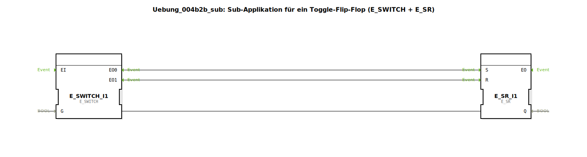

# Uebung_004b2b_sub: Sub-Applikation für ein Toggle-Flip-Flop (E_SWITCH + E_SR)

* * * * * * * * * *

## Einleitung

Diese Übung implementiert ein **Toggle-Flip-Flop** (auch bekannt als Umschaltglied) unter Verwendung der Funktionsbausteine `E_SWITCH` und `E_SR`. Ziel ist es, den booleschen Ausgang `Q` bei jedem eingehenden Ereignis `IND` umzuschalten. Die Realisierung erfolgt als Subapplikation, die als wiederverwendbarer Baustein in übergeordnete Applikationen eingebunden werden kann.

## Verwendete Funktionsbausteine (FBs)

### Sub-Baustein: `Uebung_004b2b_sub`

- **Typ**: SubAppType (Subapplikation)
- **Verwendete interne FBs**:
  - **E_SWITCH_I1**: `E_SWITCH`
    - Parameter: keine
    - Ereigniseingang: `EI`
    - Ereignisausgänge: `EO0` (bei `G=FALSE`), `EO1` (bei `G=TRUE`)
    - Dateneingang: `G` (BOOL)
    - Datenausgang: keine
  - **E_SR_I1**: `E_SR`
    - Parameter: keine
    - Ereigniseingänge: `S` (Set), `R` (Reset)
    - Ereignisausgang: `EO` (wird nach Set/Reset ausgegeben)
    - Datenausgang: `Q` (BOOL, aktueller Zustand)
- **Funktionsweise**:
  Der `E_SWITCH` leitet das Eingangsereignis `IND` abhängig vom Wert des Dateneingangs `G` an einen seiner beiden Ereignisausgänge weiter:
  - Ist `G = FALSE`, wird das Ereignis auf `EO0` (Set) gegeben.
  - Ist `G = TRUE`, wird das Ereignis auf `EO1` (Reset) gegeben.
  
  Der `E_SR` reagiert auf die Ereignisse an seinen Set- und Reset-Eingängen:
  - Ein Ereignis auf `S` setzt den Ausgang `Q = TRUE`.
  - Ein Ereignis auf `R` setzt `Q = FALSE`.
  
  Der Ausgang `Q` wird zurück an den Gate-Eingang `G` des `E_SWITCH` geführt. Dadurch wird bei jedem neuen Ereignis `IND` der aktuelle Zustand invertiert – es entsteht ein **Toggle-Flip-Flop**. Der Ausgang `Q` wird gleichzeitig an den äußeren Ausgang der Subapplikation weitergeleitet.

## Programmablauf und Verbindungen

1. **Initialzustand**: Beim Start ist der Ausgang `Q` des `E_SR` zunächst `FALSE` (Default).
2. **Erstes Ereignis**: Ein Ereignis am Eingang `IND` erreicht den `E_SWITCH`. Da `G = FALSE` ist, wird das Ereignis an den Set-Eingang `S` des `E_SR` weitergeleitet. Der `E_SR` setzt `Q` auf `TRUE` und gibt ein Ereignis am Ausgang `EO` aus (wird an den äußeren Ausgang `EO` der Subapplikation weitergereicht).
3. **Zweites Ereignis**: Nun ist `G = TRUE`. Das nächste `IND`-Ereignis wird daher an den Reset-Eingang `R` gegeben, der `Q` wieder auf `FALSE` setzt. Der Vorgang wiederholt sich bei jedem weiteren Ereignis.

**Verbindungen im Überblick** (intern):

- Ereignisverbindungen:  
  `IND` → `E_SWITCH.EI`  
  `E_SWITCH.EO0` → `E_SR.S`  
  `E_SWITCH.EO1` → `E_SR.R`  
  `E_SR.EO` → `EO` (äußerer Ausgang)
- Datenverbindungen:  
  `E_SR.Q` → `E_SWITCH.G` (Rückkopplung)  
  `E_SR.Q` → `Q` (äußerer Ausgang)

**Lernziele**:
- Verständnis des Toggle-Flip-Flop-Verhaltens.
- Kennenlernen der Funktionsbausteine `E_SWITCH` (ereignisgesteuerter Multiplexer) und `E_SR` (Set/Reset-Speicher).
- Erstellung und Nutzung einer Subapplikation in 4diac-IDE.

**Schwierigkeitsgrad**: Einfach

**Vorkenntnisse**: Grundlegende Kenntnisse der Ereignissteuerung und Boolescher Logik in 4diac.

**Ausführung**: Die Subapplikation kann direkt in eine Applikation eingefügt werden. Über den Eingang `IND` wird getoggelt, der Ausgang `Q` zeigt den aktuellen Zustand an.

## Zusammenfassung

Die Übung 004b2b demonstriert die einfache Realisierung eines Toggle-Flip-Flops durch die Kombination der Standardbausteine `E_SWITCH` und `E_SR`. Die Rückkopplung des Ausgangs auf den Gate-Eingang des `E_SWITCH` erzeugt das charakteristische Umschaltverhalten. Die Implementierung als Subapplikation ermöglicht eine saubere Kapselung und Wiederverwendung in komplexeren Steuerungsaufgaben.