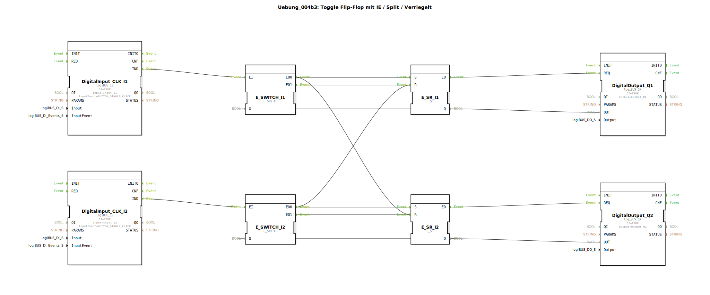

# Uebung_004b3: Toggle Flip-Flop mit IE / Split / Verriegelt


[](https://notebooklm.google.com/notebook/a6872e59-1dfc-4132-a118-aff1bc7bc944)

Dieser Artikel beschreibt die logiBUS®-Übung `Uebung_004b3`. Diese Übung erweitert das zweikanalige System um eine gegenseitige Verriegelung: Es kann immer nur maximal eine Lampe gleichzeitig leuchten.

----


## Ziel der Übung

Implementierung einer exklusiven Auswahl-Logik. Das Einschalten eines Kanals muss zwangsläufig das Ausschalten des anderen Kanals zur Folge haben. Dies ist eine Standardanforderung bei der Auswahl von Betriebsmodi oder Fahrtrichtungen.

-----

## Beschreibung und Komponenten

[cite_start]Die Subapplikation `Uebung_004b3.SUB` basiert auf dem Aufbau von 004b2, führt jedoch zusätzliche Ereignisverbindungen zur Verriegelung ein[cite: 1].

### Funktionsbausteine (FBs)




  * Identisch zu 004b2: Taster `I1`/`I2`, Weichen `E_SWITCH_I1`/`I2`, Speicher `E_SR_I1`/`I2`.

-----

## Funktionsweise

Die Besonderheit liegt in der "Über-Kreuz-Verbindung" der Setz-Ereignisse:

```xml
<EventConnections>
    <!-- Normale Toggle-Logik Kanal 1 -->
    <Connection Source="E_SWITCH_I1.EO0" Destination="E_SR_I1.S"/>
    <Connection Source="E_SWITCH_I1.EO1" Destination="E_SR_I1.R"/>
    
    <!-- Verriegelung: Wenn Kanal 1 einschaltet (EO0), schalte Kanal 2 aus! -->
    <Connection Source="E_SWITCH_I1.EO0" Destination="E_SR_I2.R"/>
    
    <!-- Verriegelung: Wenn Kanal 2 einschaltet (EO0), schalte Kanal 1 aus! -->
    <Connection Source="E_SWITCH_I2.EO0" Destination="E_SR_I1.R"/>
</EventConnections>
```

[cite_start][cite: 1]

Der funktionale Ablauf:
1.  Lampe 1 ist an, Lampe 2 ist aus.
2.  Nutzer drückt Taster 2 (`I2`).
3.  Die Weiche von Kanal 2 erkennt "Lampe 2 ist aus" und feuert das Ereignis zum Einschalten (`EO0`).
4.  Dieses Ereignis geht einerseits an den Speicher von Kanal 2 (`Setzen`) ➡️ Lampe 2 geht an.
5.  Gleichzeitig geht das selbe Ereignis an den Reset-Eingang von Kanal 1 ➡️ Lampe 1 geht sofort aus.

Ergebnis: Durch das Einschalten einer Funktion wird die andere automatisch deaktiviert.

-----

## Anwendungsbeispiel

**Betriebsarten-Wahl**: Eine Anlage kann entweder im Modus "Automatik" (`Q1`) oder im Modus "Handbetrieb" (`Q2`) laufen. Sobald der Bediener auf Handbetrieb umschaltet, muss die Automatik aus Sicherheitsgründen sofort gestoppt werden.