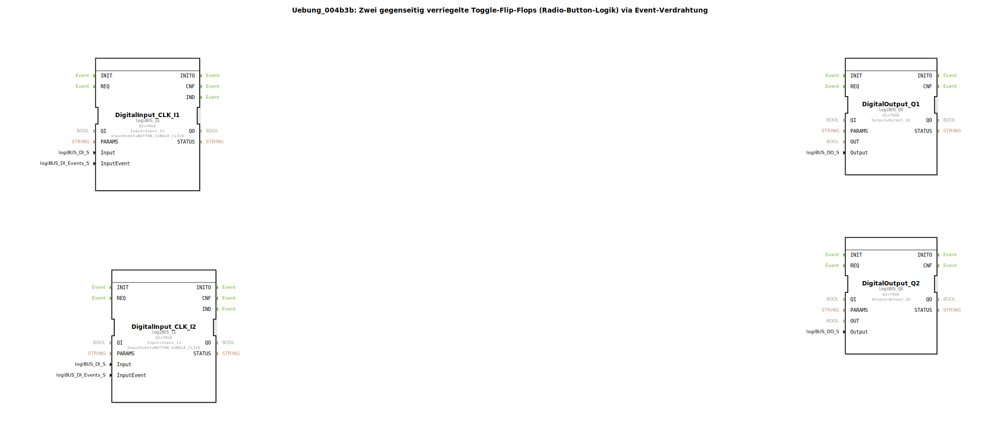

# Uebung_004b3b: Zwei gegenseitig verriegelte Toggle-Flip-Flops (Radio-Button-Logik) via Event-Verdrahtung

* * * * * * * * * *

## Einleitung

Diese Übung realisiert eine **Radio-Button-Logik** – zwei Toggle-Flip-Flops, die sich gegenseitig verriegeln.  
Durch die Ereignisverdrahtung wird sichergestellt, dass immer nur einer der beiden Ausgänge (`Q1` oder `Q2`) aktiv sein kann.  
Ein Tastendruck auf den zugehörigen Eingang setzt das entsprechende Flip-Flop und setzt das andere gleichzeitig zurück.  
Die Logik ist als wiederverwendbare SubApplikation aufgebaut und nutzt logiBUS-Ein-/Ausgänge.

## Verwendete Funktionsbausteine (FBs)

### Sub-Bausteine: `Uebung_004b3b_sub`

Die Hauptapplikation verwendet zwei Instanzen dieses Sub-Bausteins (`Uebung_004b3b_sub1` und `Uebung_004b3b_sub2`).  
Der Sub-Baustein bildet ein **Toggle-Flip-Flop mit externem RESET-Eingang und SET-Ausgang zur Verriegelung**.

- **Typ**: SubApplikation (eigener Typ `Uebung_004b3b_sub`)
- **Schnittstelle**:
  - Ereigniseingänge: `IND` (Toggle-Impuls), `RESET` (externer Rücksetzbefehl)
  - Ereignisausgänge: `EO` (Ausgangsimpuls nach Toggle), `SET` (Signal an das andere Flip-Flop zum Zurücksetzen)
  - Datenausgang: `Q` (BOOL – aktueller Zustand)

- **Verwendete interne FBs**:
  - **E_SWITCH_I1**: `iec61499::events::E_SWITCH`
    - Parameter: keine
    - Ereigniseingang: `EI`
    - Daten-Eingang: `G` (BOOL)
    - Ereignisausgänge: `EO0` (wenn `G = FALSE`), `EO1` (wenn `G = TRUE`)
    - **Funktion**: Leitet den eingehenden Ereignisimpuls abhängig vom Wert von `G` entweder auf `EO0` oder `EO1`.
  - **E_SR_I1**: `iec61499::events::E_SR`
    - Parameter: keine
    - Ereigniseingänge: `S` (Set), `R` (Reset)
    - Ereignisausgang: `EO` (wird bei jedem Set- oder Reset-Ereignis ausgelöst)
    - Datenausgang: `Q` (BOOL – gespeicherter Zustand)
    - **Funktion**: Set-Reset-Flip-Flop. Wird durch ein Ereignis auf `S` gesetzt (`Q = TRUE`), durch ein Ereignis auf `R` zurückgesetzt (`Q = FALSE`). Der Ausgang `EO` signalisiert eine Zustandsänderung.

- **Funktionsweise des Sub-Bausteins**:
  - Ein Ereignis auf `IND` wird durch `E_SWITCH` geleitet.  
  - Der aktuelle Zustand `Q` des Flip-Flops wird als `G` an den Switch geführt.  
    - Ist `Q = FALSE`, wird das Ereignis auf `EO0` (Set-Pfad) gegeben → setzt `E_SR`.  
    - Ist `Q = TRUE`, wird das Ereignis auf `EO1` (Reset-Pfad) gegeben → setzt `E_SR` zurück (Toggle-Verhalten).  
  - Gleichzeitig wird das Set-Ereignis (von `EO0`) auch auf den `SET`-Ausgang gelegt, um das andere Flip-Flop zu verriegeln.  
  - Der externe `RESET`-Eingang zwingt das Flip-Flop in den Zustand `Q = FALSE`.

## Programmablauf und Verbindungen

Die Verschaltung der Hauptapplikation (`Uebung_004b3b`) ist wie folgt aufgebaut:

1. **Eingänge**:  
   Zwei logiBUS-Digitaleingänge (`DigitalInput_CLK_I1` und `DigitalInput_CLK_I2`) werden mit den physikalischen Eingängen `Input_I1` und `Input_I2` verbunden.  
   Beide sind auf das Ereignis `BUTTON_SINGLE_CLICK` konfiguriert – ein Tastendruck löst ein Ereignis aus.

2. **Verbindung der Ereignisse**:  
   - Das Ereignis `IND` von `DigitalInput_CLK_I1` wird an den Sub-Baustein `Uebung_004b3b_sub1.IND` geführt.  
   - Das Ereignis `IND` von `DigitalInput_CLK_I2` wird an `Uebung_004b3b_sub2.IND` geführt.  
   - Der `SET`-Ausgang von `sub1` ist mit dem `RESET`-Eingang von `sub2` verbunden.  
   - Der `SET`-Ausgang von `sub2` ist mit dem `RESET`-Eingang von `sub1` verbunden.  
   *Dies bewirkt die gegenseitige Verriegelung: Sobald ein Flip-Flop gesetzt wird, wird das andere zurückgesetzt.*

3. **Ausgänge**:  
   - Der `Q`-Ausgang von `sub1` wird an den logiBUS-Digitalausgang `DigitalOutput_Q1` (`Output_Q1`) übergeben.  
   - Der `Q`-Ausgang von `sub2` wird an `DigitalOutput_Q2` (`Output_Q2`) übergeben.  
   - Die Ausgangsimpulse (`EO`) der Sub-Bausteine triggern die zugehörigen Ausgangsbausteine über die `REQ`-Eingänge.

**Ablauf Beispiel**:  
- Drückt man die Taste an `I1`, wird `sub1` getoggelt: Ist `Q1` aus, wird es eingeschaltet; der `SET`-Ausgang setzt `sub2` zurück.  
- Ist `Q1` bereits an, schaltet es aus, ohne das andere zu beeinflussen.  
- Ein Tastendruck auf `I2` verhält sich analog.

**Lernziele**:  
- Verständnis von Ereignisverdrahtung in IEC 61499  
- Aufbau einer gegenseitigen Verriegelung (Radio-Button)  
- Verwendung von Toggle-Flip-Flops mit externem Reset  
- Arbeit mit logiBUS-Ein-/Ausgangsbausteinen  

**Schwierigkeitsgrad**: Mittel  
**Vorkenntnisse**: Grundlagen der ereignisgesteuerten Logik, Umgang mit 4diac-IDE und logiBUS.

## Zusammenfassung

Die Übung `Uebung_004b3b` demonstriert eine elegante Realisierung einer Radio-Button-Logik durch zwei miteinander verriegelte Toggle-Flip-Flops.  
Die Kernidee besteht darin, die `SET`-Ausgänge der Sub-Bausteine kreuzweise mit den `RESET`-Eingängen zu verbinden, sodass nur ein Ausgang gleichzeitig aktiv sein kann.  
Dank der modularen Sub-Applikation lässt sich die Logik leicht auf mehrere Kanäle erweitern.