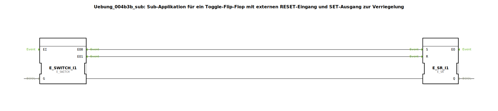

# Uebung_004b3b_sub: Sub-Applikation für ein Toggle-Flip-Flop mit externen RESET-Eingang und SET-Ausgang zur Verriegelung

* * * * * * * * * *

## Einleitung

Diese Sub-Applikation realisiert ein Toggle-Flip-Flop mit einem externen RESET-Eingang und einem SET-Ausgang zur Verriegelung. Sie dient als wiederverwendbarer Baustein für Anwendungen, bei denen ein Ausgangszustand bei jedem Ereignis umgeschaltet wird und bei Bedarf zurückgesetzt werden kann.

## Verwendete Funktionsbausteine (FBs)

Die Sub-Applikation enthält zwei Funktionsbausteine:

### E_SWITCH (IEC 61499 Ereignis-Schalter)

- **Typ**: `iec61499::events::E_SWITCH`
- **Verwendete interne FBs** (keine weiteren Sub-Bausteine vorhanden)
- **Ereigniseingänge**: `EI` (Ereigniseingang)
- **Ereignisausgänge**: `EO0` (wenn Eingangsbedingung `G` = TRUE), `EO1` (wenn `G` = FALSE)
- **Dateneingang**: `G` (BOOL – Steuersignal)
- **Funktionsweise**: Der Baustein leitet ein eingehendes Ereignis an `EO0` weiter, wenn der Datenwert `G` den Zustand TRUE hat, andernfalls an `EO1`. Er fungiert als bedingtes Ereignis-Tor.

### E_SR (IEC 61499 Set-Reset-Flip-Flop)

- **Typ**: `iec61499::events::E_SR`
- **Verwendete interne FBs** (keine weiteren Sub-Bausteine vorhanden)
- **Ereigniseingänge**: `S` (Setzen), `R` (Rücksetzen)
- **Ereignisausgang**: `EO` (wird bei jeder Zustandsänderung ausgelöst)
- **Datenausgang**: `Q` (BOOL – aktueller Zustand)
- **Parameter** (Standard): keiner explizit gesetzt
- **Funktionsweise**: Der Baustein setzt den Ausgang `Q` auf TRUE, wenn ein Ereignis am Eingang `S` eintrifft; er setzt `Q` auf FALSE, wenn ein Ereignis am Eingang `R` eintrifft. Ein gleichzeitiges Ereignis an `S` und `R` hat Vorrang: `S` hat höhere Priorität.

## Programmablauf und Verbindungen

Die Sub-Applikation besitzt zwei Ereigniseingänge (`IND` und `RESET`) sowie zwei Ereignisausgänge (`EO` und `SET`) und einen Datenausgang (`Q`).

**Ereignisverbindungen**:
- Der Eingang `IND` ist mit dem Ereigniseingang `EI` des `E_SWITCH` verbunden.
- Der Ausgang `EO0` von `E_SWITCH` führt zum Setz-Eingang `S` des `E_SR` und gleichzeitig zum Sub-Applikationsausgang `SET`.
- Der Ausgang `EO1` von `E_SWITCH` ist mit dem Rücksetz-Eingang `R` des `E_SR` verbunden.
- Der Ereignisausgang `EO` von `E_SR` wird direkt zum Sub-Applikationsausgang `EO` weitergeleitet.
- Der Sub-Applikationseingang `RESET` ist ebenfalls mit dem Rücksetz-Eingang `R` des `E_SR` verbunden.

**Datenverbindungen**:
- Der Ausgang `Q` von `E_SR` ist mit dem Steuereingang `G` von `E_SWITCH` verbunden.
- Der Ausgang `Q` von `E_SR` wird auch als Sub-Applikationsausgang `Q` herausgeführt.

**Ablauf**:
1. Ein Ereignis am Eingang `IND` startet die Verarbeitung.
2. Der `E_SWITCH` prüft den aktuellen Zustand von `Q` (über das Steuersignal `G`):
   - Ist `Q` = FALSE, wird das Ereignis an `EO0` weitergegeben, sodass `E_SR` gesetzt wird (Q wird TRUE) und gleichzeitig der Ausgang `SET` aktiviert wird.
   - Ist `Q` = TRUE, wird das Ereignis an `EO1` weitergegeben, sodass `E_SR` zurückgesetzt wird (Q wird FALSE).
3. Nach jeder Zustandsänderung des `E_SR` wird ein Ereignis an `EO` ausgegeben.
4. Ein externes Ereignis am Eingang `RESET` erzwingt das Rücksetzen von `E_SR` (unabhängig vom aktuellen Zustand) und löst ebenfalls ein Ereignis an `EO` aus.

Damit realisiert die Sub-Applikation eine Toggle-Funktion: Jedes Ereignis an `IND` schaltet den Ausgang `Q` um. Der Ausgang `SET` wird bei einem Wechsel von FALSE auf TRUE aktiviert und kann zur Verriegelung (z. B. Setzen eines anderen Bausteins) verwendet werden. Der Eingang `RESET` setzt den Zustand zurück, ohne den Toggle-Zyklus zu beeinflussen.

## Zusammenfassung

In dieser Übung wurde eine Sub-Applikation zur Realisierung eines Toggle-Flip-Flops mit Reset-Möglichkeit erstellt. Die Funktionsweise basiert auf den standardisierten IEC‑61499-Bausteinen `E_SWITCH` und `E_SR`. Die Verknüpfung der Ereignis- und Datenverbindungen ermöglicht eine saubere Rückkopplung des aktuellen Zustands und eine gezielte Ausgabe eines Set-Impulses. Der Baustein kann als Grundlage für Zyklussteuerungen, Zähler oder einfache Zustandsautomaten dienen.