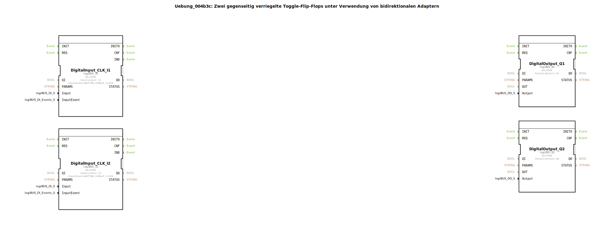

# Uebung_004b3c: Zwei gegenseitig verriegelte Toggle-Flip-Flops unter Verwendung von bidirektionalen Adaptern

(Der Übung liegt keine bildliche Darstellung bei.)

* * * * * * * * * *
## Einleitung

In dieser Übung wird eine Schaltung aus zwei verriegelten Toggle-Flip-Flops realisiert. Jedes Flip-Flop wird über einen eigenen Taster (Eingang I1 bzw. I2) umgeschaltet. Die Besonderheit liegt in der gegenseitigen Verriegelung: Immer nur eines der beiden Flip-Flops kann den logischen Zustand `TRUE` annehmen. Sobald ein Flip-Flop auf `TRUE` gesetzt wird, setzt es automatisch das andere zurück. Die Kommunikation zwischen den beiden Sub-Applikationen erfolgt über einen einzigen bidirektionalen Adapter (Typ AE2), wodurch eine sehr kompakte Verbindungsstruktur entsteht.

Die Übung demonstriert den Einsatz von bidirektionalen Adaptern zur Signalübertragung zwischen Sub-Applikationen sowie die Kopplung von Ereignis- und Datenflüssen in einer verriegelten Steuerung.

## Verwendete Funktionsbausteine (FBs)

Auf der obersten Ebene der Sub-Applikation `Uebung_004b3c` werden folgende Funktionsbausteine eingesetzt:

- **DigitalInput_CLK_I1** (Typ: `logiBUS::io::DI::logiBUS_IE`)  
  - Eingang: `Input_I1`  
  - Ereignis: `BUTTON_SINGLE_CLICK`  
  - Gibt bei einem Tastendruck ein Ereignis an `IND` aus.

- **DigitalInput_CLK_I2** (Typ: `logiBUS::io::DI::logiBUS_IE`)  
  - Eingang: `Input_I2`  
  - Ereignis: `BUTTON_SINGLE_CLICK`

- **DigitalOutput_Q1** (Typ: `logiBUS::io::DQ::logiBUS_QX`)  
  - Ausgang: `Output_Q1`  
  - Schaltet den physikalischen Ausgang Q1.

- **DigitalOutput_Q2** (Typ: `logiBUS::io::DQ::logiBUS_QX`)  
  - Ausgang: `Output_Q2`

- **Uebung_004b3b_sub1** (Typ: `Uebungen::Uebung_004b3c_sub`)  
  - Erste Instanz des verriegelbaren Toggle-Flip-Flops.

- **Uebung_004b3b_sub2** (Typ: `Uebungen::Uebung_004b3c_sub`)  
  - Zweite Instanz des verriegelbaren Toggle-Flip-Flops.

### Sub-Bausteine: `Uebung_004b3c_sub`

Diese Sub-Applikation realisiert ein verriegelbares Toggle-Flip-Flop mit einer bidirektionalen Adapterschnittstelle (AE2).

- **Typ**: SubApp  
- **Verwendete interne FBs**:  

  - **E_SWITCH_I1** (Typ: `iec61499::events::E_SWITCH`)  
    - Ereigniseingang: `EI`  
    - Dateneingang: `G` (Gate)  
    - Ereignisausgänge: `EO0` (bei G=FALSE), `EO1` (bei G=TRUE)  
    - Funktion: Leitet das eingehende Ereignis abhängig vom Wert `G` entweder an `EO0` oder `EO1`.

  - **E_SR_I1** (Typ: `iec61499::events::E_SR`)  
    - Ereigniseingänge: `S` (Set), `R` (Reset)  
    - Ereignisausgang: `EO` (nach Änderung des Ausgangs Q)  
    - Datenausgang: `Q` (BOOL)  
    - Funktion: Set-Reset-Flip-Flop. Bei Set-Ereignis wird `Q = TRUE`, bei Reset-Ereignis `Q = FALSE`.

  - **AE2_EVENT_TO_E** (Typ: `adapter::conversion::bidirectional::AE2_EVENT_TO_E`)  
    - Konvertiert ein Ereignis, das über den Adapter empfangen wird, in ein normales Ereignissignal.

  - **AE2_E_TO_EVENT** (Typ: `adapter::conversion::bidirectional::AE2_E_TO_EVENT`)  
    - Konvertiert ein normales Ereignissignal in ein Ereignis, das über den Adapter gesendet wird.

- **Funktionsweise**:  
  Der interne Toggle-Mechanismus wird durch das Set-Reset-Flip-Flop `E_SR` realisiert. Beim Eintreffen eines Ereignisses am Eingang `IND` wird durch `E_SWITCH` abhängig vom aktuellen Zustand `Q` (das auf `G` zurückgeführt ist) entschieden, ob gesetzt oder zurückgesetzt werden soll:
  - Ist `Q = FALSE` → Ereignis über `EO0` zum Set-Eingang `S` → Flip-Flop wird gesetzt.
  - Ist `Q = TRUE`  → Ereignis über `EO1` zum Reset-Eingang `R` → Flip-Flop wird zurückgesetzt.

  Parallel dazu wird bei einem Setz-Vorgang (EO0) ein Ereignis über den Adapter (`AE2_E_TO_EVENT`) an die andere Sub-Applikation gesendet, um dort ein Reset auszulösen. Das über den Adapter empfangene Ereignis von der anderen Seite (`AE2_EVENT_TO_E`) wird ebenfalls auf den Reset-Eingang geführt. Dadurch wird sichergestellt, dass immer nur eines der beiden Flip-Flops `TRUE` ist.

  Der Ausgang `Q` wird nach außen über den Datenausgang der Sub-Applikation weitergegeben.

## Programmablauf und Verbindungen

Die äußere Verschaltung der Haupt-Sub-Applikation ist wie folgt aufgebaut:

- Die Ereignisausgänge der beiden digitalen Eingänge (`DigitalInput_CLK_I1.IND` und `DigitalInput_CLK_I2.IND`) sind direkt mit den Ereigniseingängen `IND` der beiden Sub-Applikationen verbunden.
- Die Datenausgänge `Q` der Sub-Applikationen werden auf die digitalen Ausgangsbausteine `DigitalOutput_Q1` und `DigitalOutput_Q2` geführt.
- Der bidirektionale Adapter verbindet **Uebung_004b3b_sub1.PLUG** mit **Uebung_004b3b_sub2.SOCKET**. Diese einzige Verbindung reicht aus, um die gegenseitige Verriegelung zu realisieren: Immer wenn eine Sub-Applikation gesetzt wird, sendet sie ein Reset-Signal über den Adapter an die andere.

**Lernziele der Übung:**
- Verständnis des Einsatzes von bidirektionalen Adaptern zur Kopplung von Sub-Applikationen.
- Realisierung einer verriegelten Toggle-Flip-Flop-Struktur.
- Zusammenspiel von Ereignis- und Datenflüssen in IEC 61499.
- Praktischer Umgang mit Hardware-Ein-/Ausgängen (logiBUS).

**Start der Übung:**  
Die Übung kann direkt in der 4diac‑IDE geöffnet und auf die Zielhardware (z. B. logiBUS) übertragen werden. Voraussetzung ist eine korrekte Konfiguration der Ein- und Ausgangsadressen entsprechend der Hardware.

## Zusammenfassung

In dieser Übung wurde eine gegenseitig verriegelte Steuerung mit zwei Toggle-Flip-Flops realisiert. Die Verriegelung erfolgt über einen einzigen bidirektionalen Adapter, der die Reset-Signale zwischen den beiden Sub-Applikationen überträgt. Die Übung verdeutlicht, wie Adapter zur effizienten Kommunikation zwischen Sub-Applikationen genutzt werden können, und festigt das Verständnis von Ereignissteuerung, Zustandsspeicherung und Verriegelungslogik im IEC 61499‑Modell.