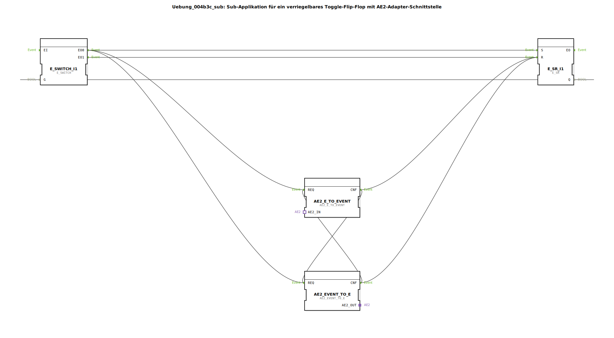

# Uebung_004b3c_sub: Sub-Applikation für ein verriegelbares Toggle-Flip-Flop mit AE2-Adapter-Schnittstelle

*Bild der Übung nicht vorhanden*

* * * * * * * * * *

## Einleitung

Diese Übung implementiert eine **Sub-Applikation für ein verriegelbares Toggle-Flip-Flop mit AE2-Adapter-Schnittstelle**.  
Das Flip-Flop kann über ein Ereignis `IND` getoggelt werden, wobei der aktuelle Zustand am Ausgang `Q` ausgegeben wird.  
Über die bidirektionalen AE2-Adapter (Plug und Socket) kann das Verhalten von externen Komponenten beeinflusst oder ausgelesen werden.

## Verwendete Funktionsbausteine (FBs)

Die Sub-Applikation besteht aus vier internen Funktionsbausteinen:

- **E_SR_I1** (Typ: `iec61499::events::E_SR`)
- **E_SWITCH_I1** (Typ: `iec61499::events::E_SWITCH`)
- **AE2_EVENT_TO_E** (Typ: `adapter::conversion::bidirectional::AE2_EVENT_TO_E`)
- **AE2_E_TO_EVENT** (Typ: `adapter::conversion::bidirectional::AE2_E_TO_EVENT`)

Keine weiteren Sub-Applikationen oder Sub-Bausteine sind enthalten.

### Details zu den Funktionsbausteinen

#### E_SR_I1 (Set-Reset Flip-Flop)
- **Typ**: `iec61499::events::E_SR`
- **Parameter**: Keine gesetzt
- **Ereigniseingänge**: `S` (Set), `R` (Reset)
- **Ereignisausgänge**: `EO` (Ereignis nach Zustandsänderung)
- **Datenausgang**: `Q` (aktueller Zustand, BOOL)
- **Funktionsweise**:  
  Das E_SR speichert einen booleschen Zustand. Ein Ereignis am `S`-Eingang setzt `Q = TRUE`, ein Ereignis am `R`-Eingang setzt `Q = FALSE`. Nach jeder Änderung wird am Ausgang `EO` ein Ereignis ausgegeben.

#### E_SWITCH_I1 (Ereignis-Weiche)
- **Typ**: `iec61499::events::E_SWITCH`
- **Parameter**: Keine gesetzt
- **Ereigniseingänge**: `EI` (Eingangsereignis)
- **Daten-Eingang**: `G` (Steuersignal, BOOL)
- **Ereignisausgänge**: `EO0` (wird ausgelöst wenn `G = FALSE`), `EO1` (wird ausgelöst wenn `G = TRUE`)
- **Funktionsweise**:  
  Ein Ereignis am Eingang `EI` wird je nach Wert des `G`-Eingangs entweder an `EO0` (bei `G = FALSE`) oder an `EO1` (bei `G = TRUE`) weitergeleitet.

#### AE2_EVENT_TO_E (Adapter: AE2-Ereignis → 4diac-Ereignis)
- **Typ**: `adapter::conversion::bidirectional::AE2_EVENT_TO_E`
- **Parameter**: Keine gesetzt
- **Ereigniseingänge**: `REQ` (Anforderung zur Konvertierung)
- **Adapter-Eingang**: `AE2_IN` (vom Typ AE2 – bidirektional)
- **Adapter-Ausgang**: `AE2_OUT`
- **Datenausgang**: Kein eigener Datenausgang (das konvertierte Ereignis wird intern weitergegeben)
- **Funktionsweise**:  
  Wandelt ein eingehendes AE2-Adapter-Ereignis (vom Socket) in ein internes 4diac-Ereignis um. Dazu muss der `REQ`-Eingang aktiviert werden; nach erfolgreicher Konvertierung wird ein `CNF`-Ereignis ausgegeben.

#### AE2_E_TO_EVENT (Adapter: 4diac-Ereignis → AE2-Ereignis)
- **Typ**: `adapter::conversion::bidirectional::AE2_E_TO_EVENT`
- **Parameter**: Keine gesetzt
- **Ereigniseingänge**: `REQ` (Anforderung zur Konvertierung)
- **Adapter-Eingang**: `AE2_IN` (bidirektional zum Socket/Plug)
- **Adapter-Ausgang**: `AE2_OUT`
- **Datenausgang**: Kein eigener Datenausgang
- **Funktionsweise**:  
  Wandelt ein internes 4diac-Ereignis (ausgelöst durch `REQ`) in ein AE2-Adapter-Ereignis um, das über den Adapterausgang `AE2_OUT` an den Plug gesendet wird. Nach Abschluss wird ein `CNF`-Ereignis ausgegeben.

## Programmablauf und Verbindungen

Die Sub-Applikation realisiert eine **verriegelbare Toggle-Funktion** mit folgenden Abläufen:

1. **Eingangsereignis `IND`** erreicht den Baustein `E_SWITCH_I1` am Ereigniseingang `EI`.
2. Der Steuereingang `G` des Switches wird durch den aktuellen Zustand `Q` des `E_SR` gespeist.
   - Ist `Q = FALSE` (Zustand aus), wird das Ereignis über `EO0` an den `S`-Eingang des `E_SR` geleitet → `Q` wird gesetzt (Toggle aus → ein).
   - Ist `Q = TRUE` (Zustand ein), wird das Ereignis über `EO1` an den `R`-Eingang des `E_SR` geleitet → `Q` wird zurückgesetzt (Toggle ein → aus).
3. Nach jeder Zustandsänderung gibt das `E_SR` ein Ereignis an `EO` (Ausgang der Sub-App) und aktualisiert `Q`.
4. **Verriegelung über den AE2-Adapter**:  
   Parallel zu den direkten Verbindungen werden die Adapter-Konverter angesteuert:
   - Jedes Ereignis von `E_SWITCH.EO0` löst gleichzeitig `AE2_EVENT_TO_E` und `AE2_E_TO_EVENT` aus (über die dargestellten Ereignisverbindungen).
   - Die beiden Konverter sind kreuzweise miteinander verbunden, sodass ein Ereignis von einem zum anderen weitergeleitet wird (siehe EventConnections im Netzwerk).  
   - Dies ermöglicht es, dass ein externer Adapter (z.B. ein weiteres System) das Toggle-Verhalten beeinflussen oder überwachen kann.  
   - Der konkrete Effekt hängt davon ab, welche Geräte oder Logiken über den Plug (Ausgang) bzw. Socket (Eingang) angeschlossen sind.

**Lernziele:**  
- Verständnis diskreter Zustandsautomaten (Set-Reset Flip-Flop) und deren Ereignissteuerung.  
- Einsatz von Adapter-Konvertern für die Kommunikation zwischen 4diac und externen Systemen (AE2).  
- Verriegelung eines Toggle-Vorgangs durch Kombination von E_SWITCH und Rückkopplung.

**Voraussetzungen:**  
- Grundlegende Kenntnisse der 4diac-IDE, Ereignis-/Datenflüsse und des AE2-Protokolls.

**Start der Übung:**  
- Die Sub-Applikation kann in ein 4diac-Projekt integriert und mit einer passenden Applikation (mit IND-Ereignisquelle und Q-Auswertung) getestet werden.

## Zusammenfassung

Die Übung **Uebung_004b3c_sub** demonstriert den Aufbau eines verriegelbaren Toggle-Flip-Flops unter Verwendung von Standard-Funktionsbausteinen (E_SR, E_SWITCH) und bidirektionaler AE2-Adapter-Konverter.  
Die Schaltung toggelt bei jedem ankommenden Ereignis `IND` den Ausgang `Q` und erlaubt gleichzeitig eine externe Beeinflussung über die AE2-Schnittstelle.  
Sie eignet sich als Grundbaustein für komplexere Steuerungen, die ein wechselndes Signal mit Rückmeldung an ein übergeordnetes System benötigen.