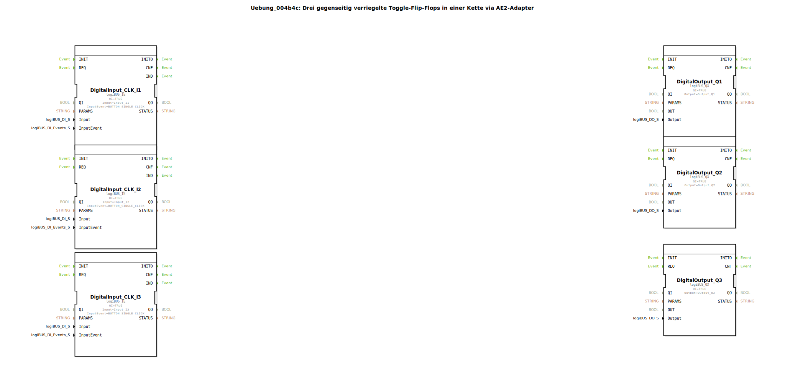

# Uebung_004b4c: Drei gegenseitig verriegelte Toggle-Flip-Flops in einer Kette via AE2-Adapter

* * * * * * * * * *

## Einleitung

Diese Übung demonstriert eine Kette aus drei gegenseitig verriegelten Toggle‑Flip‑Flops. Jedes Flip‑Flop wird über einen eigenen Taster (Single‑Click) umgeschaltet. Die Verriegelung stellt sicher, dass immer nur genau ein Ausgang aktiv ist – ähnlich wie bei einem Ringzähler mit wechselseitiger Sperre. Die Verbindung zwischen den einzelnen Stufen erfolgt über einen bidirektionalen AE2‑Adapter, sodass für die gesamte Kommunikation nur eine einzige Verbindung pro Kettenglied ausreicht.

Die Hardware besteht aus drei digitalen Eingängen (I1, I2, I3) und drei digitalen Ausgängen (Q1, Q2, Q3). Durch mehrmaliges Betätigen eines Tasters kann der aktive Ausgang weitergeschaltet werden.

## Verwendete Funktionsbausteine (FBs)

- **logiBUS::io::DI::logiBUS_IE**: Digitaler Eingang mit Ereignisauslösung.
  - Parameter: QI = TRUE (Eingang aktiv), Input = entsprechender Hardware‑Eingang (Input_I1, _I2, _I3), InputEvent = BUTTON_SINGLE_CLICK.

- **logiBUS::io::DQ::logiBUS_QX**: Digitaler Ausgang.
  - Parameter: QI = TRUE (Ausgang aktiv), Output = entsprechender Hardware‑Ausgang (Output_Q1, _Q2, _Q3).

- **SubApp Uebung_004b3c_sub** (hier dreimal instanziiert): Kernbaustein der Übung. Er realisiert ein Toggle‑Flip‑Flop mit wechselseitiger Verriegelung.

### Sub‑Bausteine: Uebung_004b3c_sub

- **Typ**: SubApp (`Uebungen::Uebung_004b3c_sub`)
- **Interne Struktur** (angenommen, basierend auf dem Aufgabentext):
  - **Verwendete interne FBs** (nicht im XML sichtbar, aber konzeptionell):
    - Ein **Toggle‑Flip‑Flop** (z. B. ein SR‑ oder JK‑Flipflop), das bei jedem Ereignis am Eingang `IND` seinen Zustand wechselt.
    - Ein **Verriegelungs‑Logikblock**, der die Ausgänge der benachbarten Stufen über den Adapter (SOCKET/PLUG) auswertet und das eigene Flip‑Flop zurücksetzt, wenn eine andere Stufe aktiv ist.
  - **Funktionsweise**:
    - Der Baustein hat einen Ereigniseingang `IND` und einen Dateneingang (vermutlich für die Verriegelung über den Adapter).
    - Bei einem positiven Ereignis (`IND`) wird der interne Zustand getoggelt. Gleichzeitig wird über den Adapter der Zustand der Nachbarstufe abgefragt. Nur wenn keine andere Stufe aktiv ist, darf der eigene Ausgang `Q` auf TRUE gehen; andernfalls wird er zurückgesetzt und gibt den Zustand an die nächste Stufe weiter.
    - Der Adapter (Plug/Socket) dient als bidirektionale Schnittstelle, sodass sowohl der Zustand der vorherigen als auch der nachfolgenden Stufe übertragen werden kann.

## Programmablauf und Verbindungen

Die drei Bausteine sind hintereinandergeschaltet:

- **Ereignisverbindungen**:
  - Jeder Taster (`DigitalInput_CLK_I1`, `_I2`, `_I3`) löst beim Drücken ein Ereignis (`IND`) aus, das direkt an die entsprechende SubApp (`Uebung_004b3b_sub1`..`_sub3`) weitergeleitet wird.
  - Der Ausgang der SubApp (`EO`) triggert den zugehörigen digitalen Ausgangsbaustein (`DigitalOutput_Q1` usw.) über dessen `REQ`-Ereigniseingang.

- **Datenverbindungen**:
  - Der Ausgangswert `Q` jeder SubApp wird direkt mit dem Datenausgang `OUT` des zugehörigen `logiBUS_QX` verbunden, sodass der Hardware‑Ausgang den aktuellen Zustand anzeigt.

- **Adapterverbindungen (Kette)**:
  - `Uebung_004b3b_sub1` (Stufe 1) verbindet seinen `PLUG` mit dem `SOCKET` von `Uebung_004b3b_sub2` (Stufe 2).
  - `Uebung_004b3b_sub2` verbindet seinen `PLUG` mit dem `SOCKET` von `Uebung_004b3b_sub3` (Stufe 3).
  - Dadurch entsteht eine logische Kette: Stufe 1 gibt ihren Zustand an Stufe 2 weiter, Stufe 2 an Stufe 3. Die bidirektionale Natur der Adapter ermöglicht es, dass sowohl Vorwärts‑ als auch Rückwärtssignale (z. B. Verriegelung) über ein einziges Kabelpaar ausgetauscht werden. Ein Kommentar im Netzwerk lautet: *„durch den Einsatz eines Bidirektionalen Adapters: 1 Verbindung REICHT!“*

Der Ablauf:  
Beim Drücken von Taster I1 wird Stufe 1 aktiviert (sofern keine andere aktiv ist). Der Zustand wandert dann bei weiteren Tastendrücken (I2 oder I3) entlang der Kette weiter. Nur ein Ausgang kann gleichzeitig TRUE sein – die Verriegelung verhindert mehrere aktive Stufen.

## Zusammenfassung

Die Übung **Uebung_004b4c** veranschaulicht die Realisierung einer gegenseitig verriegelten Toggle‑Flip‑Flop‑Kette unter Verwendung von bidirektionalen AE2‑Adaptern. Sie kombiniert digitale Ein‑/Ausgänge (logiBUS‑Bibliothek) mit einer eigens entwickelten SubApp, die das Toggle‑ und Verriegelungsverhalten kapselt. Die Kopplung über Adapter reduziert die Anzahl der benötigten Verbindungen auf eine pro Stufe und vereinfacht so die Verkabelung. Die Übung eignet sich zum Erlernen des Adapter‑Konzepts in 4diac sowie der Umsetzung von wechselseitiger Sperrlogik (Mutual Exclusion) in industriellen Steuerungen.