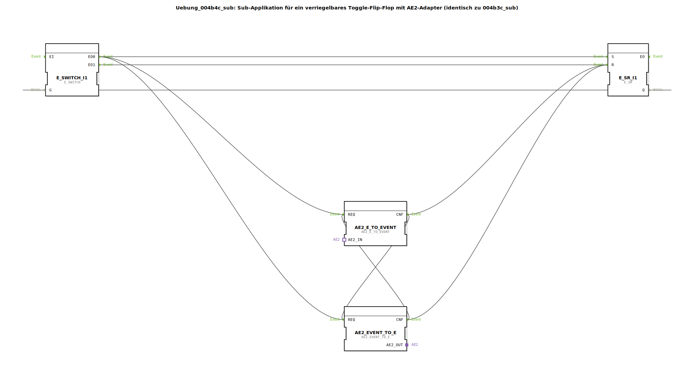

# Uebung_004b4c_sub: Sub-Applikation für ein verriegelbares Toggle-Flip-Flop mit AE2-Adapter (identisch zu 004b3c_sub)

* * * * * * * * * *

## Einleitung

Diese Übung implementiert eine Sub-Applikation für ein verriegelbares Toggle-Flip-Flop, das über einen AE2-Adapter mit anderen Komponenten kommunizieren kann. Die Schaltung entspricht der aus Übung 004b3c_sub und dient als Grundlage für das Verständnis von Ereignis-gesteuerten Zustandsänderungen mit Rückkopplung und Adapter-basierter Ein-/Ausgabe.

## Verwendete Funktionsbausteine (FBs)

Die Sub-Applikation enthält vier interne Funktionsbausteine, die über Ereignis-, Daten- und Adapterverbindungen miteinander verknüpft sind.

### Sub-Bausteine: `E_SR_I1` (Typ: `iec61499::events::E_SR`)

- **Typ**: Ereignis-gesteuertes SR-Flip-Flop (Set/Reset)
- **Verwendete interne FBs**: keine (primitive FB)
- **Parameter**: keine (Standardkonfiguration)
- **Ereigniseingänge**:
  - `S`: Set-Ereignis (setzt Ausgang `Q` auf TRUE)
  - `R`: Reset-Ereignis (setzt Ausgang `Q` auf FALSE)
- **Ereignisausgänge**:
  - `EO`: Ausgangsereignis (wird nach Verarbeitung eines Set/Reset ausgelöst)
- **Datenausgang**: `Q` (BOOL) – aktueller Zustand des Flip-Flops
- **Funktionsweise**: Der Baustein speichert einen booleschen Zustand. Bei einem Ereignis am Eingang `S` wird `Q` auf TRUE gesetzt, bei `R` auf FALSE. Nach jeder Änderung wird `EO` ausgelöst.

### Sub-Bausteine: `E_SWITCH_I1` (Typ: `iec61499::events::E_SWITCH`)

- **Typ**: Ereignisgesteuerter Umschalter (Switch)
- **Verwendete interne FBs**: keine (primitiver FB)
- **Parameter**: keine (Standard)
- **Ereigniseingang**:
  - `EI`: Eingangsereignis (wird auf einen der Ausgänge weitergeleitet)
- **Daten eingang**:
  - `G` (BOOL): Steuersignal – bei TRUE wird `EI` auf `EO0` geleitet, bei FALSE auf `EO1`
- **Ereignisausgänge**:
  - `EO0`: Ausgang bei `G = TRUE`
  - `EO1`: Ausgang bei `G = FALSE`
- **Funktionsweise**: Ein eingehendes Ereignis wird abhängig vom Wert des `G`-Eingangs an einen der beiden Ausgänge weitergegeben. Dient hier zur Unterscheidung zwischen Setzen und Zurücksetzen des Flip-Flops.

### Sub-Bausteine: `AE2_EVENT_TO_E` (Typ: `adapter::conversion::bidirectional::AE2_EVENT_TO_E`)

- **Typ**: Adapter-Konverter – wandelt ein AE2-Adapter-Ereignis in ein IEC 61499 Ereignis um
- **Verwendete interne FBs**: keine (Konverter-Baustein)
- **Parameter**: keine
- **Adapter-Eingang**: `AE2_IN` (Socket-Seite)
- **Ereignisausgang**: `CNF` (wird ausgelöst, wenn am Adapter ein Ereignis ankommt)
- **Funktionsweise**: Empfängt ein Ereignis über den AE2-Adapter (z.B. von einem externen Baustein) und gibt es als normales IEC 61499 Ereignis am Ausgang `CNF` weiter.

### Sub-Bausteine: `AE2_E_TO_EVENT` (Typ: `adapter::conversion::bidirectional::AE2_E_TO_EVENT`)

- **Typ**: Adapter-Konverter – wandelt ein IEC 61499 Ereignis in ein AE2-Adapter-Ereignis um
- **Verwendete interne FBs**: keine (Konverter-Baustein)
- **Parameter**: keine
- **Ereigniseingang**: `REQ` (normales Ereignis)
- **Adapter-Ausgang**: `AE2_OUT` (Plug-Seite)
- **Funktionsweise**: Ein eingehendes IEC 61499 Ereignis wird in ein Adapter-Ereignis umgewandelt und über den `AE2_OUT` Plug nach außen gesendet.

## Programmablauf und Verbindungen

Die Sub-Applikation arbeitet nach folgendem Ablauf:

1. Ein externes Ereignis trifft am Ereigniseingang `IND` der Sub-Applikation ein.
2. Dieses Ereignis wird dem `E_SWITCH_I1` am Eingang `EI` zugeführt.
3. Der Zustand des internen Flip-Flops (`Q` von `E_SR_I1`) wird als Steuersignal `G` an `E_SWITCH_I1` zurückgeführt.
   - Ist `Q = TRUE` (Flip-Flop gesetzt), wird das Ereignis an den Ausgang `EO0` weitergeleitet.
   - Ist `Q = FALSE` (Flip-Flop zurückgesetzt), wird das Ereignis an `EO1` weitergeleitet.
4. Der Ausgang `EO0` (bei gesetztem Zustand) führt zum Reset-Eingang `R` des Flip-Flops (über den Pfad: `EO0` → `AE2_E_TO_EVENT.REQ` → (Rückkopplung) → `AE2_EVENT_TO_E.CNF` → `E_SR_I1.R`). **Hinweis:** Die Ereigniskette ist tatsächlich wie folgt verschaltet:
   - `E_SWITCH_I1.EO0` geht zu `E_SR_I1.S` (Setzen).
   - `E_SWITCH_I1.EO1` geht zu `E_SR_I1.R` (Rücksetzen).
   - Zusätzlich sind beide Ausgänge mit den AE2-Konvertern verbunden, um die Ereignisse nach außen zu senden.
   - Die Adapter-Konverter sind kreuzweise rückgekoppelt (siehe EventConnections), sodass ein Ereignis von `AE2_E_TO_EVENT` an `AE2_EVENT_TO_E` und umgekehrt weitergegeben wird. Dies ermöglicht eine bidirektionale Kommunikation über den Adapter.

5. Nach Verarbeitung des Set- oder Reset-Ereignisses wird der Ausgang `EO` von `E_SR_I1` ausgelöst und als Sub-Applikationsausgang `EO` bereitgestellt.
6. Der aktuelle Zustand `Q` wird direkt als Ausgang `Q` der Sub-Applikation ausgegeben.

**Adapterverbindungen:**
- Der Socket `SOCKET` der Sub-Applikation ist mit `AE2_E_TO_EVENT.AE2_IN` verbunden – externe Ereignisse können so empfangen werden.
- Der Plug `PLUG` ist mit `AE2_EVENT_TO_E.AE2_OUT` verbunden – interne Ereignisse werden nach außen gesendet.

**Lernziele:**
- Verständnis von verriegelbaren Toggle-Flip-Flops (Set/Reset mit Zustandsrückkopplung).
- Einsatz von Ereignisumschaltern (`E_SWITCH`) in Abhängigkeit von Zuständen.
- Verwendung von Adapter-Konvertern zur bidirektionalen Ereigniskommunikation über AE2-Schnittstellen.
- Rückkopplung von Ereignissen über mehrere Konverterstufen.

**Schwierigkeitsgrad:** Fortgeschritten  
**Vorkenntnisse:** Funktionsweise von SR-Flip-Flops, Ereignisgesteuerte Bausteine, Adapter-Konzepte in 4diac.

## Zusammenfassung

Die Übung 004b4c_sub zeigt den Aufbau eines verriegelbaren Toggle-Flip-Flops, das seinen Zustand nur bei jedem zweiten Eingangsereignis wechselt (Toggle). Die Verriegelung wird durch die Rückkopplung des aktuellen Zustands auf den Eingang eines `E_SWITCH` realisiert. Über die AE2-Adapterplugs und -Sockets ist die Sub-Applikation in der Lage, mit anderen Komponenten Ereignisse auszutauschen, was sie ideal für verteilte Automatisierungssysteme macht.

* * * * * * * * * *