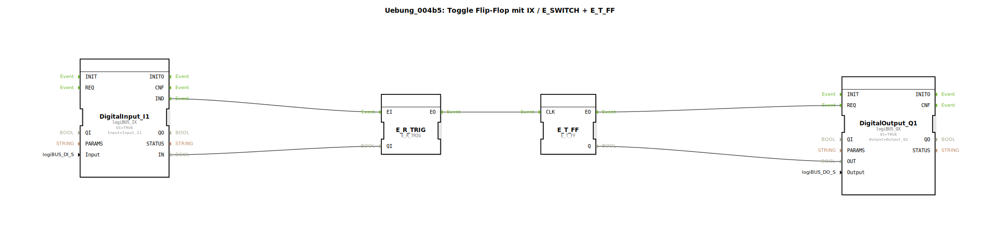

# Uebung_004b5: Toggle Flip-Flop mit IX / E_SWITCH + E_T_FF

* * * * * * * * * *
## Einleitung
Diese Übung demonstriert die Realisierung eines Toggle-Flipflops (T-FF) mithilfe der Funktionsbausteine `E_R_TRIG` (Flankenerkennung steigend) und `E_T_FF` (Toggle-Flipflop). Ein digitaler Eingang (IX) wird als Taster verwendet – jede steigende Flanke am Eingang schaltet den digitalen Ausgang (QX) um (toggle). Der Aufbau eignet sich z. B. zum Ein- und Ausschalten einer Leuchte mit einem einzelnen Taster.

## Verwendete Funktionsbausteine (FBs)
Die Subapplikation besteht aus vier Funktionsbausteinen:

- **DigitalInput_I1**: Typ `logiBUS::io::DI::logiBUS_IX`  
  - **Beschreibung**: Liest einen digitalen Eingang vom Feldbus (z. B. einen Taster).  
  - **Parameter**: `QI = TRUE` (Qualität des Eingangs aktiv), `Input = Input_I1` (physikalischer Kanal).  
  - **Ereignisausgänge**: `IND` (wird ausgelöst, wenn sich der Eingangszustand ändert).  
  - **Datenausgang**: `IN` (aktueller digitaler Wert).  

- **E_R_TRIG**: Typ `iec61499::events::E_R_TRIG`  
  - **Beschreibung**: Erkennt eine steigende Flanke des Eingangssignals.  
  - **Eingänge**:  
    - Ereignis: `EI` (Start der Verarbeitung).  
    - Daten: `QI` (Qualität des Eingangswerts, hier mit `DigitalInput_I1.IN` verbunden).  
  - **Ausgänge**:  
    - Ereignis: `EO` (wird genau bei einer steigenden Flanke von `QI` ausgelöst).  

- **E_T_FF**: Typ `iec61499::events::E_T_FF`  
  - **Beschreibung**: Toggle-Flipflop – bei jedem Ereignis am Eingang `CLK` wird der interne Zustand invertiert.  
  - **Eingänge**:  
    - Ereignis: `CLK` (Takt, hier von `E_R_TRIG.EO` gespeist).  
  - **Ausgänge**:  
    - Ereignis: `EO` (wird nach Zustandswechsel einmal ausgelöst).  
    - Daten: `Q` (aktueller Zustand des Flipflops, TRUE/FALSE).  

- **DigitalOutput_Q1**: Typ `logiBUS::io::DQ::logiBUS_QX`  
  - **Beschreibung**: Setzt einen digitalen Ausgang am Feldbus (z. B. eine Leuchte).  
  - **Parameter**: `QI = TRUE` (Ausgang freigegeben), `Output = Output_Q1` (physikalischer Kanal).  
  - **Ereigniseingänge**: `REQ` (Anforderung zum Beschreiben des Ausgangs).  
  - **Dateneingang**: `OUT` (gewünschter digitaler Wert).  

## Programmablauf und Verbindungen
Die Subapplikation ist als ereignisgesteuerte Kette realisiert:

1. **Eingangsänderung**: Der Baustein `DigitalInput_I1` überwacht den physikalischen Eingang. Sobald sich der Zustand ändert, wird das Ereignis `IND` ausgelöst.
2. **Flankenerkennung**: Das Ereignis `IND` wird an den Ereigniseingang `EI` von `E_R_TRIG` weitergeleitet (**Event-Verbindung**: `DigitalInput_I1.IND → E_R_TRIG.EI`). Parallel dazu wird der aktuelle digitale Wert (`DigitalInput_I1.IN`) an den Dateneingang `QI` von `E_R_TRIG` übergeben (**Data-Verbindung**: `DigitalInput_I1.IN → E_R_TRIG.QI`).  
   `E_R_TRIG` prüft, ob der Wert von `QI` eine steigende Flanke (Wechsel von FALSE auf TRUE) aufweist. Ist dies der Fall, wird am Ausgang `EO` ein Ereignis erzeugt.
3. **Toggle-Flipflop**: Das Ereignis `EO` von `E_R_TRIG` triggert den Takteingang `CLK` von `E_T_FF` (**Event-Verbindung**: `E_R_TRIG.EO → E_T_FF.CLK`). Bei jedem Takt wechselt der Zustand des Flipflops. Das Ergebnis steht am Datenausgang `Q` zur Verfügung. Gleichzeitig wird das Ausgangsereignis `EO` von `E_T_FF` ausgelöst.
4. **Ausgang setzen**: Das Ereignis `EO` von `E_T_FF` wird an den `REQ`-Eingang von `DigitalOutput_Q1` weitergeleitet (**Event-Verbindung**: `E_T_FF.EO → DigitalOutput_Q1.REQ`). Der Flipflop-Zustand (`E_T_FF.Q`) wird als Sollwert an den Dateneingang `OUT` von `DigitalOutput_Q1` übergeben (**Data-Verbindung**: `E_T_FF.Q → DigitalOutput_Q1.OUT`). Dadurch wird der physikalische Ausgang entsprechend gesetzt.

**Lernziele**:  
- Verständnis ereignisgesteuerter Abläufe in 4diac.  
- Einsatz eines Flankenerkennungsbausteins (`E_R_TRIG`).  
- Realisierung eines Toggle-Flipflops mit `E_T_FF`.  
- Kopplung von digitalen Ein-/Ausgängen über logiBUS.

**Schwierigkeitsgrad**: Einsteiger (nach Kenntnis grundlegender FB-Typen).

**Vorkenntnisse**: Grundlegender Umgang mit 4diac‑IDE, Kenntnis von Event- und Datenverbindungen.

## Zusammenfassung
Mit dieser Übung wurde eine typische Taster‑Schalter‑Funktion (Toggle) umgesetzt. Durch die Kombination von `E_R_TRIG` und `E_T_FF` wird jede steigende Flanke am Eingang erkannt und der Ausgangszustand umgeschaltet. Die Bausteine sind lose gekoppelt – ein Vorteil der ereignisgesteuerten Programmierung. Die Subapplikation kann direkt in ein 4diac-Projekt eingebunden und auf einem entsprechenden Zielsystem (mit logiBUS‑Anbindung) ausgeführt werden.