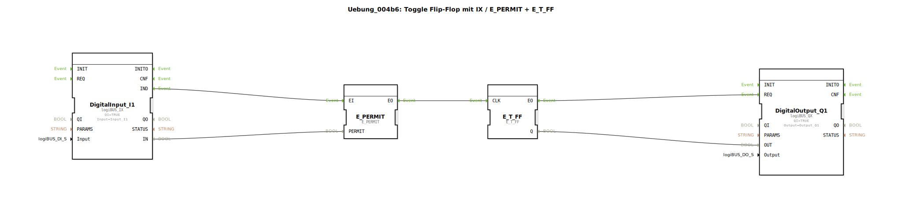

# Uebung_004b6: Toggle Flip-Flop mit IX / E_PERMIT + E_T_FF

* * * * * * * * * *

## Einleitung
Diese Übung realisiert einen Toggle-Flip-Flop (T-FF) mithilfe eines digitalen Eingangs (logiBUS_IX) und der Funktionsbausteine **E_PERMIT** und **E_T_FF**.  
Der digitale Eingang dient als Freigabesignal (PERMIT) für einen Takt, der den Zustand des Flip-Flops wechselt. Der Ausgang wird auf einen digitalen Ausgang (logiBUS_QX) geschaltet.

## Verwendete Funktionsbausteine (FBs)

### DigitalInput_I1
- **Typ**: `logiBUS::io::DI::logiBUS_IX`
- **Parameter**:
  - `QI` = `TRUE`
  - `Input` = `Input_I1`
- **Funktion**: Liest den Zustand des angeschlossenen digitalen Eingangssignals und stellt den Wert am Datenausgang `IN` bereit. Bei einer Signaländerung wird das Ereignis `IND` ausgelöst.

### E_PERMIT
- **Typ**: `iec61499::events::E_PERMIT`
- **Parameter**: keine
- **Ereigniseingang/-ausgang**:
  - `EI` (Ereigniseingang)
  - `EO` (Ereignisausgang)
- **Dateneingang**:
  - `PERMIT` (BOOL)
- **Funktion**: Gibt ein an `EI` eingehendes Ereignis nur dann am Ausgang `EO` weiter, wenn der Wert von `PERMIT` = `TRUE` ist. Dient als Freigabeglied.

### E_T_FF
- **Typ**: `iec61499::events::E_T_FF`
- **Parameter**: keine
- **Ereigniseingang/-ausgang**:
  - `CLK` (Ereigniseingang)
  - `EO` (Ereignisausgang)
- **Datenausgang**:
  - `Q` (BOOL)
- **Funktion**: Toggle-Flip-Flop. Bei jedem Takt (Ereignis an `CLK`) wechselt der Ausgang `Q` seinen Zustand (toggle). Gleichzeitig wird das Ereignis `EO` ausgelöst.

### DigitalOutput_Q1
- **Typ**: `logiBUS::io::DQ::logiBUS_QX`
- **Parameter**:
  - `QI` = `TRUE`
  - `Output` = `Output_Q1`
- **Funktion**: Setzt den digitalen Ausgang gemäß dem am Datenausgang `OUT` anliegenden Wert. Die Aktualisierung erfolgt durch das Ereignis `REQ`.

## Programmablauf und Verbindungen

**Event-Verbindungen**:
- `DigitalInput_I1.IND` → `E_PERMIT.EI`
- `E_PERMIT.EO` → `E_T_FF.CLK`
- `E_T_FF.EO` → `DigitalOutput_Q1.REQ`

**Datenverbindungen**:
- `DigitalInput_I1.IN` → `E_PERMIT.PERMIT`
- `E_T_FF.Q` → `DigitalOutput_Q1.OUT`

**Ablauf**:  
Sobald sich der Digitaleingang ändert, wird das Ereignis `IND` ausgelöst. Der aktuelle Zustand des Eingangs (`IN`) wird als `PERMIT` an den Baustein `E_PERMIT` übergeben.  
- Ist `PERMIT = TRUE`, wird das Ereignis an den Takt-Eingang (`CLK`) des Toggle-Flip-Flops weitergeleitet.  
- Der `E_T_FF` toggelt daraufhin seinen Ausgang `Q`.  
- Gleichzeitig wird das Ereignis `EO` von `E_T_FF` an den Digitalausgang gesendet, der den neuen Wert von `Q` übernimmt.

**Lernziele**:
- Verständnis des Toggle-Flip-Flop (T-FF)
- Anwendung des Freigabebausteins `E_PERMIT`
- Zusammenspiel von Ereignis- und Datenflüssen in IEC 61499

**Schwierigkeitsgrad**: Mittel  
**Vorkenntnisse**: Grundlagen der ereignisgesteuerten Logik und digitaler Ein-/Ausgänge

**Starten der Übung**:  
Fügen Sie die SubApp `Uebung_004b6` in ein 4diac-Projekt ein, verbinden Sie die Hardware-Ressourcen (z. B. physischen Eingang `Input_I1` und Ausgang `Output_Q1`) und führen Sie die Applikation aus.

## Zusammenfassung
Die Übung demonstriert einen Toggle-Flip-Flop, der nur bei aktivem digitalen Eingang seinen Zustand wechselt. Durch die Kombination von `E_PERMIT` und `E_T_FF` kann eine Freigabe für den Takt realisiert werden – nützlich für Anwendungen wie entprellte Taster oder Betriebsartenumschaltung.