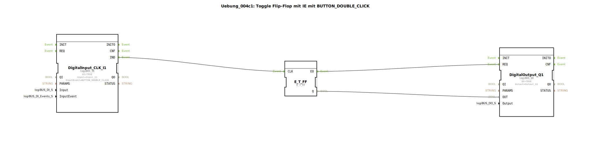

# Uebung_004c1: Toggle Flip-Flop mit IE mit BUTTON_DOUBLE_CLICK

Dieser Artikel beschreibt die logiBUS®-Übung `Uebung_004c1`. Ab hier widmen wir uns den erweiterten Fähigkeiten des `logiBUS_IE` Bausteins, der komplexe Taster-Muster erkennen kann.

----

## Ziel der Übung

Nutzung des Ereignisses `BUTTON_DOUBLE_CLICK` zur Steuerung einer Speicherfunktion.

-----

## Beschreibung und Komponenten

[cite_start]Die Subapplikation `Uebung_004c1.SUB` schaltet eine Lampe nur bei einem Doppelklick um[cite: 1].

### Funktionsbausteine (FBs)

  * **`DigitalInput_CLK_I1`**: Typ `logiBUS_IE`. Dieser ist im Parameter `InputEvent` auf `BUTTON_DOUBLE_CLICK` konfiguriert.
  * **`E_T_FF`**: Das Toggle-Flip-Flop.

-----

## Funktionsweise

Der Eingangsbaustein überwacht das zeitliche Muster am Hardware-Pin `I1`.
1.  Ein einfacher Tastendruck wird ignoriert (kein Event an `IND`).
2.  Werden zwei Klicks innerhalb einer definierten Zeit (meist < 500ms) erkannt, feuert der Baustein **einmal** das Ereignis `IND`.
3.  Dieses Ereignis triggert das Flip-Flop, welches den Zustand der Lampe wechselt.

-----

## Anwendungsbeispiel

**Vermeidung von Fehlbedienungen**: Kritische Befehle (wie z.B. "Alle Motoren Stopp" oder "Daten löschen") können auf einen Doppelklick gelegt werden, damit ein versehentliches Berühren des Tasters keine Folgen hat.