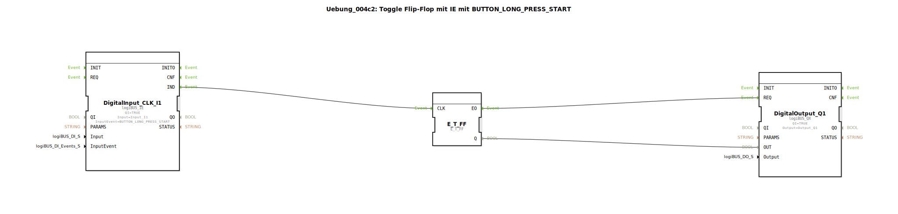

# Uebung_004c2: Toggle Flip-Flop mit IE mit BUTTON_LONG_PRESS_START

Dieser Artikel beschreibt die logiBUS®-Übung `Uebung_004c2`.

----

## Ziel der Übung

Nutzung des Ereignisses `BUTTON_LONG_PRESS_START`.

-----

## Funktionsweise

[cite_start]Der Baustein `DigitalInput_CLK_I1` in `Uebung_004c2.SUB` reagiert auf langes Drücken[cite: 1].

Das Ereignis `IND` wird genau in dem Moment gefeuert, in dem die vordefinierte Zeit für einen "langen Druck" (z.B. 1 Sekunde) abgelaufen ist – auch wenn der Taster danach noch weiter gedrückt bleibt. Ein kurzes Tippen löst hier kein Ereignis aus.

-----

## Anwendungsbeispiel

**Menü-Navigation**: In vielen Steuerungen gelangt man durch einen kurzen Klick zur nächsten Seite, während ein langer Druck (`LONG_PRESS_START`) das Setup-Menü öffnet.