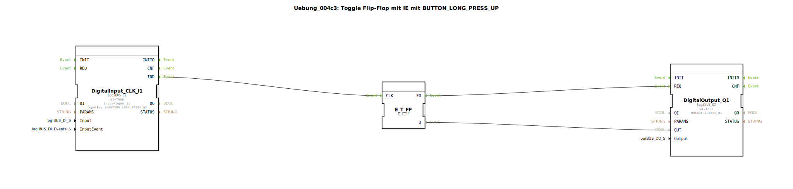

# Uebung_004c3: Toggle Flip-Flop mit IE mit BUTTON_LONG_PRESS_UP

Dieser Artikel beschreibt die logiBUS®-Übung `Uebung_004c3`.

----

## Ziel der Übung

Nutzung des Ereignisses `BUTTON_LONG_PRESS_UP`.

-----

## Funktionsweise

[cite_start]Der Baustein `DigitalInput_CLK_I1` in `Uebung_004c3.SUB` erkennt das Ende eines langen Drucks[cite: 1].

Im Gegensatz zum `START`-Event feuert `LONG_PRESS_UP` erst dann, wenn der Nutzer den Taster **wieder loslässt**, sofern dieser vorher lange genug gedrückt wurde. Dies ermöglicht es, Aktionen genau am Ende einer Interaktion auszulösen.

-----

## Anwendungsbeispiel

**Bestätigungs-Dialog**: Der Nutzer muss eine Taste lange gedrückt halten, um sicherzugehen, dass er die Aktion will. Die Ausführung (z.B. "Motor starten") erfolgt erst beim Loslassen als finale Bestätigung.