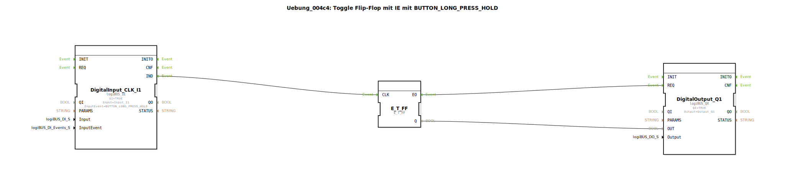

# Uebung_004c4: Toggle Flip-Flop mit IE mit BUTTON_LONG_PRESS_HOLD

Dieser Artikel beschreibt die logiBUS®-Übung `Uebung_004c4`.

----

## Ziel der Übung

Nutzung des Ereignisses `BUTTON_LONG_PRESS_HOLD`.

-----

## Funktionsweise

[cite_start]Der Baustein `DigitalInput_CLK_I1` in `Uebung_004c4.SUB` ist auf permanentes Halten konfiguriert[cite: 1].

Dieses Ereignis wird **periodisch wiederholt** (z.B. alle 200ms), solange der Taster nach der ersten Erkennung des langen Drucks weiterhin gehalten wird. Da in dieser Übung ein Toggle-Flip-Flop am Ausgang hängt, führt dies dazu, dass die Lampe schnell an- und ausgeht (Blinken), solange der Finger auf dem Taster ist.

-----

## Anwendungsbeispiel

**Wert-Inkrementierung**: Solange man eine Taste gedrückt hält, zählt ein Wert (z.B. die Zieltemperatur oder die Motordrehzahl) kontinuierlich hoch.