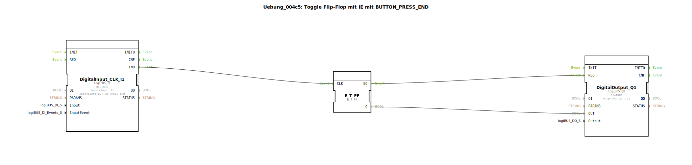

# Uebung_004c5: Toggle Flip-Flop mit IE mit BUTTON_PRESS_END

Dieser Artikel beschreibt die logiBUS®-Übung `Uebung_004c5`.

----

## Ziel der Übung

Nutzung des Ereignisses `BUTTON_PRESS_END`.

-----

## Funktionsweise

[cite_start]Der Baustein `DigitalInput_CLK_I1` in `Uebung_004c5.SUB` reagiert auf jede fallende Flanke[cite: 1].

Dieses Ereignis feuert **immer**, wenn der Taster losgelassen wird – völlig unabhängig davon, ob er vorher kurz (`CLICK`) oder lang (`LONG_PRESS`) gedrückt wurde. Es ist das universelle Ereignis für das Ende einer Interaktion.

-----

## Anwendungsbeispiel

**Sicherheits-Stopp**: Eine Funktion (z.B. ein Kranarm) bewegt sich, solange die Taste gedrückt ist. Sobald der Finger weggenommen wird (`PRESS_END`), muss die Bewegung sofort stoppen, egal wie kurz die Betätigung war.