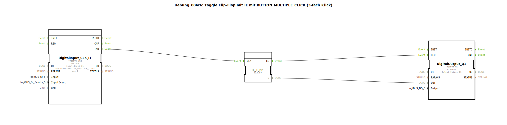

# Uebung_004c6: Toggle Flip-Flop mit IE mit BUTTON_MULTIPLE_CLICK (3-fach Klick)

Dieser Artikel beschreibt die logiBUS®-Übung `Uebung_004c6`. Hier wird der erweiterte Baustein `logiBUS_IE2` genutzt, um eine spezifische Anzahl von Klicks auszuwerten.

----

## Ziel der Übung

Konfiguration eines n-fach Klicks unter Verwendung von Argumenten.

-----

## Beschreibung und Komponenten

[cite_start]Die Subapplikation `Uebung_004c6.SUB` nutzt den Bausteintyp `logiBUS_IE2` mit dem Ereignis `BUTTON_MULTIPLE_CLICK` und dem Argument `arg = 3`[cite: 1].

-----

## Funktionsweise

Der Baustein zählt die Klicks innerhalb eines Zeitfensters. Nur wenn der Nutzer den Taster **exakt dreimal** kurz hintereinander drückt, wird das Ereignis `IND` gefeuert und die Lampe toggelt. Alle anderen Klick-Kombinationen werden verworfen.

-----

## Anwendungsbeispiel

**Versteckte Experten-Funktionen**: Zugriff auf Kalibrierungs-Modi oder Service-Menüs, die für den normalen Anwender nicht direkt ersichtlich sein sollen. Ein Triple-Click ist eine bewusste Handlung, die im normalen Betrieb kaum versehentlich vorkommt.