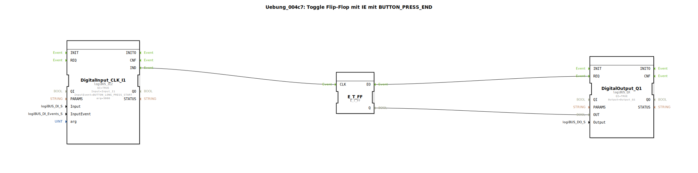

# Uebung_004c7: Toggle Flip-Flop mit IE mit BUTTON_PRESS_END

Dieser Artikel beschreibt die logiBUS®-Übung `Uebung_004c7`. Auch hier wird der Baustein `logiBUS_IE2` genutzt, um die Haltezeit für ein Ereignis individuell anzupassen.

----

## Ziel der Übung

Festlegung einer spezifischen Zeitdauer für einen langen Tastendruck.

-----

## Beschreibung und Komponenten

[cite_start]Die Subapplikation `Uebung_004c7.SUB` nutzt `logiBUS_IE2` mit `BUTTON_LONG_PRESS_START` und dem Argument `arg = 3000`[cite: 1].

-----

## Funktionsweise

Die Einheit des Arguments `arg` sind Millisekunden. Das bedeutet: Das Ereignis `IND` wird erst dann gefeuert, wenn der Taster für **mindestens 3 Sekunden** (3000ms) ununterbrochen gedrückt wurde. Dies überschreibt den im System hinterlegten Standardwert für "Long Press".

-----

## Anwendungsbeispiel

**Werkseinstellungen laden (Factory Reset)**: Eine kritische Aktion, die eine sehr bewusste und lange Interaktion des Nutzers erfordert, um versehentliche Datenverluste absolut sicher auszuschließen.