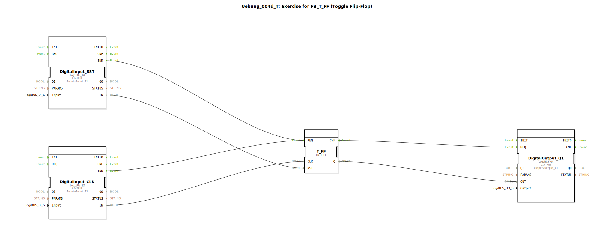

# Uebung_004d_T: Exercise for FB_T_FF (Toggle Flip-Flop)

* * * * * * * * * *

## Einleitung

Diese Übung demonstriert die Anwendung des Funktionsbausteins **FB_T_FF** (Toggle Flip-Flop).  
Ein Toggle-Flipflop ändert seinen Ausgangszustand bei jedem positiven Flanke des Taktsignals (CLK). Zusätzlich kann der Ausgang durch ein Resetsignal (RST) zurückgesetzt werden.  
In der Übung werden zwei digitale Eingänge als Takt- und Reset-Quelle verwendet, der T-FF-Baustein verarbeitet die Signale und steuert einen digitalen Ausgang. Ziel ist es, das grundlegende Umschaltverhalten eines Toggle-Flipflops in einer Automatisierungsumgebung zu verstehen.

## Verwendete Funktionsbausteine (FBs)

Die Übung besteht aus vier Funktionsbausteinen, die im SubApp-Netzwerk miteinander verbunden sind:

### DigitalInput_RST (logiBUS_IX)
- **Typ**: `logiBUS::io::DI::logiBUS_IX`
- **Parameter**:  
  `QI = TRUE` (Qualifier für Initialisierung aktiv)  
  `Input = Input_I1` (physischer Eingang der logiBUS-Klemme)
- **Funktionsweise**: Liest den digitalen Eingang `Input_I1` aus. Das Ereignis `IND` wird bei Signaländerung ausgelöst. Der gelesene Wert wird am Datenausgang `IN` bereitgestellt. Dient als Reset-Signal für das T-FF.

### DigitalInput_CLK (logiBUS_IX)
- **Typ**: `logiBUS::io::DI::logiBUS_IX`
- **Parameter**:  
  `QI = TRUE`  
  `Input = Input_I2`
- **Funktionsweise**: Liest den digitalen Eingang `Input_I2` aus. Das Ereignis `IND` wird bei Signaländerung ausgelöst. Der gelesene Wert wird am Datenausgang `IN` bereitgestellt. Dient als Taktsignal für das T-FF.

### T_FF (FB_T_FF)
- **Typ**: `logiBUS::bistableElements::FB_T_FF`
- **Parameter**: Keine expliziten Parameter, die Schnittstellen werden über Verbindungen belegt.
- **Funktionsweise**: Implementiert ein Toggle-Flipflop.  
  - **Ereigniseingang `REQ`**: Startet die Verarbeitung.  
  - **Dateneingang `CLK`**: Taktsignal (boolesch). Bei positiver Flanke von `CLK` wird der interne Zustand getoggelt.  
  - **Dateneingang `RST`**: Resetsignal (boolesch). Bei `TRUE` wird der Ausgang sofort auf `FALSE` gesetzt, unabhängig vom Takt.  
  - **Datenausgang `Q`**: Aktueller Zustand des Flipflops.  
  - **Ereignisausgang `CNF`**: Wird nach abgeschlossener Verarbeitung ausgelöst.

### DigitalOutput_Q1 (logiBUS_QX)
- **Typ**: `logiBUS::io::DQ::logiBUS_QX`
- **Parameter**:  
  `QI = TRUE`  
  `Output = Output_Q1`
- **Funktionsweise**: Empfängt den Zustand des T-FF über den Dateneingang `OUT` und gibt diesen am physischen Ausgang `Output_Q1` aus. Der Ausgang wird durch das Ereignis `REQ` aktualisiert.

## Programmablauf und Verbindungen

1. **Ereignisverkettung**:  
   - Beide Digitaleingänge (`DigitalInput_RST` und `DigitalInput_CLK`) sind über ihren Ereignisausgang `IND` mit dem Ereigniseingang `REQ` des `T_FF` verbunden.  
   - Das bedeutet: Jede Änderung eines der beiden Eingänge löst eine Verarbeitung des T-FF aus.  
   - Nach der Verarbeitung des T-FF wird der Ereignisausgang `CNF` mit dem `REQ`-Eingang des `DigitalOutput_Q1` verbunden, sodass der Ausgangswert sofort an die Hardware weitergereicht wird.

2. **Datenverkettung**:  
   - Der gelesene Wert des Reseteingangs (`DigitalInput_RST.IN`) wird auf den `RST`-Eingang des T-FF gelegt.  
   - Der gelesene Wert des Takteingangs (`DigitalInput_CLK.IN`) wird auf den `CLK`-Eingang des T-FF gelegt.  
   - Der Ausgang des T-FF (`T_FF.Q`) wird auf den `OUT`-Eingang des Digitalausgangs `DigitalOutput_Q1` verbunden.

3. **Funktionsweise im Betrieb**:  
   - Wird `Input_I2` (Takt) von `FALSE` auf `TRUE` geändert (positive Flanke), toggelt der Ausgang `Q` des T-FF.  
   - Wird gleichzeitig oder später `Input_I1` (Reset) auf `TRUE` gesetzt, wird `Q` sofort `FALSE` (asynchroner Reset).  
   - Der aktuelle Zustand von `Q` erscheint am Ausgang `Output_Q1`.

**Lernziele:**  
- Funktionsweise eines Toggle-Flipflops (T-FF) verstehen.  
- Ereignisgesteuerte Datenflussmodellierung in 4diac (IEC 61499).  
- Einfache Verbindung von Hardware-Eingängen/Ausgängen mit logischen Bausteinen.

**Schwierigkeitsgrad:** Einfach (grundlegende Übung).  
**Vorkenntnisse:** Grundlagen der Digitaltechnik, Einführung in die 4diac-IDE.

**Start der Übung:**  
1. Laden Sie das Projekt in die 4diac-IDE (die SubApp `Uebung_004d_T` ist in der Klasse `Uebungen` enthalten).  
2. Weisen Sie die Eingänge `Input_I1` und `Input_I2` sowie den Ausgang `Output_Q1` den entsprechenden logiBUS-Klemmen Ihrer Hardware zu.  
3. Starten Sie die Anwendung und beobachten Sie das Verhalten durch Anlegen von Signalen an die Eingänge.

## Zusammenfassung

Die Übung `Uebung_004d_T` zeigt den Einsatz des Funktionsbausteins `FB_T_FF` zur Realisierung eines Toggle-Flipflops. Durch die Kopplung von digitalen Eingängen, dem T-FF und einem digitalen Ausgang wird das grundlegende Schaltverhalten – Toggeln bei Taktflanke und asynchrones Rücksetzen – vermittelt. Die einfache Ereignis- und Datenverkettung macht diese Übung zu einem idealen Einstieg in die Arbeit mit bistabilen Elementen unter IEC 61499.