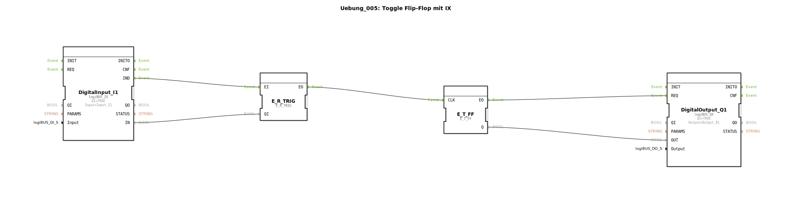

# Uebung_005: Toggle Flip-Flop mit IX


[](https://notebooklm.google.com/notebook/a6872e59-1dfc-4132-a118-aff1bc7bc944)

Dieser Artikel beschreibt die logiBUS®-Übung `Uebung_005`. Hier wird demonstriert, wie ein zustandsbasierter Hardware-Eingang (`IX`) genutzt werden kann, um ein ereignisbasiertes Toggle-Flip-Flop zu steuern.

## 🎧 Podcast




* [Automatisierung entschlüsselt: Leiten, Steuern, Regeln – Die unsichtbare Sprache der Technik (DIN IEC 60050-351)](https://podcasters.spotify.com/pod/show/ms-muc-lama/episodes/Automatisierung-entschlsselt-Leiten--Steuern--Regeln--Die-unsichtbare-Sprache-der-Technik-DIN-IEC-60050-351-e36t52b)

----


## Ziel der Übung

Verständnis der Flankenauswertung unter Verwendung von Ereignisweichen. Es wird gezeigt, wie man aus einem kontinuierlichen Signal (Taster gedrückt) einen einzelnen Impuls zum Umschalten generiert, ohne den spezialisierten `logiBUS_IE` Baustein zu verwenden.

-----

## Beschreibung und Komponenten

[cite_start]Die Subapplikation `Uebung_005.SUB` kombiniert einen Standard-Eingang (`IX`) mit einer Ereignis-Weiche, um ein Flip-Flop zu takten[cite: 1].

### Funktionsbausteine (FBs)

  * **`DigitalInput_I1`**: Typ `logiBUS_IX`. Liefert ein Ereignis bei jeder Pegeländerung (Drücken und Loslassen).
  * **`E_SWITCH`**: Dient als Gatter, um nur eine der beiden Flanken durchzulassen.
  * **`E_T_FF`**: Das Toggle-Flip-Flop.

-----

## Funktionsweise

Die Schaltung nutzt die Datenverbindung vom Eingang zum Gate der Weiche:

```xml
<EventConnections>
    <Connection Source="DigitalInput_I1.IND" Destination="E_SWITCH.EI"/>
    <Connection Source="E_SWITCH.EO1" Destination="E_T_FF.CLK"/>
</EventConnections>
<DataConnections>
    <Connection Source="DigitalInput_I1.IN" Destination="E_SWITCH.G"/>
</DataConnections>
```

[cite_start][cite: 1]

Der funktionale Ablauf:
1.  **Drücken**: `I1` wechselt von FALSE auf TRUE. Ein `IND`-Event wird gesendet. Da am Eingang `G` der Weiche nun TRUE anliegt, wird das Event an `EO1` ➡️ `CLK` weitergeleitet. Das Licht toggelt.
2.  **Loslassen**: `I1` wechselt zurück auf FALSE. Wieder wird ein `IND`-Event gesendet. Da am Eingang `G` nun aber FALSE anliegt, wird das Event an `EO0` (hier nicht verbunden) geleitet. Das Flip-Flop reagiert nicht.

Ergebnis: Die Lampe schaltet nur beim Drücken des Tasters um (steigende Flanke).

-----

## Bewertung

Dieser Aufbau verdeutlicht die Interaktion von Daten (`G`) und Events (`EI`). In der Praxis ist für diese Aufgabe jedoch die Verwendung eines `logiBUS_IE` Bausteins (siehe Übung 004a) effizienter.