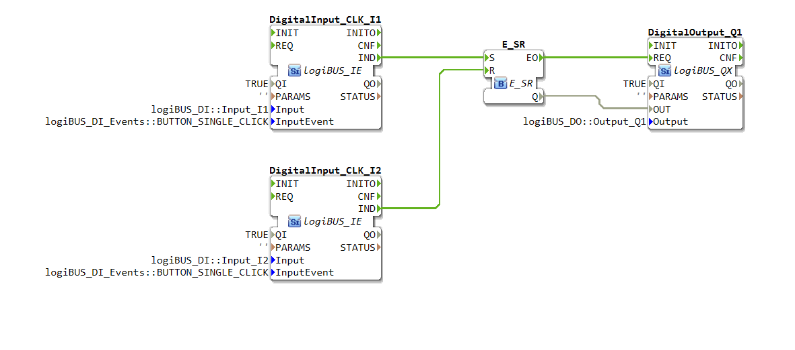
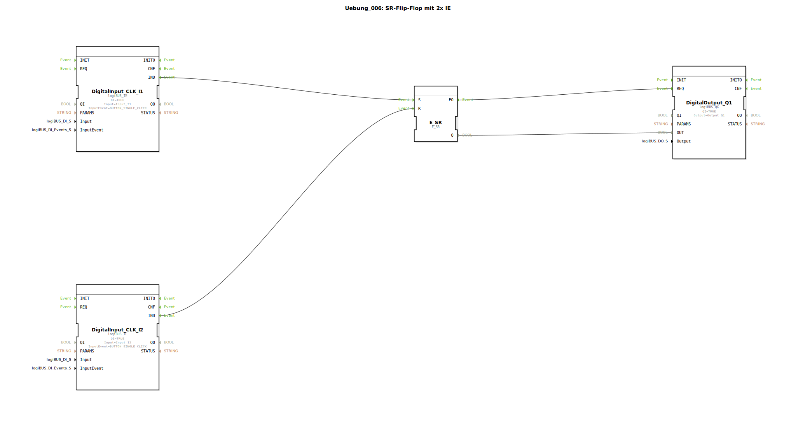

# Uebung_006: SR-Flip-Flop mit 2x IE


[](https://notebooklm.google.com/notebook/a6872e59-1dfc-4132-a118-aff1bc7bc944)

Dieser Artikel beschreibt die logiBUS®-Übung `Uebung_006`. Hier wird ein klassischer Selbsthaltespeicher mit getrennten Tastern für Ein und Aus implementiert.

----



## Ziel der Übung

Realisierung einer Schaltung mit getrennter Setz- und Rücksetz-Logik unter Verwendung von Ereignis-Bausteinen.

-----

## Beschreibung und Komponenten

[cite_start]Die Subapplikation `Uebung_006.SUB` nutzt zwei ereignisbasierte Eingänge und einen SR-Speicher[cite: 1].

### Funktionsbausteine (FBs)




  * **`I1` (Set)**: Taster zum Einschalten (konfiguriert auf Einzelklick).
  * **`I2` (Reset)**: Taster zum Ausschalten (konfiguriert auf Einzelklick).
  * **`E_SR`**: Ein ereignisbasierter Speicherbaustein. [cite_start]Ein Event am Eingang `S` (Set) setzt den Ausgang `Q` auf TRUE, ein Event am Eingang `R` (Reset) setzt ihn auf FALSE[cite: 1].

-----

## Funktionsweise

```xml
<EventConnections>
    <Connection Source="DigitalInput_CLK_I1.IND" Destination="E_SR.S"/>
    <Connection Source="DigitalInput_CLK_I2.IND" Destination="E_SR.R"/>
    <Connection Source="E_SR.EO" Destination="DigitalOutput_Q1.REQ"/>
</EventConnections>
```

[cite_start][cite: 1]

*   Ein Klick auf Taster 1 ➡️ Speicher wird gesetzt ➡️ Lampe geht an.
*   Ein Klick auf Taster 2 ➡️ Speicher wird gelöscht ➡️ Lampe geht aus.
*   Erneutes Drücken von Taster 1, wenn das Licht bereits an ist, hat keine Auswirkung.

-----

## Anwendungsbeispiel

**Industrielle Start/Stopp-Steuerung**: Ein grüner Taster startet eine Maschine, ein roter Taster stoppt sie. Dies ist sicherer als ein einzelner Toggle-Taster, da der Bediener immer einen definierten Befehl ("Ich will aus") geben kann, unabhängig vom aktuellen Zustand.