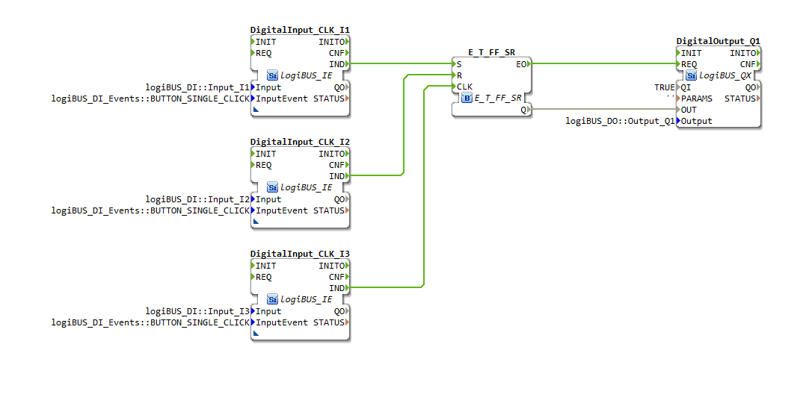
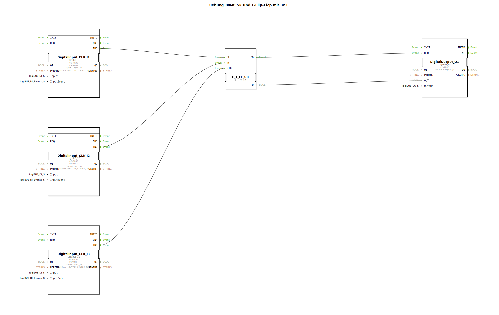

# Uebung_006a: SR und T-Flip-Flop mit 3x IE

Dieser Artikel beschreibt die logiBUS®-Übung `Uebung_006a`. Hier wird ein hochflexibler Speicherbaustein verwendet, der drei verschiedene Bedienweisen kombiniert.

----

## Ziel der Übung

Einführung des `E_T_FF_SR` Bausteins. Dieser vereint die Funktionen eines Toggle-Flip-Flops mit denen eines SR-Speichers.

-----

## Beschreibung und Komponenten

[cite_start]Die Subapplikation `Uebung_006a.SUB` verknüpft drei separate Taster mit einem zentralen Speicherglied[cite: 1].

### Funktionsbausteine (FBs)

  * **`I1` (Set)**: Schaltet den Ausgang ein.
  * **`I2` (Reset)**: Schaltet den Ausgang aus.
  * **`I3` (Toggle)**: Wechselt den aktuellen Zustand.
  * **`E_T_FF_SR`**: Der Kombi-Baustein für alle drei Ereignistypen.

-----

## Funktionsweise

Der Baustein reagiert auf jedes der drei Eingangs-Events individuell:
*   Ein Event an `S` setzt den Zustand fest auf `TRUE`.
*   Ein Event an `R` setzt den Zustand fest auf `FALSE`.
*   Ein Event an `CLK` invertiert den aktuellen Zustand (Toggle).

Alle Ereignisse führen zu einer Aktualisierung des Ausgangs `Q` und feuern das Bestätigungs-Event `EO` ab, um die Hardware anzusteuern.

-----

## Anwendungsbeispiel

**Gebäude-Lichtsteuerung**:
*   **Vor Ort**: Ein Taster im Zimmer toggelt das Licht (`I3`).
*   **Zentrale**: Am Hauseingang gibt es einen Taster "Gute Nacht", der alle Lichter per Reset (`I2`) ausschaltet.
*   **Alarmanlage**: Im Falle eines Einbruchs setzt die Zentrale alle Lichter per Set (`I1`) dauerhaft ein.