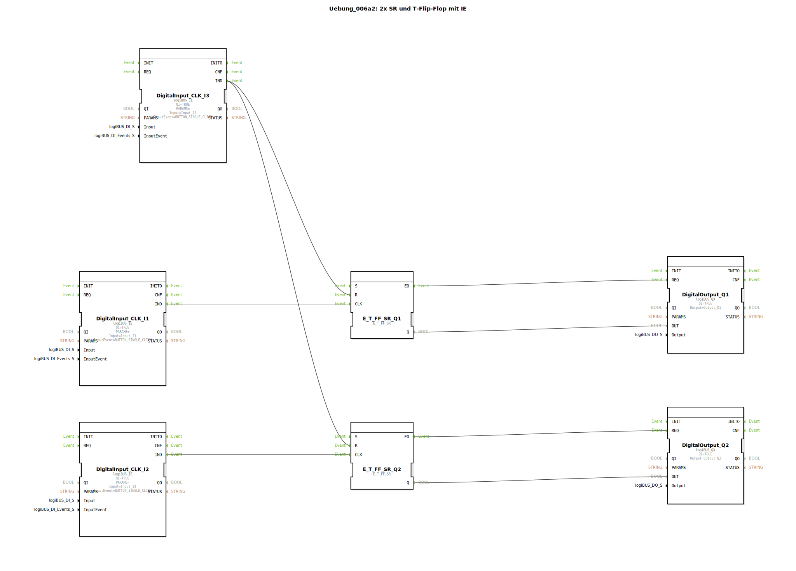

# Uebung_006a2: 2x SR und T-Flip-Flop mit IE

Dieser Artikel beschreibt die logiBUS®-Übung `Uebung_006a2`.

----

## Ziel der Übung

Realisierung einer "Zentral-Aus" Funktion für mehrere unabhängige Speicherglieder.

-----

## Beschreibung und Komponenten

[cite_start]Die Subapplikation `Uebung_006a2.SUB` steuert zwei separate Lampen (`Q1`, `Q2`) über zwei Taster (`I1`, `I2`), die durch einen dritten Taster (`I3`) gemeinsam zurückgesetzt werden können[cite: 1].

### Funktionsbausteine (FBs)

  * **2x `E_T_FF_SR`**: Einer für jeden Lichtkanal.
  * **`I1` & `I2`**: Tasten zum individuellen Umschalten der Kanäle.
  * **`I3`**: Gemeinsamer Reset-Taster.

-----

## Funktionsweise

Die Logik nutzt das Fan-Out Prinzip für Ereignisse:
*   `I1` ist mit `CLK` von Flip-Flop 1 verbunden.
*   `I2` ist mit `CLK` von Flip-Flop 2 verbunden.
*   `I3` (Reset) ist mit den `R`-Eingängen **beider** Flip-Flops verbunden.

Ein Druck auf `I3` schaltet sofort alle Lampen im System aus, unabhängig davon, in welchem Zustand sie sich vorher befanden.

-----

## Anwendungsbeispiel

**Werkstatt-Beleuchtung**: Jede Maschine hat ihr eigenes Arbeitslicht. Am Ende des Arbeitstages kann der Werkstattleiter über einen zentralen Schalter an der Tür alle Lichter gleichzeitig löschen.