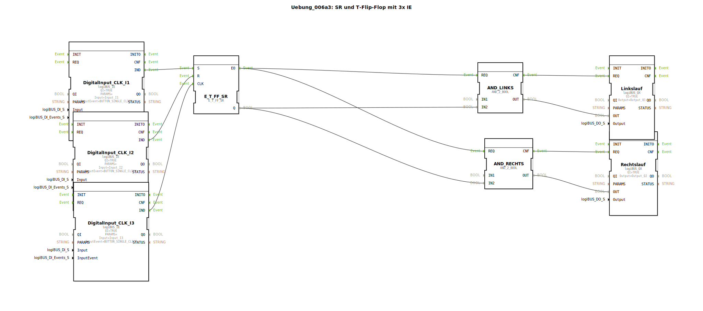

# Uebung_006a3: SR und T-Flip-Flop mit 3x IE

Dieser Artikel beschreibt die logiBUS®-Übung `Uebung_006a3`. Dies ist eine anspruchsvollere Anwendung zur Steuerung eines Motors mit zwei Drehrichtungen und automatischer Umschaltung.

----

## Ziel der Übung

Aufbau einer Steuerung für Vorwärts- und Rückwärtslauf mit Software-Verriegelung. Es muss sichergestellt werden, dass niemals beide Richtungen gleichzeitig angesteuert werden können.

-----

## Beschreibung und Komponenten

[cite_start]Die Subapplikation `Uebung_006a3.SUB` kombiniert einen Haupt-Ein/Aus-Speicher mit einer Logik zur Richtungsentscheidung[cite: 1].

### Funktionsbausteine (FBs)

  * **`E_T_FF_SR`**: Bestimmt, ob der Motor läuft (Ein/Aus).
  * **`LinksRechts_T_FF` (SubApp)**: Ein interner Merker, der bei jedem Start die Richtung wechselt.
  * **2x `AND_2_BOOL`**: Verknüpfen das "Ein"-Signal mit der gewählten Richtung.
  * **`Q1` (Linkslauf) & `Q2` (Rechtslauf)**: Die Hardware-Ausgänge.

-----

## Funktionsweise

1.  Der Nutzer startet das System über `I1`, `I2` oder `I3`.
2.  Das Flip-Flop liefert ein "Global Ein" Signal.
3.  Die SubApp `LinksRechts_T_FF` entscheidet, welcher Zweig aktiv ist.
4.  Durch die UND-Gatter kann das "Ein"-Signal nur zu einem der beiden Ausgänge durchdringen.

Diese Schaltung demonstriert, wie man komplexe Entscheidungen durch die Kombination von Basisfunktionen (Speicher, Logikgatter, Sub-Applikationen) löst.

-----

## Anwendungsbeispiel

**Reversierendes Rührwerk**: Ein Motor in einem Mischtank soll bei jedem Einschalten die Drehrichtung ändern, um eine bessere Durchmischung des Mediums zu erreichen. Die Software stellt dabei sicher, dass der Motor immer nur in eine Richtung Strom erhält.