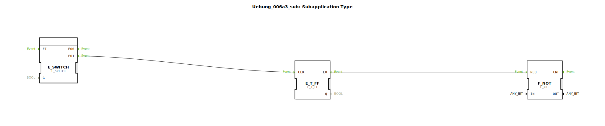

# Uebung_006a3_sub: Subapplication Type

Dieser Artikel beschreibt den Sub-App-Typ `Uebung_006a3_sub`. Er dient als interner Zustandsautomat zur Realisierung eines alternierenden Richtungswechsels.

----

## Übersicht

[cite_start]Dieser Baustein kapselt die Logik für eine Links/Rechts-Umschaltung[cite: 1].
Er verfügt über einen Ereignis-Eingang `EI`. Bei jedem Eintreffen eines Ereignisses wechselt der Baustein intern seine Richtungsvorgabe. Die Ergebnisse werden über die Daten-Ausgänge `Links` und `Rechts` bereitgestellt.
Dies wird in der Übung 006a3 genutzt, um einen Motor bei jedem Startvorgang automatisch in die jeweils andere Richtung drehen zu lassen. Der Baustein stellt dabei sicher, dass immer eine eindeutige Richtungsentscheidung vorliegt.

## 🛠️ Zugehörige Übungen

* [Uebung_006a3](Uebung_006a3.md)

