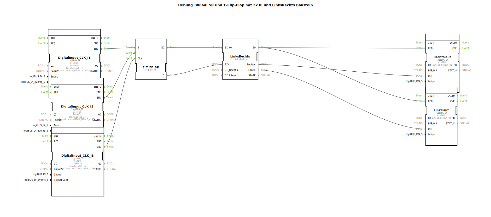

# Uebung_006a4: SR und T-Flip-Flop mit 3x IE und LinksRechts Baustein

Dieser Artikel beschreibt die logiBUS®-Übung `Uebung_006a4`. Hier wird die Motorsteuerung aus der vorherigen Übung durch die Verwendung eines fertigen Bibliotheksbausteins optimiert.

----

## Ziel der Übung

Nutzung von spezialisierten Dienstbausteinen zur Reduktion der Diagramm-Komplexität.

-----

## Beschreibung und Komponenten

[cite_start]In `Uebung_006a4.SUB` wird das Netzwerk aus Gattern und Sub-Apps durch den Baustein `LinksRechts` ersetzt[cite: 1].

### Funktionsbausteine (FBs)

  * **`LinksRechts`**: Typ `logiBUS::utils::sequence::verteiler::LinksRechts`. [cite_start]Dieser Baustein übernimmt die komplette Verwaltung der zwei Ausgänge inklusive der internen Richtungs-Logik[cite: 1].
  * **`E_T_FF_SR`**: Liefert weiterhin das Startsignal an den Eingang `EI_ON`.

-----

## Vorteil

Durch die Verwendung von Bibliotheksbausteinen wird das Programm lesbarer und wartungsfreundlicher. Die interne Verriegelung ist im Baustein fest programmiert und kann nicht versehentlich durch fehlerhafte Verbindungen im Hauptdiagramm umgangen werden.