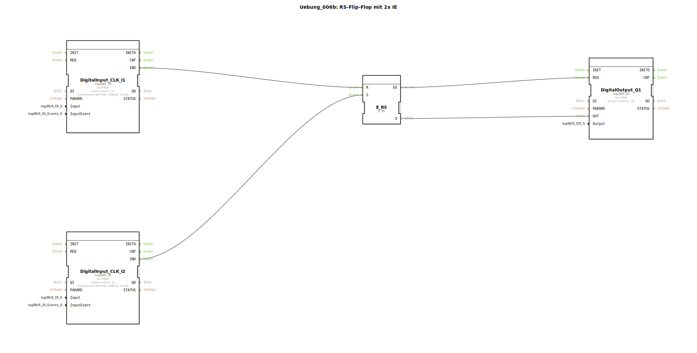

# Uebung_006b: RS-Flip-Flop mit 2x IE

Dieser Artikel beschreibt die logiBUS®-Übung `Uebung_006b`.

----

## Ziel der Übung

Verständnis der Reset-Priorität.

-----

## Beschreibung und Komponenten

[cite_start]Die Subapplikation `Uebung_006b.SUB` nutzt einen `E_RS` Baustein[cite: 1].

### Funktionsbausteine (FBs)

  * **`E_RS`**: Ein ereignisbasiertes RS-Flip-Flop (Reset dominant).

-----

## Funktionsweise

Funktional sehr ähnlich zum SR-Speicher (Übung 006). Der entscheidende Unterschied liegt im Verhalten bei "Gleichzeitigkeit": Sollten im exakt gleichen Moment sowohl ein Setz- als auch ein Rücksetz-Ereignis eintreffen, gewinnt beim `E_RS` das **Rücksetzen**. Der Ausgang wird also sicher auf `FALSE` geschaltet.

-----

## Anwendungsbeispiel

**Gefahrenabschaltung**: Bei einer Maschine hat der Stopp-Befehl immer Vorrang. Wenn ein Fehlerzustand den Stopp auslöst, darf ein gleichzeitiger Startversuch des Bedieners die Abschaltung nicht verhindern. Hier ist ein RS-Glied zwingend erforderlich.