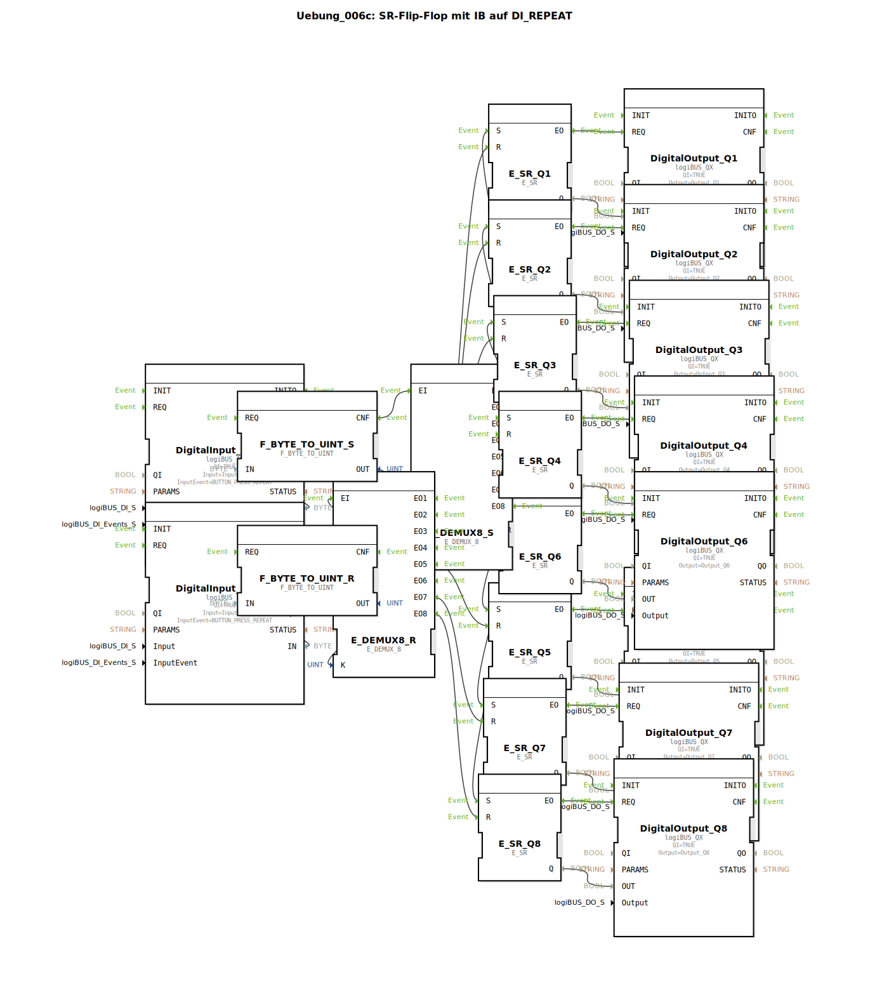

# Uebung_006c: SR-Flip-Flop mit IB auf DI_REPEAT

Dieser Artikel beschreibt die logiBUS®-Übung `Uebung_006c`. Hier wird eine komplexe Kanalsteuerung unter Verwendung von Byte-Daten und Ereignis-Demultiplexern realisiert.

----

## Ziel der Übung

Erlernen der adressierten Ereignisverteilung. Anstatt für jeden Kanal eine eigene Leitung zu ziehen, wird eine "Adresse" (Index) genutzt, um ein Ereignis an das richtige Ziel zu leiten.

-----

## Beschreibung und Komponenten

[cite_start]Die Subapplikation `Uebung_006c.SUB` steuert 8 Lampenspeicher über zwei zentrale Wahlschalter[cite: 1].

### Funktionsbausteine (FBs)

  * **`logiBUS_IB`**: Ein spezieller Eingangsbaustein für "Input Byte". Er liefert einen Zahlenwert (0-255), der meist von einem Multi-Funktions-Bedienelement (z.B. einem ISOBUS-Joystick mit vielen Tasten) stammt.
  * **`E_DEMUX_8`**: Ein Ereignis-Demultiplexer. Er hat einen Ereignis-Eingang `EI` und einen Daten-Eingang `K` (Selector). Je nach Wert von `K` leitet er das Event an einen der acht Ausgänge `EO1` bis `EO8` weiter.
  * **8x `E_SR`**: Speicher für die Ausgänge `Q1` bis `Q8`.

-----

## Funktionsweise

Das System arbeitet mit zwei Kanälen:
1.  **Setzen-Kanal**: Ein Druck auf Taster `I1` (konfiguriert als Repeat) liefert eine Nummer. Der Demux `E_DEMUX8_S` leitet das Ereignis an den entsprechenden Speicherplatz weiter ➡️ Die Lampe geht an.
2.  **Rücksetzen-Kanal**: Taster `I2` liefert analog dazu eine Nummer an `E_DEMUX8_R` ➡️ Die entsprechende Lampe geht aus.

-----

## Anwendungsbeispiel

**Fernsteuerung von Aktoren über ein Terminal**:
Ein Bediener hat ein Nummernfeld oder ein Drehrad am Joystick. Er wählt eine Nummer aus und drückt "Aktivieren". Die Steuerung sorgt dafür, dass genau das Gerät mit dieser Nummer eingeschaltet wird. Dies spart enorm viele physische Taster und Leitungen ein.