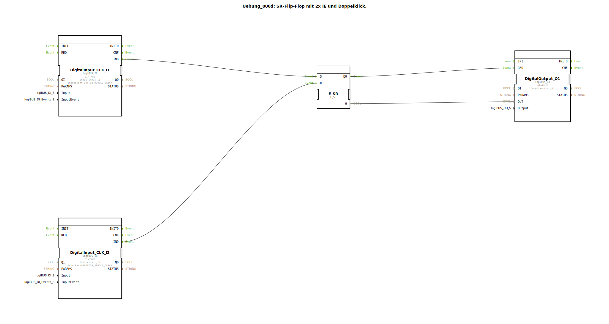

# Uebung_006d: SR-Flip-Flop mit 2x IE und Doppelklick.

Dieser Artikel beschreibt die logiBUS®-Übung `Uebung_006d`. Hier wird eine asymmetrische Bedienlogik zum Schutz der Anlage implementiert.

----

## Ziel der Übung

Kombination von komplexen Eingangsereignissen (Doppelklick) mit Speicherbausteinen.

-----

## Beschreibung und Komponenten

[cite_start]Die Subapplikation `Uebung_006d.SUB` realisiert eine Ein/Aus-Logik mit unterschiedlichen Hürden[cite: 1].

### Funktionsbausteine (FBs)

  * **`I1` (Set)**: Konfiguriert auf `BUTTON_DOUBLE_CLICK`.
  * **`I2` (Reset)**: Konfiguriert auf `BUTTON_SINGLE_CLICK`.
  * **`E_SR`**: Der Speicherbaustein.

-----

## Funktionsweise

*   **Einschalten**: Erfordert eine bewusste Handlung des Nutzers (Doppelklick auf `I1`). Ein einfaches Berühren reicht nicht aus.
*   **Ausschalten**: Muss im Bedarfsfall schnell und einfach gehen (einfacher Klick auf `I2`).

Das Flip-Flop speichert den Zustand zwischen diesen Ereignissen.

-----

## Anwendungsbeispiel

**Sicherheitsrelevante Hilfsantriebe**:
Eine hydraulische Pumpe oder ein Schneidwerk soll nicht durch ein versehentliches Anstoßen des Schalters in der Kabine starten. Der Nutzer muss durch den Doppelklick seine Absicht bestätigen. Das sofortige Ausschalten bei Gefahr muss jedoch durch einen einfachen Schlag auf den Aus-Taster gewährleistet sein.