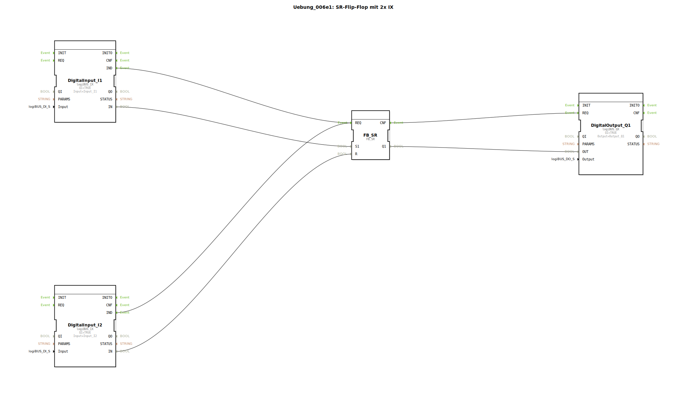

Hier ist die Dokumentationsseite für die Übung `Uebung_006e1` basierend auf den bereitgestellten Daten.

# Uebung_006e1: SR-Flip-Flop mit 2x IX

* * * * * * * * * *

## Einleitung

Die Übung **Uebung_006e1** demonstriert die Implementierung eines SR-Flip-Flops (Set-Reset-Speicherglied) innerhalb einer Sub-Application. Es werden zwei digitale Eingänge verwendet, um einen digitalen Ausgang zu steuern. Diese Schaltung veranschaulicht das grundlegende Speicherverhalten in der Steuerungstechnik, bei dem ein Impuls einen Zustand setzt, der bis zum Rücksetzen erhalten bleibt.

## Verwendete Funktionsbausteine (FBs)

In dieser Übung wird ein Netzwerk aus Standard-Bausteinen verwendet, um die gewünschte Logik abzubilden. Da es sich hierbei um eine `SubAppType` handelt, werden die darin enthaltenen Instanzen als interne FBs beschrieben.

### Sub-Bausteine: Uebung_006e1 (Netzwerk)

*   **Typ**: SubAppType
*   **Verwendete interne FBs**:
    *   **DigitalInput_I1**: `logiBUS::io::DI::logiBUS_IX`
        *   Parameter: `QI` = `TRUE`
        *   Parameter: `Input` = `Input_I1`
        *   Ereignisausgang: `IND` (Indication - Signaländerung)
        *   Datenausgang: `IN` (Aktueller Wert des Eingangs)
    *   **DigitalInput_I2**: `logiBUS::io::DI::logiBUS_IX`
        *   Parameter: `QI` = `TRUE`
        *   Parameter: `Input` = `Input_I2`
        *   Ereignisausgang: `IND` (Indication - Signaländerung)
        *   Datenausgang: `IN` (Aktueller Wert des Eingangs)
    *   **DigitalOutput_Q1**: `logiBUS::io::DQ::logiBUS_QX`
        *   Parameter: `QI` = `TRUE`
        *   Parameter: `Output` = `Output_Q1`
        *   Ereigniseingang: `REQ` (Request - Aktualisierung anfordern)
        *   Dateneingang: `OUT` (Zu schreibender Wert)
    *   **FB_SR**: `iec61131::bistableElements::FB_SR`
        *   Ereigniseingang: `REQ`
        *   Ereignisausgang: `CNF`
        *   Dateneingang: `S1` (Setzen)
        *   Dateneingang: `R` (Rücksetzen)
        *   Datenausgang: `Q1` (Speicherzustand)

*   **Funktionsweise**:
    Die SubApp liest zwei Hardware-Eingänge ein. Der erste Eingang dient als "Set"-Signal, der zweite als "Reset"-Signal für einen SR-Speicherbaustein. Der resultierende Zustand wird auf einen Hardware-Ausgang geschrieben.

## Programmablauf und Verbindungen

Das Netzwerk verknüpft die physischen Ein- und Ausgänge mit der logischen SR-Funktion:

1.  **Eingangsverarbeitung**:
    *   `DigitalInput_I1` ist mit dem Eingang `S1` (Setzen) des `FB_SR` verbunden.
    *   `DigitalInput_I2` ist mit dem Eingang `R` (Rücksetzen) des `FB_SR` verbunden.
    *   Sobald sich an einem der Eingänge der Wert ändert (Event `IND`), wird die Berechnung im `FB_SR` über das Event `REQ` angestoßen.

2.  **Logik (SR-Flip-Flop)**:
    *   Der Baustein `FB_SR` speichert den Zustand.
    *   Ist `S1` TRUE, wird der Ausgang `Q1` auf TRUE gesetzt.
    *   Ist `R` TRUE, wird der Ausgang `Q1` auf FALSE gesetzt.
    *   (Hinweis: Bei SR-Gliedern ist in der Regel das Setzen dominant, wenn beide Eingänge gleichzeitig TRUE sind, hängt dies jedoch von der spezifischen Implementierung der IEC 61131 Library ab; typischerweise ist ein SR-Glied Rücksetz-Dominant, wenn es als SR bezeichnet wird, aber die IEC Norm definiert SR als Set-Dominant. In 4diac/IEC61499 ist `FB_SR` definiert: Wenn S1 und R beide 1 sind, ist Q1=1).

3.  **Ausgangsverarbeitung**:
    *   Das Ergebnis `Q1` des Flip-Flops wird an den Dateneingang `OUT` von `DigitalOutput_Q1` geleitet.
    *   Nach erfolgter Berechnung im Flip-Flop (Event `CNF`) wird der Ausgangsbaustein getriggert (`REQ`), um den physischen Ausgang zu aktualisieren.

**Lernziele:**
*   Verständnis von bistabilen Kippstufen (Flip-Flops).
*   Unterscheidung zwischen Setzen und Rücksetzen.
*   Verknüpfung von Event- und Datenflüssen zwischen IO-Bausteinen und Logik-Bausteinen.

## Zusammenfassung

Die Übung `Uebung_006e1` ist eine klassische Anwendung einer Speicherfunktion. Mit Hilfe von zwei Tastern (oder Schaltern) an den Eingängen `Input_I1` und `Input_I2` kann der Ausgang `Output_Q1` dauerhaft ein- bzw. ausgeschaltet werden. Dies bildet die Grundlage für viele Steuerungsaufgaben, wie z.B. Start/Stopp-Schaltungen für Motoren.