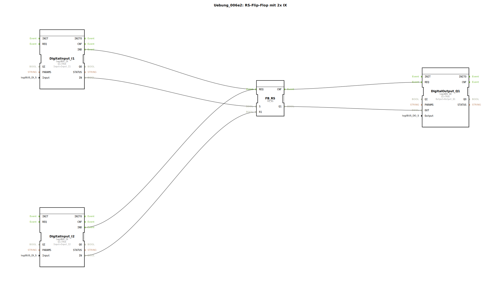

Hier ist die Dokumentation für die Übung `Uebung_006e2`, basierend auf den bereitgestellten Daten.

# Uebung_006e2: RS-Flip-Flop mit 2x IX

* * * * * * * * * *

## Einleitung
Die Übung **Uebung_006e2** demonstriert die Implementierung eines **RS-Flip-Flops** (Rücksetz-Dominant) unter Verwendung von zwei digitalen Eingängen (IX) und einem digitalen Ausgang. Das Ziel ist es, eine grundlegende Speicherfunktion zu realisieren, bei der ein Eingang den Ausgang setzt und der andere ihn zurücksetzt. Diese Übung nutzt die `logiBUS` Bibliothek für die Hardware-Abstraktion der Ein- und Ausgänge.

## Verwendete Funktionsbausteine (FBs)

In dieser Sub-Applikation werden verschiedene Bausteine instanziiert und miteinander verschaltet.

### Sub-Bausteine: DigitalInput_I1
- **Typ**: `logiBUS::io::DI::logiBUS_IX`
- **Beschreibung**: Dieser Baustein repräsentiert den ersten digitalen Eingang, der als "Set"-Signal fungiert.
- **Parameter**:
    - `QI` = `TRUE` (Initialisierung aktiviert)
    - `Input` = `Input_I1` (Hardware-Mapping auf Eingang I1)

### Sub-Bausteine: DigitalInput_I2
- **Typ**: `logiBUS::io::DI::logiBUS_IX`
- **Beschreibung**: Dieser Baustein repräsentiert den zweiten digitalen Eingang, der als "Reset"-Signal fungiert.
- **Parameter**:
    - `QI` = `TRUE`
    - `Input` = `Input_I2` (Hardware-Mapping auf Eingang I2)

### Sub-Bausteine: FB_RS
- **Typ**: `iec61131::bistableElements::FB_RS`
- **Beschreibung**: Ein bistabiles Element (Flip-Flop) mit Rücksetz-Dominanz.
- **Funktionsweise**:
    - Wenn der Eingang `S` (Set) TRUE ist und `R1` (Reset) FALSE ist, wird der Ausgang `Q1` TRUE.
    - Wenn der Eingang `R1` TRUE ist, wird der Ausgang `Q1` FALSE (unabhängig von S, da RS rücksetz-dominant ist).

### Sub-Bausteine: DigitalOutput_Q1
- **Typ**: `logiBUS::io::DQ::logiBUS_QX`
- **Beschreibung**: Dieser Baustein repräsentiert den digitalen Ausgang, der den Status des Flip-Flops anzeigt.
- **Parameter**:
    - `QI` = `TRUE`
    - `Output` = `Output_Q1` (Hardware-Mapping auf Ausgang Q1)

## Programmablauf und Verbindungen

Der Programmablauf wird durch die Ereignisketten (Event Connections) und den Datenfluss (Data Connections) bestimmt:

1.  **Eingangsverarbeitung**:
    - Die digitalen Eingänge `DigitalInput_I1` und `DigitalInput_I2` erfassen Signale von der Hardware.
    - Sobald sich ein Eingangswert ändert oder aktualisiert wird, wird ein `IND`-Event (Indication) ausgelöst.

2.  **Logikverarbeitung (RS-Flip-Flop)**:
    - Die `IND`-Events beider Eingänge sind mit dem `REQ`-Eingang (Request) des `FB_RS` verbunden. Das bedeutet, jede Änderung an I1 oder I2 triggert die Berechnung des Flip-Flops.
    - **Datenverbindung**:
        - Der Wert von `DigitalInput_I1` (`IN`) ist mit dem Set-Eingang (`S`) des `FB_RS` verbunden.
        - Der Wert von `DigitalInput_I2` (`IN`) ist mit dem Reset-Eingang (`R1`) des `FB_RS` verbunden.

3.  **Ausgangsverarbeitung**:
    - Nach der Berechnung des `FB_RS` wird das `CNF`-Event (Confirmation) ausgelöst.
    - Dieses Event ist mit dem `REQ`-Eingang des `DigitalOutput_Q1` verbunden, um den Ausgang zu aktualisieren.
    - **Datenverbindung**: Der Ergebnisausgang `Q1` des Flip-Flops wird an den Eingang `OUT` des `DigitalOutput_Q1` übergeben.

**Zusammengefasstes Verhalten:**
- Taste/Schalter an **Input_I1** aktiviert den Ausgang **Output_Q1**.
- Taste/Schalter an **Input_I2** deaktiviert den Ausgang **Output_Q1**.
- Werden beide Eingänge gleichzeitig betätigt, bleibt der Ausgang aus (Reset ist dominant).

## Zusammenfassung
Diese Übung ist ein klassisches Beispiel für speicherprogrammierbare Steuerungslogik nach IEC 61131-3. Sie vermittelt das Verständnis für bistabile Elemente und die Ereignissteuerung in 4diac, bei der die Ausführung der Logikblöcke durch Trigger (Events) von den Eingangsbausteinen gesteuert wird. Das Ergebnis ist eine robuste Schaltung zum Ein- und Ausschalten eines Verbrauchers über zwei getrennte Signale.