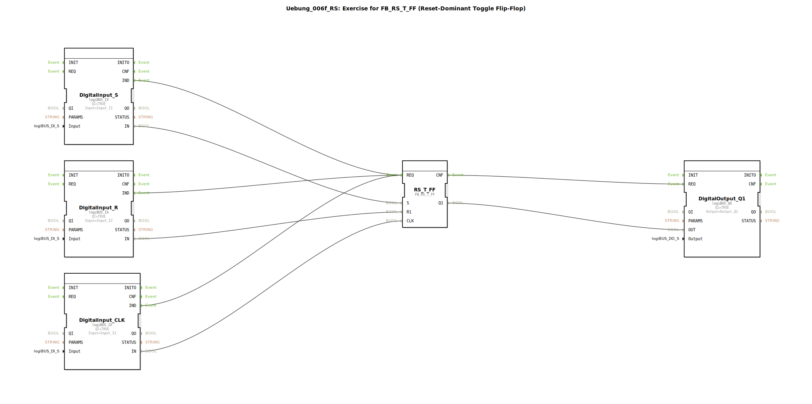

# Uebung_006f_RS: Exercise for FB_RS_T_FF (Reset-Dominant Toggle Flip-Flop)

* * * * * * * * * *
## Einleitung

Diese Übung demonstriert die Verwendung eines **reset-dominanten Toggle-Flipflops** (FB_RS_T_FF) in der 4diac-IDE. Ziel ist es, das Verhalten eines priorisierten Rücksetzeingangs in Kombination mit einem taktgesteuerten Toggle-Mechanismus zu verstehen. Die Eingänge werden über logiBUS-Hardwarekomponenten angeschlossen, die Ausgabe erfolgt über einen digitalen Ausgang.

## Verwendete Funktionsbausteine (FBs)

Die Übung besteht aus fünf Funktionsbausteinen, die direkt im SubApp-Netzwerk verbunden sind:

| Bausteinname | Typ | Zweck |
| :--- | :--- | :--- |
| `DigitalInput_S` | logiBUS::io::DI::logiBUS_IX | Digitaler Eingang für den Set-Eingang (S) |
| `DigitalInput_R` | logiBUS::io::DI::logiBUS_IX | Digitaler Eingang für den Reset-Eingang (R1) |
| `DigitalInput_CLK` | logiBUS::io::DI::logiBUS_IX | Digitaler Eingang für den Takteingang (CLK) |
| `RS_T_FF` | logiBUS::bistableElements::FB_RS_T_FF | Reset-dominantes Toggle-Flipflop |
| `DigitalOutput_Q1` | logiBUS::io::DQ::logiBUS_QX | Digitaler Ausgang für das Flipflop-Signal (Q1) |

### Details zu den Bausteinen

#### `DigitalInput_S`, `DigitalInput_R`, `DigitalInput_CLK`
- **Typ**: logiBUS::io::DI::logiBUS_IX (Hardware-Eingangsbaustein)
- **Parameter**:
  - `QI` = `TRUE` (Eingang aktiviert)
  - `Input` = `Input_I1`, `Input_I2`, `Input_I3` (physische Eingänge)
- **Ereignisausgang**: `IND` (wird ausgelöst, wenn sich der Eingangswert ändert)
- **Datenausgang**: `IN` (aktueller digitaler Wert des Eingangs)

#### `RS_T_FF`
- **Typ**: logiBUS::bistableElements::FB_RS_T_FF
- **Parameter**: Keine benutzerdefinierten Parameter
- **Ereigniseingang**: `REQ` (startet die Verarbeitung)
  - Verbunden mit den `IND`-Ereignissen aller drei Eingangsbausteine
- **Ereignisausgang**: `CNF` (zeigt Abschluss der Verarbeitung an)
- **Daten-/Eingänge**:
  - `S` (Set, von `DigitalInput_S.IN`)
  - `R1` (Reset, von `DigitalInput_R.IN`)
  - `CLK` (Takt, von `DigitalInput_CLK.IN`)
- **Datenausgang**: `Q1` (Ausgangszustand des Flipflops)

#### `DigitalOutput_Q1`
- **Typ**: logiBUS::io::DQ::logiBUS_QX (Hardware-Ausgangsbaustein)
- **Parameter**:
  - `QI` = `TRUE` (Ausgang aktiviert)
  - `Output` = `Output_Q1` (physischer Ausgang)
- **Ereigniseingang**: `REQ` (vom `CNF` des Flipflops)
- **Dateneingang**: `OUT` (vom `Q1` des Flipflops)

## Programmablauf und Verbindungen

Der Programmablauf wird durch die physischen Eingänge I1, I2 und I3 gesteuert. Jede Änderung an einem dieser Eingänge führt zu folgenden Schritten:

1. **Ereignisauslösung**: Der betroffene Eingangsbaustein (`DigitalInput_S`, `DigitalInput_R` oder `DigitalInput_CLK`) sendet ein `IND`-Ereignis.
2. **Ereignisweiterleitung**: Alle drei `IND`-Ereignisse sind mit dem `REQ`-Eingang des Flipflops `RS_T_FF` verbunden. Somit wird das Flipflop bei **jeder** Änderung eines Eingangs neu berechnet.
3. **Datenverarbeitung im Flipflop**:
   - Der Set-Eingang `S` wird durch `DigitalInput_S.IN` (I1) gespeist.
   - Der Reset-Eingang `R1` wird durch `DigitalInput_R.IN` (I2) gespeist.
   - Der Takteingang `CLK` wird durch `DigitalInput_CLK.IN` (I3) gespeist.
   - Das Flipflop verhält sich reset-dominant: Wenn `R1 = TRUE`, wird der Ausgang `Q1` unabhängig von `S` und der Taktflanke zurückgesetzt. Bei `R1 = FALSE` und positiver Taktflanke auf `CLK` wird der Ausgang getoggelt, wenn `S = TRUE`.
4. **Ausgabe**: Nach der Verarbeitung sendet `RS_T_FF` ein `CNF`-Ereignis an den Ausgangsbaustein `DigitalOutput_Q1`. Der neue Zustand `Q1` wird auf den physischen Ausgang Q1 übertragen.

**Wichtige Hinweise**:
- Durch die Ereignisverbindung aller drei `IND`-Ereignisse auf den gleichen `REQ`-Eingang wird das Flipflop bei jeder Eingangsänderung neu berechnet, auch wenn der Auslöser kein Taktwechsel ist. Dies kann zu unerwartetem Verhalten führen, wenn die Logik nicht berücksichtigt, dass das Flipflop eigentlich taktgesteuert arbeitet. In der Praxis sollte der Takt separat behandelt werden.
- Die Übung dient dem Verständnis der Priorisierung von Reset vor Toggle in einem reset-dominanten Flipflop.

## Zusammenfassung

Die Übung `Uebung_006f_RS` zeigt die Einbindung eines reset-dominanten Toggle-Flipflops in eine 4diac-Anwendung mit logiBUS-Hardware. Die drei Eingänge (Set, Reset, Takt) werden über digitale Eingangsbausteine eingelesen. Der Ausgang des Flipflops steuert einen digitalen Ausgang. Der Ablauf verdeutlicht die Verarbeitung von Ereignisketten und die Funktion eines priorisierten Resets. Als Lernziel steht das Verständnis der Toggle-Logik und der Dominanz des Reset-Signals im Vordergrund.