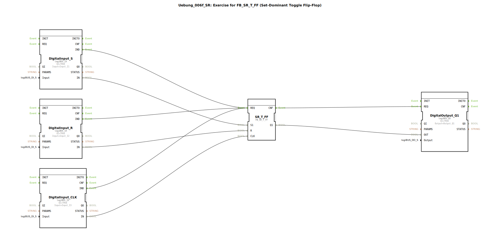

# Uebung_006f_SR: Exercise for FB_SR_T_FF (Set-Dominant Toggle Flip-Flop)

* * * * * * * * * *
## Einleitung

Diese Übung dient dem Verständnis und der Anwendung eines **set-dominanten Toggle-Flipflops** (FB_SR_T_FF). Der Baustein kombiniert die Eigenschaften eines SR-Flipflops mit einer Toggle-Funktion, wobei der Set-Eingang (S1) Vorrang vor dem Reset-Eingang (R) hat. Die Übung demonstriert die grundlegende Verschaltung von digitalen Eingängen, dem Flipflop und einem digitalen Ausgang in der 4diac-IDE unter Verwendung der logiBUS-Bibliothek.

## Verwendete Funktionsbausteine (FBs)

Die Übung besteht aus fünf Funktionsbausteinen, die im logiBUS-Netzwerk miteinander verbunden sind.

- **DigitalInput_S** (Typ: *logiBUS::io::DI::logiBUS_IX*)
  - **Parameter**: QI = TRUE, Input = Input_I1
  - **Ereignisausgang**: IND (wird bei anliegendem Eingangssignal ausgelöst)
  - **Datenausgang**: IN (logischer Wert des physischen Eingangs)
  - **Funktionsweise**: Liest den digitalen Eingang I1 (z. B. Taster oder Sensor) und stellt den Wert als Datensignal sowie das Ereignis IND bereit.

- **DigitalInput_R** (Typ: *logiBUS::io::DI::logiBUS_IX*)
  - **Parameter**: QI = TRUE, Input = Input_I2
  - **Ereignisausgang**: IND
  - **Datenausgang**: IN
  - **Funktionsweise**: Liest den digitalen Eingang I2 (Reset-Taster) und gibt den Wert sowie das Ereignis aus.

- **DigitalInput_CLK** (Typ: *logiBUS::io::DI::logiBUS_IX*)
  - **Parameter**: QI = TRUE, Input = Input_I3
  - **Ereignisausgang**: IND
  - **Datenausgang**: IN
  - **Funktionsweise**: Liest den digitalen Eingang I3 (Taktsignal) und stellt den Wert sowie das Ereignis bereit.

- **SR_T_FF** (Typ: *logiBUS::bistableElements::FB_SR_T_FF*)
  - **Parameter**: Keine (werkseitige Konfiguration)
  - **Ereigniseingang**: REQ (löst die Verarbeitung aus)
  - **Ereignisausgang**: CNF (bestätigt die Ausführung)
  - **Dateneingänge**: S1 (Set, dominant), R (Reset), CLK (Takt)
  - **Datenausgang**: Q1 (Ausgangszustand)
  - **Funktionsweise**: Realisiert ein set-dominantes Toggle-Flipflop. Bei jedem Taktflanke (CLK) wird der Ausgang Q1 gesetzt, wenn S1 aktiv ist, oder zurückgesetzt, wenn R aktiv ist. Sind beide Eingänge aktiv, dominiert S1 (Set). Der Ausgang toggelt, wenn weder S1 noch R aktiv sind, jedoch nur bei steigender Taktflanke.

- **DigitalOutput_Q1** (Typ: *logiBUS::io::DQ::logiBUS_QX*)
  - **Parameter**: QI = TRUE, Output = Output_Q1
  - **Ereigniseingang**: REQ (löst das Setzen des Ausgangs aus)
  - **Dateneingang**: OUT (Wert, der auf den physischen Ausgang gegeben wird)
  - **Funktionsweise**: Gibt den übergebenen Wert (OUT) auf den digitalen Ausgang Q1 (z. B. LED oder Aktor) aus.

## Programmablauf und Verbindungen

Die folgenden Ereignis- und Datenverbindungen definieren den Ablauf der Übung:

**Ereignisverbindungen:**
- Die Ereignisausgänge der drei digitalen Eingänge (DigitalInput_S.IND, DigitalInput_R.IND, DigitalInput_CLK.IND) sind alle mit dem Ereigniseingang des Flipflops (SR_T_FF.REQ) verbunden.  
  *Hinweis:* Dies bedeutet, dass jede Änderung an einem der Eingänge (S, R oder CLK) die Verarbeitung des Flipflops auslöst. In der Praxis sollte der Takt (CLK) den Hauptauslöser darstellen; die gleichzeitige Verknüpfung aller drei Eingänge ist hier als vereinfachte Übung gewählt.
- Das Bestätigungsereignis des Flipflops (SR_T_FF.CNF) ist mit dem Ereigniseingang des Ausgangsbausteins (DigitalOutput_Q1.REQ) verbunden, sodass nach jeder Flipflop-Berechnung der Ausgang aktualisiert wird.

**Datenverbindungen:**
- DigitalInput_S.IN → SR_T_FF.S1 (Set-Eingang)
- DigitalInput_R.IN → SR_T_FF.R (Reset-Eingang)
- DigitalInput_CLK.IN → SR_T_FF.CLK (Taktsignal)
- SR_T_FF.Q1 → DigitalOutput_Q1.OUT (Ausgangswert)

**Ablauf:**
1. Ein Signal an einem der digitalen Eingänge (I1, I2 oder I3) erzeugt ein Ereignis (IND).
2. Dieses Ereignis triggert den Flipflop-Baustein (REQ).
3. Der Flipflop wertet die aktuellen Datenwerte an S1, R und CLK aus und berechnet den neuen Zustand Q1 gemäß der set-dominanten Toggle-Logik.
4. Nach der Berechnung signalisiert der Flipflop die Fertigstellung (CNF).
5. Der Ausgangsbaustein übernimmt den Wert (OUT) und setzt den physischen Ausgang Q1 entsprechend.

**Lernziele:**
- Verständnis der Funktionsweise eines set-dominanten Toggle-Flipflops (SR_T_FF).
- Umgang mit logiBUS-Eingangs- und Ausgangsbausteinen.
- Verknüpfung von Ereignis- und Datenflüssen in der 4diac-IDE.
- Praktische Anwendung der logiBUS-Bibliothek zur Steuerung von Hardware.

**Schwierigkeitsgrad:** Einfach bis mittel. Grundkenntnisse in der 4diac-IDE und im Umgang mit logiBUS-Komponenten werden vorausgesetzt.

**Vorkenntnisse:** Grundlagen der binären Logik und Funktionsweise von Flipflops.

**Durchführung:** Die Übung kann in der 4diac-IDE geladen und auf einer entsprechenden Hardware (z. B. Siemens SPS mit logiBUS) oder im Simulationsmodus ausgeführt werden. Die Eingänge I1, I2 und I3 müssen physisch mit Tastern oder Signalquellen verbunden sein. Der Ausgang Q1 wird z. B. an eine LED angeschlossen.

## Zusammenfassung

Die Übung *Uebung_006f_SR* vermittelt die praktische Anwendung eines set-dominanten Toggle-Flipflops (FB_SR_T_FF) in der 4diac-IDE. Durch die Verschaltung von drei digitalen Eingängen, dem Flipflop und einem digitalen Ausgang wird gezeigt, wie Ereignis- und Datenflüsse gesteuert werden können. Der Baustein verhält sich set-dominant: Bei gleichzeitig anliegenden Set- und Reset-Signalen hat der Set-Eingang Vorrang. Diese Übung ist ein grundlegender Baustein für das Verständnis sequenzieller Logik in der industriellen Automatisierungstechnik.