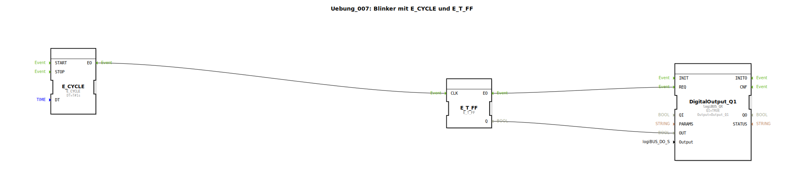

# Uebung_007: Blinker mit E_CYCLE und E_T_FF

Dieser Artikel beschreibt die logiBUS®-Übung `Uebung_007`. Hier wird gezeigt, wie man periodische Ereignisse erzeugt, um ein zyklisches Blinksignal zu realisieren.

----

## Ziel der Übung

Verwendung des `E_CYCLE` Bausteins zur Erzeugung einer Zeitbasis. Es wird demonstriert, wie ein periodischer Trigger ein Toggle-Flip-Flop ansteuert, um ein gleichmäßiges Rechtecksignal (An/Aus) zu generieren.

-----

## Beschreibung und Komponenten

[cite_start]Die Subapplikation `Uebung_007.SUB` kombiniert einen Taktgeber mit einem Speicherglied[cite: 1].

### Funktionsbausteine (FBs)

  * **`E_CYCLE`**: Ein Ereignis-Generator. [cite_start]Er sendet periodisch Ereignisse am Ausgang `EO` aus. Der Parameter `DT` bestimmt das Zeitintervall (hier `T#1s` = 1 Sekunde)[cite: 1].
  * **`E_T_FF`**: Das Toggle-Flip-Flop, welches bei jedem Takt seinen Zustand invertiert.
  * **`DigitalOutput_Q1`**: Die physische Lampe.

-----

## Funktionsweise

1.  Der `E_CYCLE` Baustein feuert jede Sekunde ein Ereignis ab.
2.  Dieses Ereignis erreicht den `CLK`-Eingang des `E_T_FF`.
3.  Das Flip-Flop wechselt bei jedem Impuls den Zustand (Aus ➡️ An ➡️ Aus ➡️ ...).
4.  Da für einen vollen Zyklus (An und Aus) zwei Taktimpulse benötigt werden, blinkt die Lampe mit einer Frequenz von 0,5 Hz (1 Sekunde an, 1 Sekunde aus).

-----

## Anwendungsbeispiel

**Betriebsanzeige**: Eine grüne LED am Schaltschrank blinkt langsam, um zu signalisieren, dass die Steuerung aktiv ist und das Programm ordnungsgemäß ausgeführt wird.