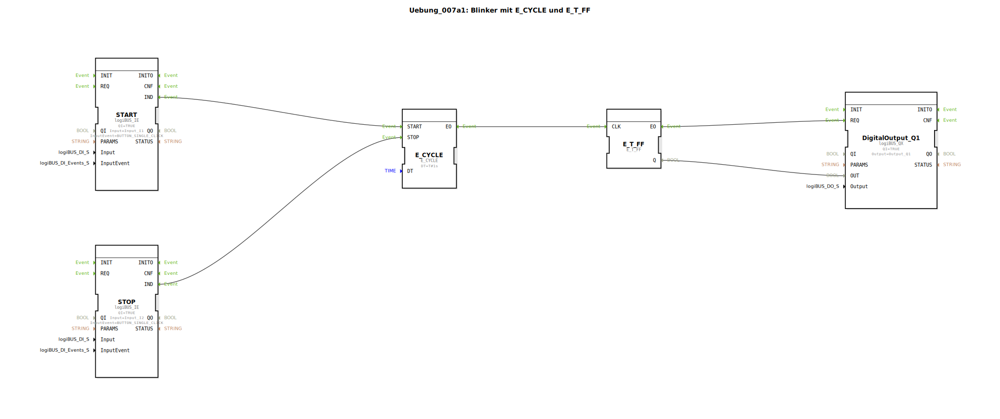

# Uebung_007a1: Blinker mit E_CYCLE und E_T_FF

Dieser Artikel beschreibt die logiBUS®-Übung `Uebung_007a1`. Hier wird versucht, den Blinker aus Übung 007 über externe Taster ein- und auszuschalten.

----

## Ziel der Übung

Steuerung eines Taktgebers über Start- und Stopp-Ereignisse.

-----

## Beschreibung und Komponenten

[cite_start]In `Uebung_007a1.SUB` werden die Steuerungseingänge des `E_CYCLE` Bausteins genutzt[cite: 1].

### Funktionsbausteine (FBs)

  * **`START` (I1)**: Sendet ein Ereignis an `E_CYCLE.START`.
  * **`STOP` (I2)**: Sendet ein Ereignis an `E_CYCLE.STOP`.
  * **`E_CYCLE`**: Startet oder stoppt die Generierung von Takt-Events.

-----

## Das Problem

Wie im Kommentar der Übung vermerkt: *"dieser Blinker bleibt zufällig auf AN oder AUS stehen"*.
Wenn der `STOP`-Befehl eintrifft, stellt der `E_CYCLE` sofort seine Arbeit ein. Das nachgeschaltete Flip-Flop `E_T_FF` verharrt jedoch in seinem **letzten Zustand**. War die Lampe in diesem Moment gerade an, bleibt sie dauerhaft leuchten. Dies ist in der Automatisierungstechnik meist unerwünscht und potenziell gefährlich.

-----

## Fazit

Diese Übung dient als Lehrbeispiel dafür, dass das bloße Anhalten eines Taktgebers nicht ausreicht, um ein System in einen sicheren (ausgeschalteten) Zustand zu überführen.