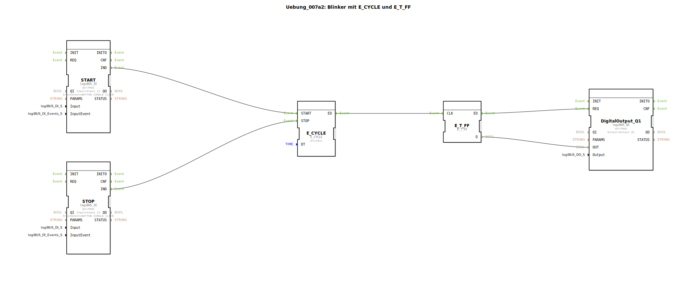

# Uebung_007a2: Blinker mit E_CYCLE und E_T_FF

Dieser Artikel beschreibt die logiBUS®-Übung `Uebung_007a2`.

----

## Übersicht

[cite_start]Strukturell ist diese Übung identisch mit `Uebung_007a1` und dient der Festigung des Wissens[cite: 1]. Auch hier besteht das Problem des undefinierten Endzustands beim Stoppen des Blinkers.

