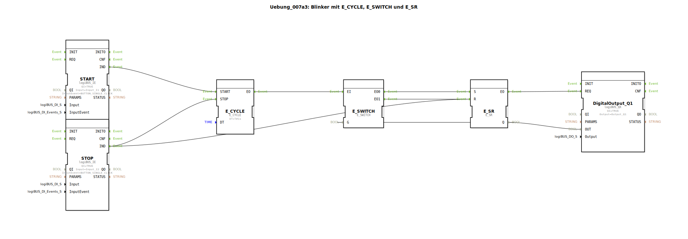

# Uebung_007a3: Blinker mit E_CYCLE, E_SWITCH und E_SR


[](https://notebooklm.google.com/notebook/a6872e59-1dfc-4132-a118-aff1bc7bc944)

Dieser Artikel beschreibt die logiBUS®-Übung `Uebung_007a3`. Hier wird die "saubere" Lösung für einen schaltbaren Blinker präsentiert, der beim Ausschalten garantiert in den Zustand "AUS" geht.

----


## Ziel der Übung

Realisierung eines Blinkers mit definiertem Stopp-Verhalten. Es wird demonstriert, wie Ereignispfade verknüpft werden müssen, um sowohl die Takterzeugung zu stoppen als auch den Zustandsspeicher zu löschen.

-----

## Beschreibung und Komponenten

[cite_start]In `Uebung_007a3.SUB` wird die Blinklogik manuell aus Weiche und Speicher aufgebaut, um die volle Kontrolle über den Reset-Vorgang zu haben[cite: 1].

### Funktionsbausteine (FBs)




  * **`E_CYCLE`**: Der Taktgeber.
  * **`E_SWITCH`**: Die Ereignis-Weiche zur Realisierung der Toggle-Funktion.
  * **`E_SR`**: Der Speicherbaustein (Reset-dominant verschaltet).
  * **`START` & `STOP`**: Die Bedien-Taster.

-----

## Funktionsweise

Die Sicherheit wird durch eine doppelte Belegung des Stopp-Signals erreicht:

```xml
<EventConnections>
    <Connection Source="START.IND" Destination="E_CYCLE.START"/>
    <Connection Source="STOP.IND" Destination="E_CYCLE.STOP"/>
    <Connection Source="E_CYCLE.EO" Destination="E_SWITCH.EI"/>
    <Connection Source="E_SWITCH.EO0" Destination="E_SR.S"/>
    <Connection Source="E_SWITCH.EO1" Destination="E_SR.R"/>
    <!-- Die entscheidende Verbindung für die Sicherheit: -->
    <Connection Source="STOP.IND" Destination="E_SR.R"/>
</EventConnections>
```

[cite_start][cite: 1]

1.  **Blinkbetrieb**: Der `E_CYCLE` triggert die `E_SWITCH/E_SR` Kombination, was zum periodischen Umschalten führt.
2.  **Ausschalten**: Wenn der Nutzer `STOP` drückt, passieren zwei Dinge gleichzeitig:
    *   Der `E_CYCLE` wird angehalten (keine neuen Takte mehr).
    *   Der Speicher `E_SR` erhält einen **direkten Reset-Befehl**. Damit wird der Ausgang sofort auf `FALSE` gezwungen, egal ob das Flip-Flop gerade im "An"- oder "Aus"-Zustand war.

-----

## Anwendungsbeispiel

**Professionelle Warnsignalisierung**:
Ein akustischer Alarm oder eine Blitzleuchte an einer Maschine muss bei Quittierung sofort und zuverlässig verstummen. Ein "Hängenbleiben" im eingeschalteten Zustand wäre irreführend und störend. Diese Schaltung garantiert, dass der Alarm nach dem Ausschalten immer inaktiv ist.