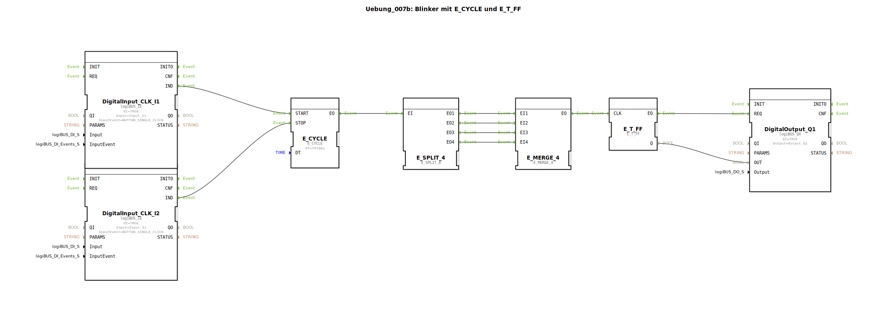

# Uebung_007b: Blinker mit E_CYCLE und E_T_FF

* * * * * * * * * *

## Einleitung

Diese Übung realisiert einen einfachen Blinker, der durch zwei Taster gesteuert wird. Ein E_CYCLE-Funktionsbaustein erzeugt periodische Ereignisse, die über einen E_SPLIT_4 auf mehrere Pfade verteilt werden. Alle vier Ausgänge des Splitters werden in einem E_MERGE_4 wieder zusammengeführt, so dass jede Periode ein einzelnes Ereignis an den Toggle-Flipflop (E_T_FF) weitergegeben wird. Der Ausgang des Flipflops schaltet einen digitalen Ausgang (logiBUS Q1) um. Der Taktgenerator kann über einen Taster (I1) gestartet und über einen zweiten Taster (I2) gestoppt werden.

Die gesamte Logik ist in einer Subapplikation gekapselt und verwendet ausschließlich logiBUS-Hardware-Ein- und -Ausgänge.

---

## Verwendete Funktionsbausteine (FBs)

Die Subapplikation besteht aus folgenden Funktionsbausteinen:

### Baustein: `DigitalOutput_Q1`
- **Typ**: `logiBUS::io::DQ::logiBUS_QX`
- **Parameter**:
  - `QI` = `TRUE` (Freigabe)
  - `Output` = `Output_Q1` (Hardware-Ausgang)
- **Ereignis-Eingänge**: `REQ` (schaltet den Ausgang)
- **Daten-Eingänge**: `OUT` (Wert für den Ausgang, 0 oder 1)
- **Funktionsweise**: Stellt den logiBUS-Digitalausgang Q1 auf den Wert des Dateneingangs, sobald ein Ereignis an `REQ` eintrifft.

---

### Baustein: `E_CYCLE`
- **Typ**: `iec61499::events::E_CYCLE`
- **Parameter**:
  - `DT` = `T#10ms` (Zykluszeit 10 ms)
- **Ereignis-Eingänge**:
  - `START` (startet die zyklische Erzeugung)
  - `STOP` (stoppt die zyklische Erzeugung)
- **Ereignis-Ausgänge**:
  - `EO` (gibt alle `DT` ein Ereignis aus)
- **Funktionsweise**: Generiert nach dem Starten periodisch Ereignisse im Abstand von 10 ms. Der Zähler kann durch ein Ereignis an `STOP` angehalten werden.

---

### Baustein: `E_T_FF`
- **Typ**: `iec61499::events::E_T_FF`
- **Parameter**: Keine
- **Ereignis-Eingänge**:
  - `CLK` (Takt – jedes Ereignis toggelt den Ausgang)
- **Ereignis-Ausgänge**:
  - `EO` (wird bei jedem Takt ausgegeben)
- **Daten-Ausgänge**:
  - `Q` (aktueller Wert des Flipflops, 0 oder 1)
- **Funktionsweise**: Ein Toggle-Flipflop: bei jedem Ereignis an `CLK` wechselt der Ausgang `Q` zwischen 0 und 1. Gleichzeitig wird ein Ereignis an `EO` ausgelöst.

---

### Baustein: `E_SPLIT_4`
- **Typ**: `iec61499::events::E_SPLIT_4`
- **Parameter**: Keine
- **Ereignis-Eingänge**: `EI` (Eingangsereignis)
- **Ereignis-Ausgänge**: `EO1`, `EO2`, `EO3`, `EO4` (vier parallele Ausgänge)
- **Funktionsweise**: Verteilt ein eingehendes Ereignis an alle vier Ausgänge gleichzeitig.

---

### Baustein: `E_MERGE_4`
- **Typ**: `iec61499::events::E_MERGE_4`
- **Parameter**: Keine
- **Ereignis-Eingänge**: `EI1`, `EI2`, `EI3`, `EI4` (vier Eingänge)
- **Ereignis-Ausgänge**: `EO` (Ausgangsereignis)
- **Funktionsweise**: Sobald an einem der vier Eingänge ein Ereignis eintrifft, wird dieses sofort an den Ausgang weitergegeben. (Logische ODER-Verknüpfung der Ereignisse.)

---

### Baustein: `DigitalInput_CLK_I1`
- **Typ**: `logiBUS::io::DI::logiBUS_IE`
- **Parameter**:
  - `QI` = `TRUE`
  - `Input` = `Input_I1` (Hardware-Eingang I1)
  - `InputEvent` = `BUTTON_SINGLE_CLICK` (Ereignis bei einfachem Tastendruck)
- **Ereignis-Ausgänge**: `IND` (wird bei erkanntem Ereignis ausgelöst)
- **Funktionsweise**: Erkennt einen einzelnen Tastendruck an Eingang I1 und gibt ein Ereignis an `IND` aus.

---

### Baustein: `DigitalInput_CLK_I2`
- **Typ**: `logiBUS::io::DI::logiBUS_IE`
- **Parameter**:
  - `QI` = `TRUE`
  - `Input` = `Input_I2` (Hardware-Eingang I2)
  - `InputEvent` = `BUTTON_SINGLE_CLICK`
- **Ereignis-Ausgänge**: `IND`
- **Funktionsweise**: Wie oben, aber für den zweiten Taster an Eingang I2.

---

## Programmablauf und Verbindungen

Die folgende Beschreibung erläutert den Signalfluss innerhalb der Subapplikation.

1. **Start/Stop des Taktgebers**  
   - Ein Tastendruck an I1 löst ein Ereignis am Ausgang `IND` von `DigitalInput_CLK_I1` aus. Dieses Ereignis wird mit dem Ereignis-Eingang `START` des `E_CYCLE` verbunden → der Zyklusgenerator startet.  
   - Ein Tastendruck an I2 löst ein Ereignis am Ausgang `IND` von `DigitalInput_CLK_I2` aus. Dieses Ereignis wird mit dem Ereignis-Eingang `STOP` des `E_CYCLE` verbunden → der Zyklusgenerator stoppt.

2. **Zyklus und Verteilung**  
   - Der `E_CYCLE` erzeugt alle 10 ms ein Ereignis an seinem Ausgang `EO`.  
   - Dieses Ereignis wird auf den Eingang `EI` des `E_SPLIT_4` gegeben. Der Splitter verteilt das Ereignis auf alle vier Ausgänge (`EO1` .. `EO4`).

3. **Zusammenführung**  
   - Die vier Ausgänge des Splitters sind mit den vier Eingängen (`EI1` .. `EI4`) des `E_MERGE_4` verbunden. Dadurch wird jedes Ereignis, egal über welchen Pfad, sofort an den Ausgang `EO` des Mergers weitergeleitet.  
   - Die Verbindung von Splitter zu Merger über alle vier Pfade dient hier als reine Durchleitung (Redundanz), könnte aber für spätere Erweiterungen genutzt werden.

4. **Toggle-Flipflop**  
   - Das Ausgangsereignis des `E_MERGE_4` wird auf den Takteingang `CLK` des `E_T_FF` gegeben.  
   - Bei jedem Takt wechselt der Ausgang `Q` des Flipflops seinen Zustand (0 → 1 → 0 → …).  
   - Gleichzeitig wird ein Ereignis am Ausgang `EO` des Flipflops ausgelöst.

5. **Ausgabe**  
   - Das Ereignis `EO` des Flipflops wird mit dem Ereignis-Eingang `REQ` des Ausgangsbausteins `DigitalOutput_Q1` verbunden.  
   - Der aktuelle Wert `Q` des Flipflops wird auf den Dateneingang `OUT` des Ausgangsbausteins gegeben.  
   - Bei jedem Takt wird der Ausgang Q1 auf den aktuellen Flipflop-Zustand gesetzt – es entsteht ein Blinksignal mit einer Periodendauer von 20 ms (10 ms Ein, 10 ms Aus, wenn die Zykluszeit 10 ms beträgt).

### Datenverbindungen

- `E_T_FF.Q` → `DigitalOutput_Q1.OUT`  
  Überträgt den toggelnden Wert (0/1) auf den Ausgangsbaustein.

### Ereignisverbindungen (Zusammenfassung)

| Quelle                    | Ziel                      |
|---------------------------|---------------------------|
| `DigitalInput_CLK_I1.IND` | `E_CYCLE.START`           |
| `DigitalInput_CLK_I2.IND` | `E_CYCLE.STOP`            |
| `E_CYCLE.EO`              | `E_SPLIT_4.EI`            |
| `E_SPLIT_4.EO1`            | `E_MERGE_4.EI1`           |
| `E_SPLIT_4.EO2`            | `E_MERGE_4.EI2`           |
| `E_SPLIT_4.EO3`            | `E_MERGE_4.EI3`           |
| `E_SPLIT_4.EO4`            | `E_MERGE_4.EI4`           |
| `E_MERGE_4.EO`             | `E_T_FF.CLK`              |
| `E_T_FF.EO`                | `DigitalOutput_Q1.REQ`    |

---

## Zusammenfassung

Die Übung 007b demonstriert den Einsatz von zyklischer Ereigniserzeugung (`E_CYCLE`), Ereignisverteilung und -zusammenführung (`E_SPLIT_4`, `E_MERGE_4`) sowie einem Toggle-Flipflop (`E_T_FF`) zur Erzeugung eines Blinksignals. Die Steuerung erfolgt über zwei logiBUS-Taster (Start/Stop). Der Aufbau ist als wiederverwendbare Subapplikation realisiert und kann direkt in eine 4diac-IDE-Umgebung importiert werden. Die Schaltung ist ein grundlegendes Beispiel für zeitgesteuerte Ausgänge mit einfacher Benutzerinteraktion.