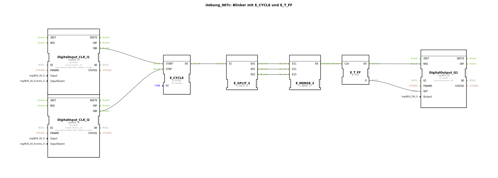

# Uebung_007c: Blinker mit E_CYCLE und E_T_FF

* * * * * * * * * *

## Einleitung

Diese Übung demonstriert die Erstellung eines einfachen Blinkers mithilfe der IEC‑61499‑Bausteine `E_CYCLE` und `E_T_FF`.  
Der Blinker wird über zwei digitale Eingänge gesteuert:  
- **Eingang I1** (Taster Single‑Click) startet die Blinkfunktion.  
- **Eingang I2** (Taster Single‑Click) stoppt sie.  

Der Ausgang **Q1** schaltet periodisch im 10‑ms‑Takt zwischen Ein und Aus um, solange die Blinkfunktion aktiv ist.  
Die Übung vermittelt den Umgang mit zyklischen Ereignissen, Ereignis‑Splitting/-Merging und der Toggle‑Funktion.

## Verwendete Funktionsbausteine (FBs)

| Bausteinname          | Typ                           | Parameter                                  | Beschreibung |
|-----------------------|-------------------------------|--------------------------------------------|--------------|
| `E_CYCLE`             | `iec61499::events::E_CYCLE`   | `DT = T#10ms`                             | Erzeugt alle 10 ms ein Ereignis an seinem Ausgang `EO`. |
| `E_SPLIT_3`           | `iec61499::events::E_SPLIT_3` | –                                          | Verteilt ein eingehendes Ereignis auf drei identische Ausgänge (`EO1`, `EO2`, `EO3`). |
| `E_MERGE_3`           | `iec61499::events::E_MERGE_3` | –                                          | Fasst drei eingehende Ereignisse (`EI1`, `EI2`, `EI3`) zu einem gemeinsamen Ausgang `EO` zusammen. |
| `E_T_FF`              | `iec61499::events::E_T_FF`    | –                                          | Toggle‑Flipflop: Bei jedem Ereignis am Eingang `CLK` wechselt der Ausgang `Q` seinen Wert (0→1 oder 1→0). |
| `DigitalInput_CLK_I1` | `logiBUS::io::DI::logiBUS_IE` | `QI = TRUE`, `Input = Input_I1`, `InputEvent = BUTTON_SINGLE_CLICK` | Wandelt einen Tastendruck an I1 in ein Ereignis am Ausgang `IND` um (Start‑Befehl). |
| `DigitalInput_CLK_I2` | `logiBUS::io::DI::logiBUS_IE` | `QI = TRUE`, `Input = Input_I2`, `InputEvent = BUTTON_SINGLE_CLICK` | Wandelt einen Tastendruck an I2 in ein Ereignis am Ausgang `IND` um (Stopp‑Befehl). |
| `DigitalOutput_Q1`    | `logiBUS::io::DQ::logiBUS_QX` | `QI = TRUE`, `Output = Output_Q1`         | Steuert den digitalen Ausgang Q1. Ein Ereignis am Eingang `REQ` übernimmt den Datenwert am Eingang `OUT` und gibt ihn physikalisch aus. |

## Programmablauf und Verbindungen

1. **Start**: Ein Tastendruck an **I1** erzeugt ein Ereignis an `DigitalInput_CLK_I1.IND`. Dieses wird mit dem **START**‑Eingang von `E_CYCLE` verbunden und aktiviert den zyklischen Timer.  
2. **Stopp**: Ein Tastendruck an **I2** erzeugt ein Ereignis an `DigitalInput_CLK_I2.IND`. Dieses wird mit dem **STOP**‑Eingang von `E_CYCLE` verbunden und deaktiviert den Timer.  
3. **Zyklus**: Solange `E_CYCLE` aktiv ist, erzeugt es alle 10 ms ein Ereignis an seinem Ausgang `EO`.  
4. **Splitting**: Dieses Ereignis wird durch `E_SPLIT_3` auf drei Ausgänge (`EO1`–`EO3`) verteilt.  
5. **Merging**: Die drei identischen Ereignisse werden über `E_MERGE_3` wieder zu einem einzigen Ereignis zusammengeführt. (Dadurch wird die Verzögerungszeit minimal gehalten und die Signalintegrität sichergestellt.)  
6. **Toggle**: Das gemergte Ereignis triggert den `CLK`‑Eingang von `E_T_FF`. Der Zustand des Flipflops wechselt bei jedem Takt. Der aktuelle Wert wird am Datenausgang `Q` bereitgestellt.  
7. **Ausgabe**: Das Ereignis `EO` von `E_T_FF` wird zum `REQ`‑Eingang von `DigitalOutput_Q1` geführt. Gleichzeitig wird der Datenwert `Q` (0 oder 1) an den `OUT`‑Eingang der Ausgangsbaugruppe übergeben. Bei jedem Takt wird der Ausgang Q1 entsprechend gesetzt.

**Lernziele**:  
- Verständnis von zyklischen Ereignissen (`E_CYCLE`)  
- Nutzung eines Toggle‑Flipflops (`E_T_FF`)  
- Ereignis‑Vervielfachung und Zusammenführung (`E_SPLIT_3`, `E_MERGE_3`)  
- Ein‑ und Ausschalten einer Funktion über digitale Eingänge  

**Schwierigkeitsgrad**: Anfänger  
**Vorkenntnisse**: Grundlagen der IEC‑61499‑Ereigniskette, einfache Verbindungen zwischen Funktionsbausteinen  

**Hinweise zum Start**:  
- Die Übung verwendet die logiBUS‑Hardware‑Schnittstelle – stellen Sie sicher, dass die Eingänge I1 und I2 sowie der Ausgang Q1 korrekt angeschlossen sind.  
- Die Taster müssen im **Single‑Click**‑Modus konfiguriert sein.  
- Nach dem Aktivieren von E_CYCLE (Start) blinkt Q1 solange, bis der Stopp‑Taster betätigt wird.

## Zusammenfassung

Die Übung `Uebung_007c` realisiert einen an‑ und ausschaltbaren Blinker auf Basis von `E_CYCLE` und `E_T_FF`. Sie zeigt, wie systemzeitgesteuerte Ereignisse mit einem Toggle‑Flipflop kombiniert werden, um einen wechselnden Ausgang zu erzeugen. Die Verwendung von `E_SPLIT_3` und `E_MERGE_3` verdeutlicht die Handhabung von Ereignisverzweigungen. Durch die beiden Taster wird der Anwender in die Lage versetzt, eine zyklische Funktion gezielt zu starten und zu stoppen.