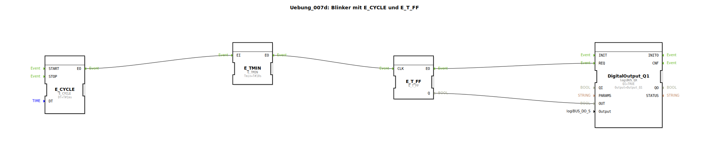

# Uebung_007d: Blinker mit E_CYCLE und E_T_FF

* * * * * * * * * *

## Einleitung

Diese Übung demonstriert die Realisierung eines Blinkers mithilfe der Funktionsbausteine `E_CYCLE` und `E_T_FF`. Der Blinker schaltet einen digitalen Ausgang in einem festen Zeitrhythmus ein und aus. Hierbei wird ein periodisches Ereignis durch `E_CYCLE` erzeugt, über `E_TMIN` auf eine bestimmte Mindestzeit verlängert und anschließend durch einen T‑Flipflop (`E_T_FF`) getoggelt. Das Ergebnis wird auf einen Digitalausgang ausgegeben.

## Verwendete Funktionsbausteine (FBs)

- **`E_CYCLE`** (Typ: `iec61499::events::E_CYCLE`)  
  Erzeugt zyklisch ein Ereignis am Ausgang `EO`.  
  - Parameter: `DT` = `T#1ms` (Zykluszeit 1 Millisekunde)

- **`E_TMIN`** (Typ: `iec61499::events::E_TMIN`)  
  Gibt am Ausgang `EO` ein Ereignis aus, wenn seit dem letzten Eingangsereignis mindestens die Zeit `Tmin` vergangen ist.  
  - Parameter: `Tmin` = `T#10s`

- **`E_T_FF`** (Typ: `iec61499::events::E_T_FF`)  
  Ein T‑Flipflop mit Takteingang `CLK`. Bei jedem Ereignis an `CLK` wechselt der Datenausgang `Q` seinen Zustand (0→1, 1→0). Der Ereignisausgang `EO` wird gleichzeitig mit dem `CLK`‑Ereignis aktiviert.

- **`DigitalOutput_Q1`** (Typ: `logiBUS::io::DQ::logiBUS_QX`)  
  Digitaler Ausgangsbaustein, der den Wert des Eingangs `OUT` an den physischen Ausgang `Output_Q1` weitergibt.  
  - Parameter: `QI` = `TRUE` (Aktivierung), `Output` = `Output_Q1` (Hardware-Adresse)  
  - Ereigniseingang `REQ`: Übernahme des Datenwertes

## Programmablauf und Verbindungen

Der Ablauf der Übung wird durch die Ereignis- und Datenverbindungen im Netzwerk bestimmt:

1. **Ereignis-Erzeugung**:  
   `E_CYCLE` sendet alle 1 ms ein Ereignis an den Eingang `EI` von `E_TMIN`.

2. **Zeitverzögerung**:  
   `E_TMIN` wartet, bis seit seinem letzten Ereignis mindestens 10 Sekunden vergangen sind. Erst dann gibt es selbst ein Ereignis an seinem Ausgang `EO` aus. Dadurch wird das ursprüngliche 1‑ms‑Ereignis auf eine Periode von 10 Sekunden „verlangsamt“.

3. **Toggle-Flipflop**:  
   Das verzögerte Ereignis von `E_TMIN.EO` wird an den Takteingang `CLK` von `E_T_FF` geführt. Jeder Takt wechselt den Datenausgang `Q` des Flipflops. Gleichzeitig erzeugt `E_T_FF` ein Ereignis an `EO`.

4. **Ausgabe**:  
   - Der Datenwert `E_T_FF.Q` wird über eine Datenverbindung an den Dateneingang `OUT` von `DigitalOutput_Q1` weitergeleitet.  
   - Das Ereignis `E_T_FF.EO` triggert den `REQ`-Eingang des Digitalausgangs, sodass der aktuelle Wert von `OUT` übernommen und am physischen Ausgang gesetzt wird.

**Ergebnis**:  
Der digitale Ausgang schaltet im 10‑Sekunden-Takt: 10 Sekunden ein, 10 Sekunden aus (Blinkfrequenz 0,05 Hz).

Diese Übung vermittelt Grundlagen der ereignisgesteuerten Zeitsteuerung in 4diac. Sie zeigt, wie aus einem schnellen Zyklus durch `E_TMIN` ein langsamerer Takt erzeugt und mit einem T‑Flipflop in ein Rechtecksignal umgewandelt werden kann.

## Zusammenfassung

Die Übung **Uebung_007d** realisiert einen einfachen Blinker unter Verwendung der Bausteine `E_CYCLE`, `E_TMIN` und `E_T_FF`. Die Kaskadierung von Ereignisbausteinen ermöglicht eine flexible Zeitsteuerung, ohne auf herkömmliche Timer oder Zähler angewiesen zu sein. Der erstellte Subapplikationstyp kann direkt in übergeordnete Projekte eingebunden werden, um z. B. Signallampen oder optische Anzeigen zeitgesteuert zu betreiben.