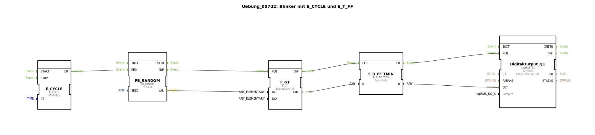

# Uebung_007d2: Blinker mit E_CYCLE und E_T_FF

* * * * * * * * * *
## Einleitung
Diese Übung realisiert einen Blinker unter Verwendung von `E_CYCLE` und `E_D_FF_TMIN`. Der Blinker erzeugt ein zufälliges Ein-/Ausschaltverhältnis, wobei ein Flipflop mit minimaler Einschaltzeit von 3 Sekunden sicherstellt, dass der Ausgang nach einem Einschalten nicht zu früh wieder ausschaltet.

## Verwendete Funktionsbausteine (FBs)

- **E_CYCLE**  
  *Typ*: `iec61499::events::E_CYCLE`  
  *Parameter*: `DT` = `T#1ms` (Zykluszeit 1 ms)  
  Ein zyklischer Ereignisgenerator, der periodisch ein Ereignis auslöst.

- **FB_RANDOM**  
  *Typ*: `eclipse4diac::utils::FB_RANDOM`  
  *Parameter*: `SEED` = `0` (Startwert für Zufallszahl)  
  Erzeugt einen Zufallswert im Bereich 0..1.

- **F_GT**  
  *Typ*: `iec61131::comparison::F_GT`  
  *Parameter*: `IN2` = `REAL#0.49` (fester Vergleichswert)  
  Vergleicht die Werte `IN1 > IN2` und liefert einen booleschen Ausgang.

- **E_D_FF_TMIN**  
  *Typ*: `iec61499::events::E_D_FF_TMIN`  
  *Parameter*: `Tmin` = `T#3s` (minimale Einschaltzeit)  
  Ein D-Flipflop, das nach einem steigenden Takt den Dateneingang übernimmt und den Ausgang für mindestens `Tmin` auf TRUE hält.

- **DigitalOutput_Q1**  
  *Typ*: `logiBUS::io::DQ::logiBUS_QX`  
  *Parameter*: `QI` = `TRUE` (Aktivierung des Ausgangs), `Output` = `Output_Q1` (physikalischer Ausgang)  
  Digitaler Ausgang auf dem logiBUS-System.

## Programmablauf und Verbindungen

Der Ablauf wird durch den zyklischen Ereignisgenerator `E_CYCLE` (alle 1 ms) gestartet. Das Ereignis `EO` triggert den Baustein `FB_RANDOM` (`REQ`), der einen zufälligen Gleitkommawert (`VAL`) erzeugt. Dieser Wert wird an den DatenEingang `IN1` von `F_GT` übergeben. Der Vergleichsbaustein vergleicht den Zufallswert mit dem festen Schwellwert `0.49` und erzeugt ein boolesches Ergebnis (`OUT`). Das Ergebnis `TRUE` entspricht einer Zufallszahl > 0.49, `FALSE` entspricht ≤ 0.49.

Das Ereignis `CNF` von `FB_RANDOM` triggert `F_GT` (`REQ`). Nach der Berechnung sendet `F_GT` ein `CNF` an den Takteingang `CLK` von `E_D_FF_TMIN`. Das Flipflop übernimmt gleichzeitig den aktuellen Wert von `D` (entspricht `F_GT.OUT`). Der Ausgang `Q` des Flipflops bleibt nach einem Einschalten mindestens 3 s lang auf `TRUE`, selbst wenn `D` vor Ablauf dieser Zeit wieder auf `FALSE` wechselt. Der Ausgang `Q` steuert den Dateneingang `OUT` von `DigitalOutput_Q1`. Das Ereignis `EO` des Flipflops triggert den Ausgangsbaustein (`REQ`), sodass der physikalische Ausgang den aktuellen Wert anlegt.

**Ereignis- und Datenverbindungen:**

- `E_CYCLE.EO` → `FB_RANDOM.REQ`
- `FB_RANDOM.CNF` → `F_GT.REQ`
- `FB_RANDOM.VAL` → `F_GT.IN1`
- `F_GT.CNF` → `E_D_FF_TMIN.CLK`
- `F_GT.OUT` → `E_D_FF_TMIN.D`
- `E_D_FF_TMIN.EO` → `DigitalOutput_Q1.REQ`
- `E_D_FF_TMIN.Q` → `DigitalOutput_Q1.OUT`

## Zusammenfassung

Die Übung demonstriert die Kombination eines zyklischen Ereignisgenerators, eines Zufallszahlengenerators, eines Vergleichsbausteins, eines Flipflops mit minimaler Einschaltzeit und eines digitalen Ausgangs. Lernziele sind:

- Verständnis von Ereignis- und Datenflüssen in IEC 61499.
- Parametrierung von Zeitbausteinen (`E_CYCLE`, `E_D_FF_TMIN`).
- Erstellung eines Blinkmusters mit variablem Tastverhältnis durch einen Zufallsprozess.
- Integration eines logiBUS-Ausgangs.

Vorausgesetzt werden Grundkenntnisse der Ereignisbehandlung nach IEC 61499 und der logiBUS-Ausgangsansteuerung.