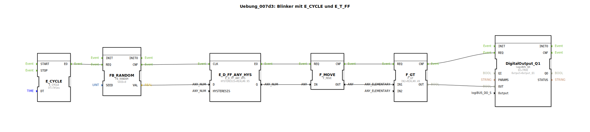

# Uebung_007d3: Blinker mit E_CYCLE und E_T_FF

* * * * * * * * * *

## Einleitung

Diese Übung realisiert einen zufallsgesteuerten Blinker mit Hilfe der Funktionsbausteine `E_CYCLE`, `FB_RANDOM`, `E_D_FF_ANY_HYS`, `F_MOVE` und `F_GT`. Ein zyklischer Takt triggert die Erzeugung eines Zufallswerts, der über ein Flip‑Flop mit Hysterese und einen Komparator einen digitalen Ausgang schaltet. Der Blinker simuliert damit ein unregelmäßiges Ein‑/Ausschaltverhalten.

## Verwendete Funktionsbausteine (FBs)

| Bausteinname | Typ | Parameter | Kurzbeschreibung |
|--------------|-----|-----------|------------------|
| `E_CYCLE` | `iec61499::events::E_CYCLE` | DT = T#1ms | Erzeugt alle 1 ms ein Ereignis am Ausgang `EO`. |
| `FB_RANDOM` | `eclipse4diac::utils::FB_RANDOM` | SEED = 0 | Liefert bei jedem `REQ`‑Ereignis einen neuen REAL‑Zufallswert zwischen 0 und 1 am Ausgang `VAL`. |
| `E_D_FF_ANY_HYS` | `logiBUS::signalprocessing::hysteresis::E_D_FF_ANY_HYS` | HYSTERESIS = REAL#0.95 | Getaktetes Flip‑Flop mit Hysterese: Der Eingang `D` wird mit dem Ereignis an `CLK` übernommen. Der Ausgang `Q` schaltet erst um, wenn der Wert die Hysterese überschreitet. |
| `F_MOVE` | `iec61131::selection::F_MOVE` | DataType = REAL | Kopiert den Eingangswert (`IN`) unverändert auf den Ausgang (`OUT`). Dient hier der Typwandlung von BOOL → REAL. |
| `F_GT` | `iec61131::comparison::F_GT` | IN2 = REAL#0.49 | Vergleicht `IN1` mit der Konstanten `IN2` und gibt am Ausgang `OUT` TRUE aus, wenn `IN1` größer als 0.49 ist. |
| `DigitalOutput_Q1` | `logiBUS::io::DQ::logiBUS_QX` | QI = TRUE, Output = Output_Q1 | Digitalausgangsbaustein, der das übergebene Signal (`OUT`) an die physikalische Adresse `Output_Q1` weitergibt. |

## Programmablauf und Verbindungen

1. **Taktgenerierung**  
   `E_CYCLE` erzeugt alle 1 ms ein Ereignis an seinem Ausgang `EO`.

2. **Zufallswert erzeugen**  
   Dieses Ereignis wird über die Eventverbindung an den Eingang `REQ` von `FB_RANDOM` weitergegeben. `FB_RANDOM` berechnet einen zufälligen REAL‑Wert zwischen 0 und 1 und gibt ihn am Datenausgang `VAL` aus. Gleichzeitig signalisiert es die Fertigstellung über `CNF`.

3. **Flip‑Flop mit Hysterese**  
   Das `CNF`‑Ereignis triggert den Takteingang `CLK` von `E_D_FF_ANY_HYS`. Der Datenwert von `FB_RANDOM.VAL` wird an den Dateneingang `D` gelegt. Durch die eingestellte Hysterese von 0.95 wird der Ausgang `Q` nur dann auf TRUE gesetzt, wenn der Zufallswert die vorherige Schwelle deutlich überschreitet; bei Unterschreitung erfolgt das Zurücksetzen mit entsprechender Verzögerung. Der Ausgang `Q` ist ein BOOL‑Wert.

4. **Typwandlung**  
   Nach dem Flip‑Flop wird der BOOL‑Wert über `F_MOVE` (mit DataType = REAL) in eine REAL‑Zahl umgewandelt (TRUE → 1.0, FALSE → 0.0). Das Ereignis dafür liefert `E_D_FF_ANY_HYS.EO`.

5. **Vergleich mit Schwellwert**  
   Der umgewandelte Wert gelangt über die Datenverbindung an den Eingang `IN1` von `F_GT`. Dieser vergleicht ihn mit der Konstanten `IN2 = 0.49`. Ist `IN1` größer, wird der Ausgang `OUT` auf TRUE gesetzt, andernfalls auf FALSE.

6. **Ausgabe an Digitalausgang**  
   Das Ergebnis des Vergleichs (`F_GT.OUT`) wird sowohl als Datenwert an den Eingang `OUT` des Digitalausgangsbausteins `DigitalOutput_Q1` gelegt, als auch über die Eventverbindung (`F_GT.CNF → DigitalOutput_Q1.REQ`) die Verarbeitung angestoßen. `DigitalOutput_Q1` gibt den Wert schließlich an die physikalische Leitung `Output_Q1` aus.

Der gesamte Ablauf wiederholt sich mit jedem Takt von `E_CYCLE` (alle 1 ms), sodass am Ausgang ein unregelmäßiges Blinksignal entsteht, das durch die Hysterese verzögert und durch den Schwellwert weiter geformt wird.

## Zusammenfassung

Die Übung demonstriert die Kombination von zyklischer Ereignissteuerung, Zufallswertgenerierung, Flip‑Flop mit Hysterese, Typkonvertierung und Vergleichslogik zur Erzeugung eines dynamischen Ausgangssignals. Lernziele sind das Verständnis von Ereignis‑Daten‑Verbindungen, die Parametrierung von Zeit‑ und Hysterese‑Bausteinen sowie die Zusammenschaltung mehrerer Funktionsbausteine zu einer funktionalen Einheit. Voraussetzung sind Grundkenntnisse in IEC 61499 und der 4diac‑IDE.