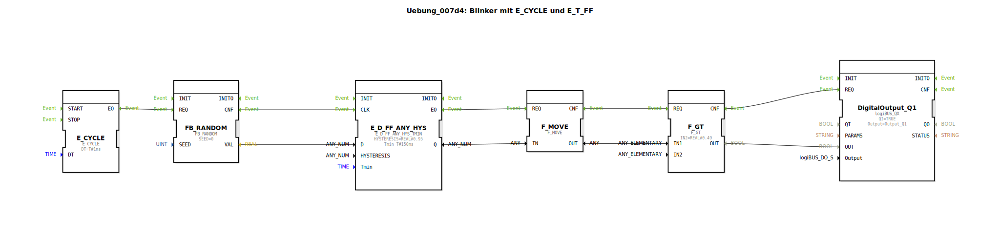

# Uebung_007d4: Blinker mit E_CYCLE und E_T_FF

* * * * * * * * * *

## Einleitung

Diese Übung realisiert einen **Blinker** basierend auf einem zufälligen Signal.  
Ein periodischer Takt (E_CYCLE) triggert einen Zufallsgenerator (FB_RANDOM).  
Dessen Ausgang wird durch einen Hysterese-Flipflop (E_D_FF_ANY_HYS) gefiltert,  
anschließend über einen Move-Baustein aufbereitet und mit einem Schwellwert verglichen (F_GT).  
Das Ergebnis schaltet einen digitalen Ausgang (logiBUS QX) – es entsteht ein unregelmäßig blinkendes Signal.

## Verwendete Funktionsbausteine (FBs)

- **DigitalOutput_Q1** (Typ: `logiBUS::io::DQ::logiBUS_QX`)  
  - Parameter: `QI` = TRUE, `Output` = "Output_Q1"  
  - Zweck: physischer Digitalausgang (hier simuliert).  
- **E_CYCLE** (Typ: `iec61499::events::E_CYCLE`)  
  - Parameter: `DT` = T#1ms  
  - Zweck: erzeugt einen periodischen Ereignisimpuls (Takt).  
- **FB_RANDOM** (Typ: `eclipse4diac::utils::FB_RANDOM`)  
  - Parameter: `SEED` = 0  
  - Zweck: erzeugt bei jedem REQ einen neuen Zufallswert (REAL) am Ausgang VAL.  
- **F_GT** (Typ: `iec61131::comparison::F_GT`)  
  - Parameter: `IN2` = REAL#0.49  
  - Zweck: vergleicht zwei REAL-Werte; OUT ist TRUE wenn IN1 > IN2.  
- **E_D_FF_ANY_HYS** (Typ: `logiBUS::signalprocessing::hysteresis::E_D_FF_ANY_HYS_TMIN`)  
  - Parameter: `HYSTERESIS` = REAL#0.95, `Tmin` = T#150ms  
  - Zweck: hysteresebehafteter D-Flipflop mit Mindesteinschaltzeit; Q wird TRUE wenn D > Hysterese und der letzte Zustand mindestens Tmin zurückliegt.  
- **F_MOVE** (Typ: `iec61131::selection::F_MOVE`)  
  - Attribut: `DataType` = REAL  
  - Zweck: kopiert den Wert von IN nach OUT (ohne Verzögerung).

## Programmablauf und Verbindungen

1. **Taktgenerierung**  
   E_CYCLE erzeugt alle 1 ms ein Ereignis an seinem Ausgang `EO`.  
   Dieses Ereignis wird direkt an den Eingang `REQ` von FB_RANDOM weitergeleitet.

2. **Zufallswert erzeugen**  
   FB_RANDOM liefert bei jedem `REQ` einen neuen REAL-Zufallswert an `VAL`.  
   Dieser Wert wird dem Dateneingang `D` des Hysterese-Flipflops zugeführt.

3. **Hysterese-Filter**  
   E_D_FF_ANY_HYS vergleicht den aktuellen Wert mit der Hysterese‑Schwelle (0.95).  
   Überschreitet der Wert die Schwelle **und** ist die Mindestzeit Tmin seit dem letzten Umschalten vergangen,  
   wird der Ausgang `Q` auf TRUE gesetzt, ansonsten auf FALSE.  
   Ein gültiger Wechsel erzeugt ein Ereignis an `EO`.

4. **Signalweitergabe**  
   - Das Ereignis `EO` vom Hysterese‑Flipflop triggert den F_MOVE‑Baustein.  
   - F_MOVE kopiert den aktuellen Zustand `Q` (als REAL: 0.0 oder 1.0?) an seinen Ausgang `OUT`.  
   - Der Ausgang `OUT` wird an den Dateneingang `IN1` des Vergleichsbausteins F_GT übergeben.  
   - Das Ereignis `CNF` von F_MOVE startet F_GT.

5. **Schwellwertvergleich**  
   F_GT prüft, ob der kopierte Wert größer als 0.49 ist.  
   - Ist der Wert > 0.49 (d.h. der Hysterese‑Ausgang war TRUE), wird `OUT` = TRUE.  
   - Ist er ≤ 0.49, wird `OUT` = FALSE.  
   Das Ereignis `CNF` von F_GT triggert den Digitalausgang.

6. **Ausgang setzen**  
   Der Digitalausgang `DigitalOutput_Q1` erhält über den Dateneingang `OUT` den Vergleichsergebnis.  
   Der Ausgang des Bausteins (z.B. eine LED) leuchtet, wenn der aktuelle Zufallswert die Hysterese überschritten hat und der Vergleich positiv war.

**Zusammenfassung der Signalverarbeitung:**

`E_CYCLE` → `FB_RANDOM` → `E_D_FF_ANY_HYS` → `F_MOVE` → `F_GT` → `DigitalOutput_Q1`

**Lernziele dieser Übung:**
- Verständnis des Zusammenspiels von Ereignis- und Datenflüssen in 4diac.
- Einsatz eines zyklischen Taktes (E_CYCLE) zur Steuerung einer wiederholten Berechnung.
- Anwendung von Zufallsgeneratoren und Hysterese‑Funktionen zur Erzeugung eines unregelmäßigen Signals.
- Praktische Nutzung von Vergleichsbausteinen und Ausgangsbausteinen.

## Zusammenfassung

Die Übung „Uebung_007d4“ demonstriert den Aufbau eines **Blinkers mit zufälligen Einschaltphasen**.  
Ein periodischer Takt löst eine Kette von Bausteinen aus: Zufallsgenerator, Hysterese-Filter, Wertweitergabe, Schwellwertvergleich und schließlich einen Digitalausgang.  
Durch die Kombination von Hysterese und Mindestzeit entsteht ein Blinkmuster, das nicht rein zufällig ist, sondern gewisse Ein‑ und Ausschaltmindestzeiten einhält.  
Dieses Beispiel vertieft das Verständnis von ereignisgesteuerten Funktionsbausteinen, Parameterkonfiguration und der Kopplung von Daten‑ und Ereignisverbindungen in der 4diac‑IDE.