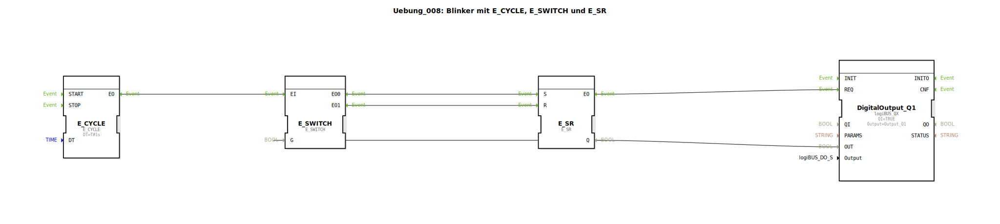

# Uebung_008: Blinker mit E_CYCLE, E_SWITCH und E_SR

Dieser Artikel beschreibt die logiBUS®-Übung `Uebung_008`. Hier wird die Logik eines dauerhaft laufenden Taktgebers mit internem Speicherzustand gezeigt.

----

## Ziel der Übung

Implementierung eines autarken Blink-Schaltkreises.

-----

## Beschreibung und Komponenten

[cite_start]Die Subapplikation `Uebung_008.SUB` nutzt die Kombination aus `E_CYCLE`, `E_SWITCH` und `E_SR` ohne externe Steuereingänge[cite: 1].

Der Taktgeber `E_CYCLE` läuft (nach einmaliger Initialisierung durch das System) permanent durch. Die Logik sorgt dafür, dass der Ausgang `Q1` im Sekundentakt zwischen `TRUE` und `FALSE` wechselt. Da keine Stopp-Logik vorhanden ist, dient dieser Aufbau als permanenter Herzschlag des Programms.

-----

## Anwendungsbeispiel

**Status-LED (Heartbeat)**:
Eine LED direkt auf der CPU-Platine, die ständig blinkt, solange die Versorgungsspannung anliegt und das Steuerungsprogramm ("Task") fehlerfrei abgearbeitet wird. Hört die LED auf zu blinken, weiß der Techniker sofort, dass die Steuerung abgestürzt ist oder im Stopp-Zustand verharrt.