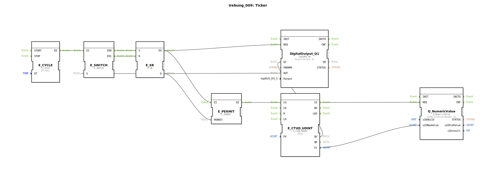

# Uebung_009: Ticker

Dieser Artikel beschreibt die logiBUS®-Übung `Uebung_009`. Hier verbinden wir die Zeitbasis mit einer Zählfunktion und einer numerischen Anzeige.

----

## Ziel der Übung

Erlernen der ereignisbasierten Zählung (`E_CTUD`) und der Darstellung von Werten auf einem Terminal.

-----

## Beschreibung und Komponenten

[cite_start]In `Uebung_009.SUB` wird ein Taktgeber genutzt, um einen Aufwärtszähler anzusteuern, dessen Wert an ein ISOBUS-Terminal gesendet wird[cite: 1].

### Funktionsbausteine (FBs)

  * **`E_CYCLE` & `E_SR`**: Erzeugen einen permanenten Takt (wie in Übung 008).
  * **`E_PERMIT`**: Ein Ereignis-Gatter. [cite_start]Es lässt Ereignisse am Eingang `EI` nur dann zum Ausgang `EO` durch, wenn der Dateneingang `PERMIT` auf `TRUE` steht[cite: 1].
  * **`E_CTUD_UDINT`**: Ein Vorwärts-/Rückwärtszähler für große Ganzzahlen.
  * **`Q_NumericValue`**: Ein ISOBUS-Ausgangsbaustein zur Anzeige einer Zahl auf dem Bildschirm.

-----

## Funktionsweise

1.  Der Blinker-Teil erzeugt jede Sekunde ein Ereignis.
2.  Dieses Ereignis wird durch `E_PERMIT` gefiltert. Da `PERMIT` mit dem blinkenden Ausgang verbunden ist, wird nur **jedes zweite** Ereignis (nämlich nur, wenn der Blinker gerade AN ist) durchgelassen.
3.  Die durchgelassenen Events erreichen den Eingang `CU` (Count Up) des Zählers.
4.  Der Zählerstand erhöht sich.
5.  Bei jeder Änderung (`CO` - Count Output) wird der neue Wert an `Q_NumericValue` gesendet.
6.  Auf dem ISOBUS-Terminal sieht der Nutzer eine Zahl, die stetig ansteigt.

-----

## Anwendungsbeispiel

**Betriebsstundenzähler**:
Die Steuerung zählt die Zeitintervalle, in denen eine bestimmte Bedingung (z.B. "Motor läuft") erfüllt ist. Der summierte Wert wird dauerhaft gespeichert und dem Bediener als Wartungsinformation am Terminal angezeigt.