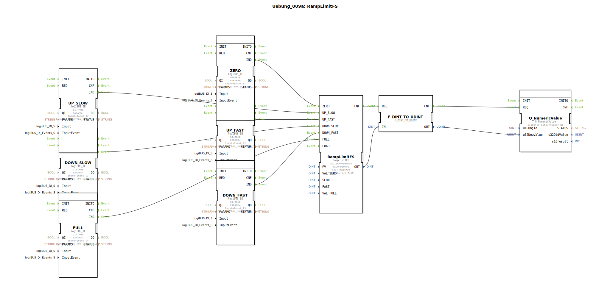

# Uebung_009a: RampLimitFS

Dieser Artikel beschreibt die logiBUS®-Übung `Uebung_009a`. Hier wird die komplexe Steuerung eines Zahlenwertes über verschiedene Taster-Interaktionen demonstriert.

----

## Ziel der Übung

Ansteuerung eines Rampen-Bausteins (`RampLimitFS`). Es wird gezeigt, wie verschiedene Ereignistypen (Klick vs. Langer Druck) genutzt werden können, um die Geschwindigkeit einer Wertänderung zu beeinflussen.

-----

## Beschreibung und Komponenten

[cite_start]Die Subapplikation `Uebung_009a.SUB` nutzt einen Rampen-Baustein zur stufenlosen Steuerung eines numerischen Werts zwischen 0 und 100[cite: 1].

### Funktionsbausteine (FBs)

  * **`RampLimitFS`**: Der Hauptbaustein aus der Signalverarbeitungs-Bibliothek. Er berechnet einen Ausgangswert, der sich zeitlich gleitend (Rampe) verändert.
  * **Eingangstaster**:
    *   `ZERO`: Setzt den Wert sofort auf 0.
    *   `FULL`: Setzt den Wert sofort auf 100.
    *   `UP_SLOW` (Klick): Erhöht den Wert langsam.
    *   `UP_FAST` (Langer Druck): Erhöht den Wert schnell.
    *   `DOWN_SLOW` (Klick): Verringert den Wert langsam.
    *   `DOWN_FAST` (Langer Druck): Verringert den Wert schnell.

-----

## Funktionsweise

Der Rampen-Baustein reagiert auf unterschiedliche Event-Eingänge:
1.  **Statische Ziele**: Bei `ZERO` oder `FULL` springt die interne Berechnung sofort auf die Grenzwerte.
2.  **Dynamische Änderung**:
    *   Ein Klick (`SINGLE_CLICK`) an `I2` triggert den `UP_SLOW` Eingang des Rampen-Bausteins. Der Wert steigt mit der im Parameter `SLOW` hinterlegten Rate.
    *   Hält der Nutzer den Taster länger gedrückt (`LONG_PRESS_START`), wird der Eingang `UP_FAST` getriggert. Der Wert steigt nun wesentlich schneller (Parameter `FAST`).

Das Ergebnis wird am ISOBUS-Terminal als Zahl (`OutputNumber_N1`) angezeigt.

-----

## Anwendungsbeispiel

**Elektrische Geschwindigkeits-Verstellung (Tempomat)**:
Mit kurzen Tastendrücken am Joystick kann der Fahrer die Zielgeschwindigkeit in 1-km/h-Schritten feinjustieren. Hält er die Taste gedrückt, beschleunigt das Fahrzeug zügig bis zur Maximalgeschwindigkeit. Ein Tastendruck auf "Null" bremst die Maschine sofort ab. Die Rampe sorgt dabei für weiche Übergänge und schont die Mechanik.