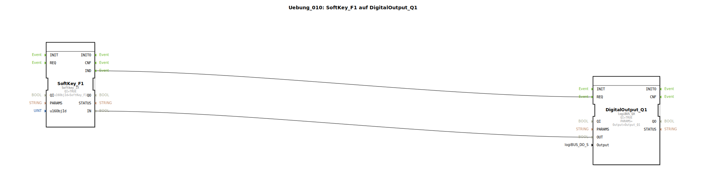

# Uebung_010: SoftKey_F1 auf DigitalOutput_Q1


[](https://notebooklm.google.com/notebook/a6872e59-1dfc-4132-a118-aff1bc7bc944)

Dieser Artikel beschreibt die logiBUS®-Übung `Uebung_010`. Hier wird die Anbindung virtueller Bedienelemente eines ISOBUS-Terminals (Universal Terminal, UT) an physische Ausgänge demonstriert.

## 🎧 Podcast




* [Das Kettenmonster erwacht: Lanz Bulldog Raupe – Die faszinierende Wiederbelebung des 10-Liter-Glühkopf-Arbeitstiers nach 25 Jahren Stillstand](https://podcasters.spotify.com/pod/show/ms-muc-lama/episodes/Das-Kettenmonster-erwacht-Lanz-Bulldog-Raupe--Die-faszinierende-Wiederbelebung-des-10-Liter-Glhkopf-Arbeitstiers-nach-25-Jahren-Stillstand-e39arpd)
* [JBC Lötspitzen C470 vs. C245 vs. C210 vs. C115: Welche Spitze ist der Allrounder und wann brauchst du den Nano-Spezialisten?](https://podcasters.spotify.com/pod/show/ms-muc-lama/episodes/JBC-Ltspitzen-C470-vs--C245-vs--C210-vs--C115-Welche-Spitze-ist-der-Allrounder-und-wann-brauchst-du-den-Nano-Spezialisten-e39ak58)
* [KI-Agenten revolutionieren Embedded-Entwicklung in 10 Stufen](https://podcasters.spotify.com/pod/show/ms-muc-lama/episodes/KI-Agenten-revolutionieren-Embedded-Entwicklung-in-10-Stufen-e3dnv23)
* [Miniware TS101: Das mobile Löt-Multitalent – Stärken, Schwächen und die USB-C Revolution](https://podcasters.spotify.com/pod/show/ms-muc-lama/episodes/Miniware-TS101-Das-mobile-Lt-Multitalent--Strken--Schwchen-und-die-USB-C-Revolution-e368lka)
* [Zwei WLANs gleichzeitig in Windows 10: Die geniale USB-Stick-Lösung für IoT-Geräte ohne Internet-Unterbrechung](https://podcasters.spotify.com/pod/show/ms-muc-lama/episodes/Zwei-WLANs-gleichzeitig-in-Windows-10-Die-geniale-USB-Stick-Lsung-fr-IoT-Gerte-ohne-Internet-Unterbrechung-e375643)

----


## Ziel der Übung

Verwendung eines `Softkey`-Bausteins zur direkten Steuerung eines digitalen Ausgangs. Es wird gezeigt, wie Ereignis- und Datenverbindungen genutzt werden, um eine Interaktion am Touchscreen in eine physische Aktion umzusetzen.

-----

## Beschreibung und Komponenten

[cite_start]Die Subapplikation `Uebung_010.SUB` verbindet eine Softkey-Instanz mit einem Standard-Ausgangsbaustein[cite: 1].

### Funktionsbausteine (FBs)

  * **`SoftKey_F1`**: Typ `isobus::UT::io::Softkey::Softkey_IX`. Dieser Baustein repräsentiert eine der Tasten am Bildschirmrand oder auf dem Touch-Display des ISOBUS-Terminals.
  * **`DigitalOutput_Q1`**: Der physische Ausgang (z.B. ein Relais oder eine Lampe).

### Parameter

*   **`u16ObjId`**: Diese Kennung verweist auf das entsprechende Objekt im ISOBUS-Pool (hier `SoftKey_F1`).

-----

## Funktionsweise

Die Kommunikation erfolgt über die standardmäßige Trennung von Trigger und Wert:

```xml
<EventConnections>
    <Connection Source="SoftKey_F1.IND" Destination="DigitalOutput_Q1.REQ"/>
</EventConnections>
<DataConnections>
    <Connection Source="SoftKey_F1.IN" Destination="DigitalOutput_Q1.OUT"/>
</DataConnections>
```

[cite_start][cite: 1]

Wenn der Bediener den Softkey am Terminal drückt:
1.  Der Baustein `SoftKey_F1` erkennt die Betätigung über das CAN-Netzwerk.
2.  Er setzt den Datenausgang `IN` auf `TRUE` und feuert ein `IND`-Event.
3.  `DigitalOutput_Q1` empfängt den Trigger und schaltet den Hardware-Ausgang ein.
4.  Beim Loslassen wechselt der Zustand zurück auf `FALSE`, ein erneutes Event wird gesendet und der Ausgang schaltet ab.

-----

## Anwendungsbeispiel

**Hydraulikventil manuell steuern**:
Der Fahrer wählt auf seinem Terminal eine Service-Seite aus. Dort befindet sich ein Button "Ventil spülen". Solange er diesen Button gedrückt hält, wird das entsprechende Magnetventil (`Q1`) angesteuert.