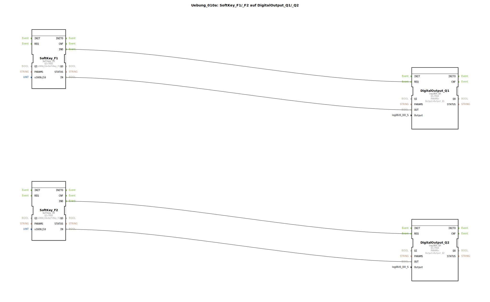

# Uebung_010a: SoftKey_F1/_F2 auf DigitalOutput_Q1/_Q2

Dieser Artikel beschreibt die logiBUS®-Übung `Uebung_010a`.

## 🎧 Podcast

* [ISO 11783-6: Softkeys und das Virtual Terminal verstehen – Dein Schlüssel zur Landmaschinen-Mechatronik](https://podcasters.spotify.com/pod/show/isobus-vt-objects/episodes/ISO-11783-6-Softkeys-und-das-Virtual-Terminal-verstehen--Dein-Schlssel-zur-Landmaschinen-Mechatronik-e36a8b0)

----

## Ziel der Übung

Erweiterung der ISOBUS-Steuerung auf mehrere Kanäle.

-----

## Beschreibung und Komponenten

[cite_start]Die Subapplikation `Uebung_010a.SUB` steuert zwei unabhängige Hardware-Ausgänge über zwei Softkeys am Terminal[cite: 1].

### Funktionsbausteine (FBs)

  * **`SoftKey_F1`** ➡️ **`DigitalOutput_Q1`**
  * **`SoftKey_F2`** ➡️ **`DigitalOutput_Q2`**

Beide Signalpfade nutzen die ereignisbasierte `IND -> REQ` Verbindung.

-----

## Funktionsweise

Dies demonstriert, dass das UT-Interface beliebig skaliert werden kann. Jeder Softkey im Objekt-Pool kann als eigenständige Instanz im 4diac-Programm genutzt werden, um spezifische Aktoren anzusteuern.