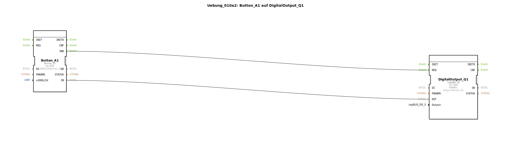

# Uebung_010a2: Button_A1 auf DigitalOutput_Q1

Dieser Artikel beschreibt die logiBUS®-Übung `Uebung_010a2`. Neben den Softkeys am Rand gibt es im ISOBUS auch "Buttons", die sich direkt innerhalb der Arbeitsmaske befinden.

----

## Ziel der Übung

Verwendung eines `Button_IX` Bausteins.

-----

## Beschreibung und Komponenten

[cite_start]Die Subapplikation `Uebung_010a2.SUB` nutzt einen Button anstelle eines Softkeys zur Steuerung eines Ausgangs[cite: 1].

### Funktionsbausteine (FBs)

  * **`Button_A1`**: Typ `isobus::UT::io::Button::Button_IX`. Referenziert das Objekt `Button_A1` im Pool.

-----

## Funktionsweise

Die Logik ist identisch zum Softkey: Solange die Schaltfläche auf dem Bildschirm berührt wird, liefert der Baustein `TRUE`. Der wesentliche Unterschied ist die visuelle Platzierung und Gestaltungsmöglichkeit innerhalb der grafischen Benutzeroberfläche des Terminals.